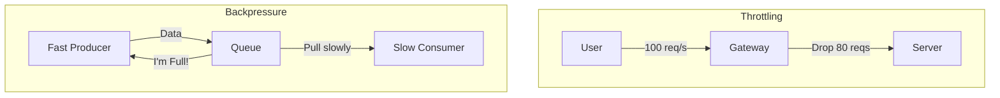

# Backpressure and Throttling: Managing System Overload

## 1. Beginner-friendly Hinglish Explanation 🇮🇳
Bhai, **Backpressure** aur **Throttling** ka matlab hai "System ko doobne se bachana." 

Socho ek bohot badi bheed (Crowd) ek chote se gate se ghusne ki koshish kar rahi hai. 
- **Throttling**: Gate par ek guard khada hai jo sirf 5 logon ko har minute andar jaane deta hai. Baki sabko wo mana kar deta hai. (E.g., "Rate Limit Exceeded"). 
- **Backpressure**: Ye thoda "Smart" hai. Jab andar jagah bharne lagti hai, toh andar wala banda bahar wale ko ishara karta hai ki "Dhire chalo, main handle nahi kar pa raha." 
System design mein, ye techniques humein "Cascading Failures" se bachati hain jab traffic achanak badh jata hai.

---

## 2. Deep Technical Explanation
Handling load is not just about scaling up; it's about gracefully handling the moments when you reach your limit.

### Throttling (Rate Limiting)
Explicitly limiting the number of requests a user or service can make.
- **Server-side**: Returning a `429 Too Many Requests` status.
- **Client-side**: Slowing down retries using Exponential Backoff.

### Backpressure
A feedback mechanism where a slow consumer tells a fast producer to "Slow down."
- **TCP**: Uses "Window Size" to tell the sender how much data it can handle.
- **Reactive Streams**: A protocol (like in Java/Project Reactor) where the subscriber "Requests" $N$ items from the publisher.

---

## 3. Architecture Diagrams
**Throttling vs Backpressure:**

---

## 4. Scalability Considerations
- **Protecting the Database**: The DB is often the slowest part. Throttling at the API layer prevents the DB from crashing under high load.
- **Multi-tenancy**: Ensuring that one "Heavy user" doesn't use all the resources, leaving none for others.

---

## 5. Failure Scenarios
- **Thundering Herd**: After a rate limit resets, all blocked users hit the system at the exact same millisecond.
- **Memory Leak**: If you use an "In-memory Queue" for backpressure and don't have a limit, the queue will grow until the server runs out of RAM (OOM).

---

## 6. Tradeoff Analysis
- **User Experience vs. System Stability**: Dropping a user's request (Throttling) is bad for UX but better than the whole site going down for everyone.
- **Drop vs. Delay**: Should you return an error (Fast) or make the user wait in a queue (Slow)?

---

## 7. Reliability Considerations
- **Circuit Breaker Integration**: If throttling is consistently happening, the circuit breaker should trip to give the system "Breathing room."
- **Graceful Degradation**: Throttling "Non-essential" requests (like analytics) to save capacity for "Essential" requests (like payments).

---

## 8. Security Implications
- **DDoS Mitigation**: Throttling is the primary defense against DDoS and brute-force attacks.
- **API Key Abuse**: Detecting when a stolen API key is being used to scrape your entire database.

---

## 9. Cost Optimization
- **Infrastructure Savings**: By throttling unnecessary or malicious traffic, you avoid paying for servers to process data that doesn't add value.

---

## 10. Real-world Production Examples
- **Twitter (X) API**: Limits how many tweets you can read or post per hour.
- **TCP Protocol**: Uses the "Receive Window" to manage backpressure at the hardware/network level.
- **Akka (Scala)**: A framework where backpressure is a first-class citizen in the actor model.

---

## 11. Debugging Strategies
- **429 Error Monitoring**: Tracking how many users are being throttled and why.
- **Queue Lag Analysis**: Measuring the time between a message being produced and consumed.

---

## 12. Performance Optimization
- **Token Bucket Algorithm**: A common way to implement throttling that allows for small "Bursts" of traffic but maintains a steady average rate.
- **Leaky Bucket Algorithm**: Smoothens out bursts to provide a perfectly steady output rate.

---

## 13. Common Mistakes
- **No Backpressure in Queues**: Having an unbounded queue (infinite size) that eventually crashes the server.
- **Global Throttling**: Throttling every user based on a "Global Counter" (very slow). Use a distributed cache like **Redis** instead.

---

## 14. Interview Questions
1. What is the difference between Throttling and Backpressure?
2. Explain the 'Token Bucket' algorithm.
3. How do you implement Rate Limiting in a distributed system with 100 servers?

---

## 15. Latest 2026 Architecture Patterns
- **AI-Adaptive Throttling**: AI that learns each user's "Normal" behavior and only throttles them if they suddenly start behaving like a bot.
- **Predictive Backpressure**: Systems that monitor CPU temperature or network latency to "Slow down" producers *before* the queue even starts filling up.
- **Client-Cooperative Throttling**: The server sending a `Retry-After` header with a dynamic, AI-calculated value to synchronize the client's next attempt perfectly.
	
