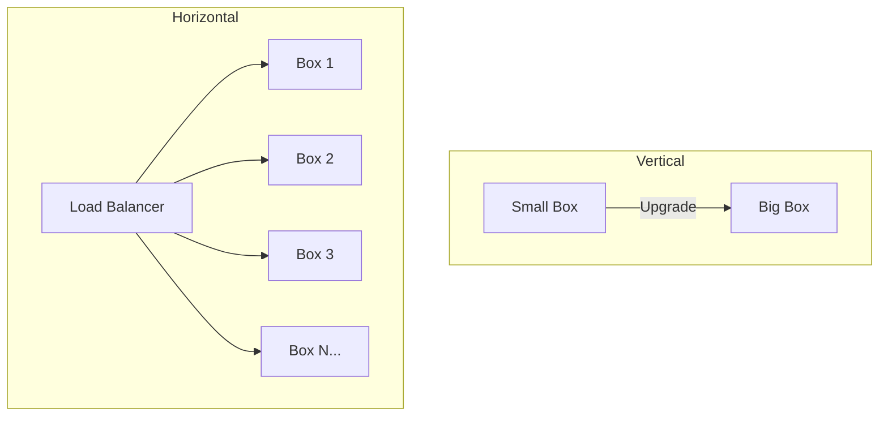

# Horizontal vs. Vertical Scaling: Choosing Your Growth Path

## 1. Beginner-friendly Hinglish Explanation 🇮🇳
Bhai, **Scaling** ka matlab hai "Apne system ki taqat badhana." 

- **Vertical Scaling (Scaling Up)**: Ye aisa hai ki aapne ek purani car bech kar ek nayi super-car kharid li. Aapne ek hi server mein zyada RAM aur CPU dal diya. Ye simple hai par iski ek limit hai—aap duniya ka sabse bada computer bhi kharid lo, wo Facebook jaisa load nahi utha payega. 
- **Horizontal Scaling (Scaling Out)**: Ye aisa hai ki aapne 10 sasti cars kharid li aur ek "Taxi Fleet" bana li. Aapne bahut saare chote servers ko ek sath jod diya. Iski koi limit nahi hai—aap jitne chahe servers add karte jao. Yahi "Modern Architecture" ka raaz hai.

---

## 2. Deep Technical Explanation
Scaling strategies determine the long-term viability and cost of your infrastructure.

### Vertical Scaling (Scaling Up)
Increasing the capacity of a single resource (e.g., upgrading an AWS EC2 instance from `t3.medium` to `r5.4xlarge`).
- **Complexity**: Low. No changes to application logic.
- **Limit**: Reaches a "Hardware Ceiling" where bigger machines don't exist or are prohibitively expensive.

### Horizontal Scaling (Scaling Out)
Adding more nodes to a pool (e.g., adding 10 more `t3.medium` instances behind a Load Balancer).
- **Complexity**: High. Requires a distributed mindset, load balancers, and statelessness.
- **Limit**: Virtually infinite, limited only by the coordination overhead and network bandwidth.

---

## 3. Architecture Diagrams
**Scaling Models:**

---

## 4. Scalability Considerations
- **Database Scaling**: Sharding is required for horizontal scaling of databases, which is much harder than scaling application servers.
- **Statelessness**: To scale horizontally, servers should not store session data in memory. Use Redis or JWTs instead.

---

## 5. Failure Scenarios
- **Vertical Failure**: If your "One Big Server" crashes, your whole app is down (100% outage).
- **Horizontal Failure**: If 1 server out of 10 crashes, you only lose 10% capacity. The system stays alive (**Graceful Degradation**).

---

## 6. Tradeoff Analysis
- **Cost**: Vertical scaling gets exponentially more expensive. Horizontal scaling is linear in cost.
- **Maintenance**: Managing 1 big server is easier than managing 100 small ones (unless you use **Kubernetes**).

---

## 7. Reliability Considerations
- **Redundancy**: Horizontal scaling provides inherent redundancy.
- **Load Balancing**: Crucial for horizontal scaling to ensure traffic is distributed evenly.

---

## 8. Security Implications
- **Internal Traffic**: Horizontal scaling increases internal network traffic, which needs to be secured (Encryption/Firewalls).
- **Patching**: Updating 100 servers requires an automated "Rolling Update" strategy to avoid downtime.

---

## 9. Cost Optimization
- **Elasticity**: Horizontal scaling allows you to "Scale down" to 1 server at night and "Scale up" to 100 during the day, saving massive amounts of money.

---

## 10. Real-world Production Examples
- **Stack Overflow**: Known for scaling **Vertically** for a long time using massive SQL servers.
- **Google/Netflix**: Scale **Horizontally** using thousands of small "Commodity" servers.

---

## 11. Debugging Strategies
- **Centralized Logging**: You cannot SSH into 100 servers to find a bug. You need a system like **ELK** or **Splunk**.
- **Instance Metadata**: Tagging logs with the `InstanceID` to see if a bug is happening on only one specific server.

---

## 12. Performance Optimization
- **Autoscaling Groups**: Automatically adding servers based on CPU or Memory usage.
- **Right-sizing**: Analyzing performance to find the "Sweet spot" between server size and count.

---

## 13. Common Mistakes
- **Vertical Scaling as a Permanent Solution**: Thinking you can just "Buy your way out" of bad code by adding more RAM.
- **Not Testing Scale**: Assuming horizontal scaling will work without testing how the database handles 100 connections.

---

## 14. Interview Questions
1. Why is Horizontal scaling considered 'Infinite' while Vertical is 'Finite'?
2. What are 'Sticky Sessions' and why are they bad for horizontal scaling?
3. How do you decide when to move from Vertical to Horizontal scaling?

---

## 15. Latest 2026 Architecture Patterns
- **Serverless Scaling**: Where the "Instance" concept disappears and the platform scales individual functions (FaaS) to zero.
- **Multi-region Horizontal Scaling**: Scaling not just across servers, but across different countries to handle global traffic.
- **AI-Managed Fleet**: Using AI to predict "Micro-bursts" of traffic and scaling up in milliseconds before the users even arrive.
