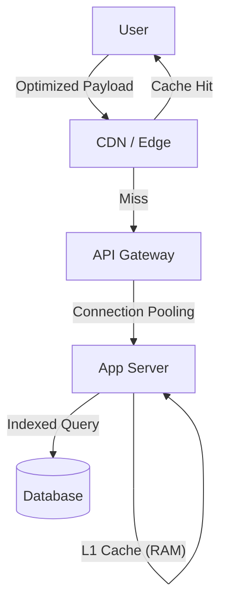

# Performance Optimization: Making it Blazing Fast

## 1. Beginner-friendly Hinglish Explanation 🇮🇳
Bhai, **Performance Optimization** ka matlab hai "Gadi ki service karwana." 

Socho aapke paas ek car hai jo 100km/h chalti hai. Optimization ka matlab ye nahi ki aap ek nayi car le lo, balki ye hai ki:
- Purana oil badlo (**Clean the Code**).
- Tyres mein hawa check karo (**Index the DB**).
- Faltu ka saaman hata do (**Remove unnecessary data**).
System design mein, hum resources badhane se pehle system ko "Efficient" banate hain taaki wahi resources zyada kaam kar sakein.

---

## 2. Deep Technical Explanation
Performance optimization is the process of improving system response time and throughput by identifying and removing bottlenecks.

### The Pillars of Optimization
1. **Code Efficiency**: Big O complexity, avoiding redundant calculations, and using efficient data structures.
2. **Database Optimization**: Indexing, query tuning, connection pooling, and choosing the right schema.
3. **Caching**: Storing results of expensive operations in memory (Redis/Memcached).
4. **Network Optimization**: Compression, reducing round-trips, and using CDNs.
5. **Concurrency**: Using multi-threading or async I/O to handle multiple tasks at once.

---

## 3. Architecture Diagrams
**Optimization Layers:**

---

## 4. Scalability Considerations
- **Efficiency leads to Scalability**: An optimized system can handle 10x more users on the same hardware, delaying the need for expensive scaling.
- **Hotspots**: Optimization should focus on the "Critical Path" (the 20% of code that handles 80% of requests).

---

## 5. Failure Scenarios
- **Over-Optimization**: Writing code that is so "Fast" that it becomes unreadable and impossible to debug.
- **Cache Invalidation Failure**: Serving "Wrong/Old" data because the cache wasn't updated correctly.

---

## 6. Tradeoff Analysis
- **Time vs. Space**: Using more RAM (Cache) to save CPU/Disk time.
- **Freshness vs. Speed**: Serving slightly old data (Fast) vs. fetching from DB (Slow).

---

## 7. Reliability Considerations
- **Graceful Degradation**: If the optimized path (Cache) fails, fall back to the slow path (DB) instead of crashing.
- **Timeouts**: Never let a performance-optimized request block forever.

---

## 8. Security Implications
- **Side-Channel Attacks**: Fast code might leak info about internal state via timing differences.
- **Cache Poisoning**: Attacker injecting malicious data into the cache.

---

## 9. Cost Optimization
- **Lower Resource Usage**: Optimized code uses less CPU and RAM, leading to smaller cloud bills.
- **I/O Reduction**: Reducing DB queries is the biggest cost saver in many systems.

---

## 10. Real-world Production Examples
- **Google Search**: They optimize every millisecond of the ranking algorithm because 100ms of latency reduces traffic by 20%.
- **WhatsApp**: Uses the Erlang VM for extreme concurrency and low memory usage per connection.

---

## 11. Debugging Strategies
- **Profiling**: Using tools like **Chrome DevTools**, **pprof**, or **Py-Spy** to find "Slow" functions.
- **Slow Query Logs**: Identifying DB queries that take more than 100ms.

---

## 12. Performance Optimization
- **Lazy Loading**: Only fetching data when it's actually needed.
- **Pre-fetching**: Predicting what data the user will need next and fetching it in the background.

---

## 13. Common Mistakes
- **Premature Optimization**: Optimizing things that don't matter. (The "Root of all evil").
- **Optimizing without Measuring**: Making changes and "Assuming" it's faster without a benchmark.

---

## 14. Interview Questions
1. How do you identify a performance bottleneck in a distributed system?
2. Explain the '80/20 Rule' in performance optimization.
3. What is 'Connection Pooling' and how does it help?

---

## 15. Latest 2026 Architecture Patterns
- **AI-Managed Profiling**: AI that constantly analyzes production traces and suggests code optimizations or index changes automatically.
- **GPU-Accelerated Processing**: Moving heavy JSON parsing or data sorting to GPUs for 100x speedup.
- **Vectorized Execution**: Using modern CPU instructions (AVX-512) to process multiple data points in a single cycle.
