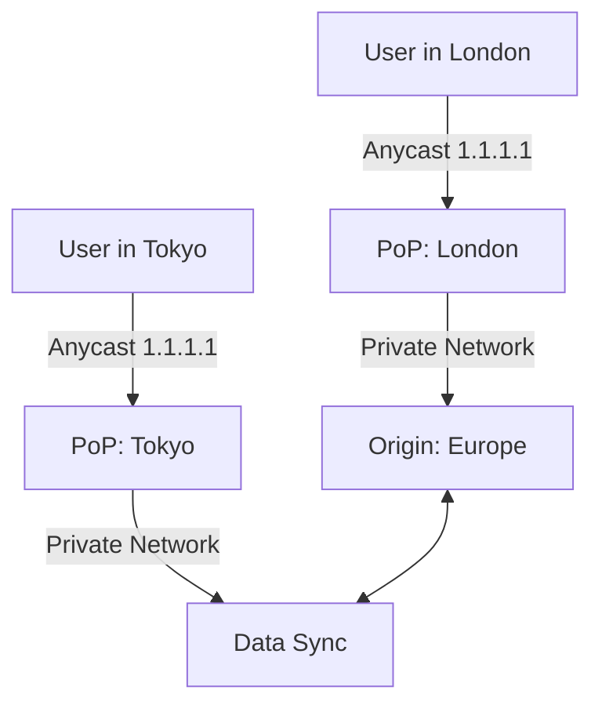

# Geo-Distributed Traffic: Handling the Global Scale

## 1. Beginner-friendly Hinglish Explanation 🇮🇳
Bhai, **Geo-Distribution** ka matlab hai "Duniya bhar mein servers lagana." 

Socho aapka server sirf Delhi mein hai. Jab New York ka banda click karega, toh data "Samundar" paar karke jayega aur aane mein 300ms lagenge—use app "Slow" lagega. Lekin agar aap ek server Delhi mein aur ek New York mein rakho, toh use 10ms mein response milega. 
System design mein, hum "DNS" aur "Anycast" use karte hain taaki user ko uske sabse "Paas" (Closest) wale data center par bheja jaye.

---

## 2. Deep Technical Explanation
Global distribution is about reducing physical distance (latency) and providing disaster recovery across continents.

### Key Concepts
- **GSLB (Global Server Load Balancing)**: Using DNS to return an IP address of a data center closest to the user.
- **Anycast Routing**: Multiple servers in different locations sharing the *same* IP address. The network (BGP) automatically routes the user to the closest one.
- **Data Sovereignty**: Regulations (like GDPR) that require certain users' data to stay within specific geographical boundaries.
- **Multi-Region Failover**: If the entire US-East region of AWS goes down, traffic is automatically rerouted to US-West or Europe.

---

## 3. Architecture Diagrams
**Global Traffic Flow:**

---

## 4. Scalability Considerations
- **Read-Heavy vs Write-Heavy**: It's easy to scale reads globally (Read Replicas in every country). It's very hard to scale writes globally because of "Speed of Light" and "Consistency" (CAP Theorem).
- **Latency Budget**: Keeping global round-trip times (RTT) under 100ms for a "Smooth" experience.

---

## 5. Failure Scenarios
- **Regional Outage**: An entire country's internet or a cloud provider's region failing.
- **Data Divergence**: A user updates their profile in India, then flies to the USA and sees their "Old" profile because the data hasn't synced across regions yet.

---

## 6. Tradeoff Analysis
- **Latency vs. Consistency**: Moving data closer to users makes it fast (Low Latency) but harder to keep perfectly in sync (Weak Consistency).
- **Complexity vs. Resilience**: Multi-region is 10x harder to manage but can survive a "Total Blackout" of a data center.

---

## 7. Reliability Considerations
- **Active-Active vs Active-Passive**: Keeping all global data centers running at once vs keeping some as "Warm Standby" for emergencies.
- **Latency-Based Routing**: Measuring the real-time speed from the user to every data center and picking the winner.

---

## 8. Security Implications
- **Compliance (GDPR/CCPA)**: Ensuring that personal data doesn't "Leave" the country illegally during a cross-region replication.
- **Edge Security**: Protecting against DDoS attacks at the local "Entry point" before they can spread to your global network.

---

## 9. Cost Optimization
- **Inter-Region Data Transfer**: Cloud providers charge heavily for data moving between regions. Using "Compression" and "Minimal Syncing" is key to saving money.
- **Local Caching**: Minimizing origin hits from distant regions.

---

## 10. Real-world Production Examples
- **WhatsApp**: Uses a massive network of edge servers to deliver messages globally with <1 second of latency.
- **Google Spanner**: A globally distributed database that uses "TrueTime" (Atomic Clocks) to provide strong consistency across continents.
- **Cloudflare**: Operates a network in 300+ cities to provide Anycast-based security and performance.

---

## 11. Debugging Strategies
- **Geographical Latency Maps**: Using tools to see the "Average Ping" from every country to your app.
- **Anycast Tracing**: Seeing which specific edge node a user is hitting.

---

## 12. Performance Optimization
- **Edge Computing**: Moving the "Logic" (e.g., Auth/Personalization) to the edge so it happens locally, even if the Database is far away.
- **TCP Optimizations**: Tuning the network stack for high-latency long-distance links.

---

## 13. Common Mistakes
- **Assuming Global Consistency**: Building a global app and assuming that a write in India will be visible in the USA instantly.
- **No Failover Testing**: Having 10 regions but never testing what happens when one is "Unplugged."

---

## 14. Interview Questions
1. How does 'Anycast' routing work?
2. What are the challenges of a 'Multi-Region' database?
3. How do you handle GDPR compliance in a globally distributed system?

---

## 15. Latest 2026 Architecture Patterns
- **Satellite Edge Nodes**: Using low-earth-orbit satellites (Starlink) as edge servers to provide <50ms latency to users in remote areas.
- **AI-Driven Data Migration**: AI that predicts where a user will be (based on travel patterns) and "Moves" their data to the destination region before they even land.
- **Sub-10ms Global Mesh**: Private fiber networks between data centers that bypass the "Public Internet" for near-instant global synchronization.
