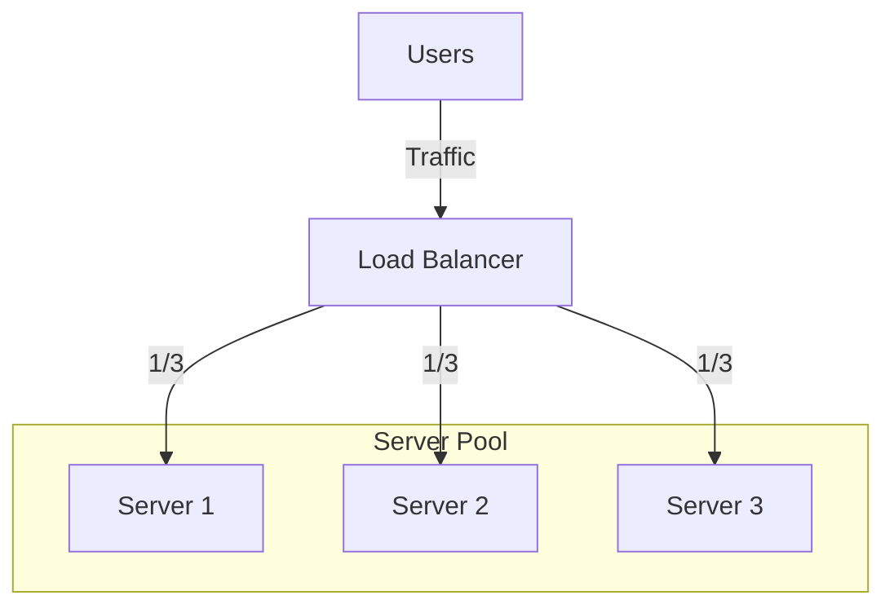

# Load Balancing Fundamentals: Distributing the Weight

## 1. Beginner-friendly Hinglish Explanation 🇮🇳
Bhai, **Load Balancer (LB)** ek "Traffic Police" ki tarah hai. 

Socho ek bohot bada mela (Fair) laga hai aur usme entry ke liye 10 gates hain. Agar sab log ek hi gate par jayenge, toh dhakkam-dhakka ho jayegi aur gate toot jayega. Traffic Police (Load Balancer) har gate par khadi hokar logon ko alag-alag gates par bhejti hai taaki kisi ek gate par load zyada na ho. 
System design mein, LB user ki requests ko multiple servers ke beech baant deta hai taaki aapka app kabhi crash na ho aur hamesha fast chale.

---

## 2. Deep Technical Explanation
A Load Balancer acts as the reverse proxy and distributes network or application traffic across a number of servers.

### Types of Load Balancers
1. **L4 (Transport Layer)**: Acts on IP and Port (TCP/UDP). Very fast but doesn't understand the content of the request.
2. **L7 (Application Layer)**: Acts on HTTP headers, Cookies, and URLs. Slower but "Smarter" (can route `/api` to one group and `/images` to another).
3. **Hardware vs Software**: F5/Citrix (Expensive Hardware) vs Nginx/HAProxy/Envoy (Software).

### Algorithms
- **Round Robin**: Sending requests in a fixed order (1, 2, 3, 1...).
- **Least Connections**: Sending to the server with the fewest active users.
- **IP Hash**: Routing a user based on their IP (Useful for session stickiness).

---

## 3. Architecture Diagrams
**The Load Balancing Layer:**

---

## 4. Scalability Considerations
- **High Availability**: What if the Load Balancer itself fails? (Fix: **Active-Passive** or **Active-Active** LBs using VRRP/Floating IPs).
- **Scalability**: An LB can handle thousands of servers. Cloud LBs (AWS ELB) scale themselves automatically.

---

## 5. Failure Scenarios
- **Health Check Failure**: The LB keeps sending traffic to a server that has crashed. (Fix: **Active Health Checks**).
- **Sticky Session Persistence**: If a server goes down, all users "stuck" to that server lose their sessions.

---

## 6. Tradeoff Analysis
- **L4 vs L7**: L4 is faster (lower latency); L7 is more flexible (smarter routing).
- **Client-side vs Server-side LB**: Client choosing the server (e.g., in gRPC) vs a central proxy.

---

## 7. Reliability Considerations
- **Session Stickiness**: Ensuring a user stays on the same server for the duration of their session.
- **Failover**: Automatically rerouting traffic to healthy servers when one fails.

---

## 8. Security Implications
- **SSL Termination**: The LB decrypts the traffic, offloading work from the app servers.
- **WAF Integration**: Filtering out malicious requests (SQLi/XSS) at the LB level.

---

## 9. Cost Optimization
- **Idle Timeout**: Closing connections quickly to free up resources.
- **SSL Offloading**: Using dedicated chips in hardware LBs or optimized software to save CPU costs on app servers.

---

## 10. Real-world Production Examples
- **AWS ALBs (Application Load Balancers)**: The industry standard for L7 balancing in the cloud.
- **Nginx**: Used by almost everyone as a lightweight software load balancer.
- **Maglev (Google)**: A high-performance distributed load balancer that runs on commodity Linux servers.

---

## 11. Debugging Strategies
- **LB Logs**: Checking which servers are returning 5xx errors.
- **Health Check Logs**: Seeing why a server was marked as "Unhealthy."

---

## 12. Performance Optimization
- **Direct Server Return (DSR)**: Requests go through LB, but responses go directly from Server to Client (to save LB bandwidth).
- **Keep-Alives**: Maintaining open connections between the LB and backend servers.

---

## 13. Common Mistakes
- **No Health Checks**: Sending traffic to "Dead" servers.
- **LB as a Single Point of Failure**: Not having a backup load balancer.
- **Uneven Weights**: Sending equal traffic to a "Small" server and a "Large" server.

---

## 14. Interview Questions
1. What is the difference between L4 and L7 load balancing?
2. How do you load balance a Load Balancer?
3. Explain 'Least Connections' vs 'Round Robin'.

---

## 15. Latest 2026 Architecture Patterns
- **Global Server Load Balancing (GSLB)**: Routing users to the closest data center across the world using Anycast or DNS.
- **Sidecar Load Balancing (Service Mesh)**: Moving load balancing logic into a "Sidecar" proxy (like Envoy) next to each microservice.
- **AI-Predictive Balancing**: Using AI to predict traffic spikes and "Pre-warming" the servers and LB capacity.
