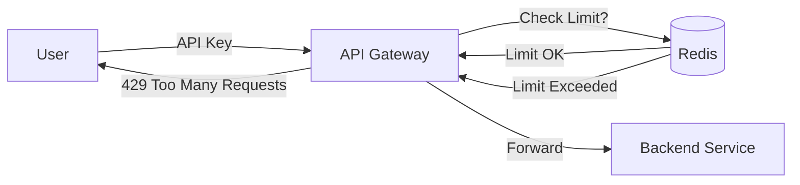

# Rate Limiting and Protection: Defending the Gates

## 1. Beginner-friendly Hinglish Explanation 🇮🇳
Bhai, **Rate Limiting** ka matlab hai "Limit mein rehna." 

Socho ek buffet hai jahan unlimited khana mil raha hai. Kuch log bohot zyada khana barbaad kar rahe hain, jiski wajah se baki logon ko khana nahi mil raha. Manager (Rate Limiter) ne rule banaya: "Ek banda sirf 2 plate le sakta hai." 
System design mein, agar koi "Hacker" ya "Buggy script" aapke server par ek sath 1 million requests bhej dega, toh aapka server crash ho jayega. Rate limiting un requests ko "Block" kar deti hai taaki system "Healthy" rahe.

---

## 2. Deep Technical Explanation
Rate limiting is a strategy for limiting network traffic to prevent service exhaustion and protect against malicious activity.

### Common Algorithms
1. **Token Bucket**: You have a bucket of $N$ tokens. Each request takes a token. Tokens are refilled at a constant rate. (Allows "Bursts").
2. **Leaky Bucket**: Requests enter a bucket and "Leak" (are processed) at a constant rate. (Smoothens traffic).
3. **Fixed Window**: 100 requests per minute. Resets exactly at the start of every minute. (Weakness: Traffic spike at the minute boundary).
4. **Sliding Window Log**: Tracking the exact timestamp of every request. (Most accurate but uses a lot of memory).
5. **Sliding Window Counter**: A memory-efficient version of the sliding window.

### Where to Implement?
- **Client-side**: Self-governing (not reliable for security).
- **Edge (CDN)**: Blocking traffic before it even hits your cloud.
- **API Gateway**: Centralized control for all microservices.
- **Service-side**: Last line of defense inside the application code.

---

## 3. Architecture Diagrams
**Rate Limiting with Redis:**

---

## 4. Scalability Considerations
- **Distributed Rate Limiting**: If you have 10 servers, they must share a central counter (usually in **Redis**) to enforce a "Global" limit.
- **Performance Overhead**: The check must be ultra-fast (<1ms). Using **Lua scripts** in Redis can make the "Check-and-Update" operation atomic and fast.

---

## 5. Failure Scenarios
- **Redis Downtime**: If your rate limiter's database is down, do you "Allow all" (risky) or "Block all" (outage)? (Best practice: **Fail Open** with a local fallback).
- **Race Condition**: Two servers reading the count as `99`, both allowing the request, and then both updating it to `100`, effectively allowing 101 requests.

---

## 6. Tradeoff Analysis
- **Accuracy vs. Performance**: Sliding window is 100% accurate but slow. Fixed window is fast but allows "Bursts" at minute boundaries.
- **User Experience**: Dropping a legitimate user's request vs. allowing a bot to crawl your site.

---

## 7. Reliability Considerations
- **Tiered Limiting**: Different limits for "Free Users" vs "Premium Users."
- **Soft vs Hard Limits**: Notifying a user they are close to the limit vs immediately returning a `429` error.

---

## 8. Security Implications
- **DDoS Protection**: Rate limiting is the #1 defense against Layer 7 DDoS attacks.
- **Brute Force Protection**: Limiting login attempts to 5 per hour per user.
- **IP Reputation**: Blocking or strictly limiting traffic from known "Bad" IP ranges.

---

## 9. Cost Optimization
- **Infrastructure Savings**: Preventing bots and scrapers from wasting your CPU/Bandwidth.
- **SaaS Limiting**: If you use an external API (like OpenAI), rate limiting *your own* users prevents you from getting a massive bill.

---

## 10. Real-world Production Examples
- **Stripe**: Wrote a famous blog post on their 4-layer rate limiting architecture (Token bucket + Redis).
- **GitHub**: Limits public API calls to 60 per hour for unauthenticated users.
- **Google Cloud**: Uses "Quota Management" to prevent users from accidentally starting 1000 expensive GPUs.

---

## 11. Debugging Strategies
- **Retry-After Header**: The server telling the client exactly *when* they can try again.
- **X-RateLimit Headers**: Showing the user their "Remaining" capacity in every response.

---

## 12. Performance Optimization
- **In-memory Local Cache**: Keeping a small part of the counter in the application's RAM to avoid hitting Redis for *every* single request.
- **Bloom Filters**: Quickly checking if a user has *ever* hit the limit before doing a full DB lookup.

---

## 13. Common Mistakes
- **Thundering Herd**: All users retrying at exactly the same time after a rate limit resets. (Fix: **Jitter** in retries).
- **Limit based on IP only**: Blocking an entire office or college because one person was behaving badly (since they share a Public IP).

---

## 14. Interview Questions
1. Design a Rate Limiter for a system with 1 million users.
2. What is the difference between 'Token Bucket' and 'Leaky Bucket'?
3. How do you handle Rate Limiting in a distributed environment?

---

## 15. Latest 2026 Architecture Patterns
- **AI-Native Behavioral Throttling**: Moving from "Fixed numbers" to "Behavioral analysis." If a user's click pattern looks like a human, they get higher limits.
- **Dynamic Quotas**: Systems that automatically increase the rate limit during "Sale events" and lower it during "Maintenance windows."
- **Cryptographic Challenges (POW)**: Instead of a 429 error, the server sends a small mathematical puzzle. If the client solves it (using their CPU), the request is allowed. (Defeats bots but allows humans).
