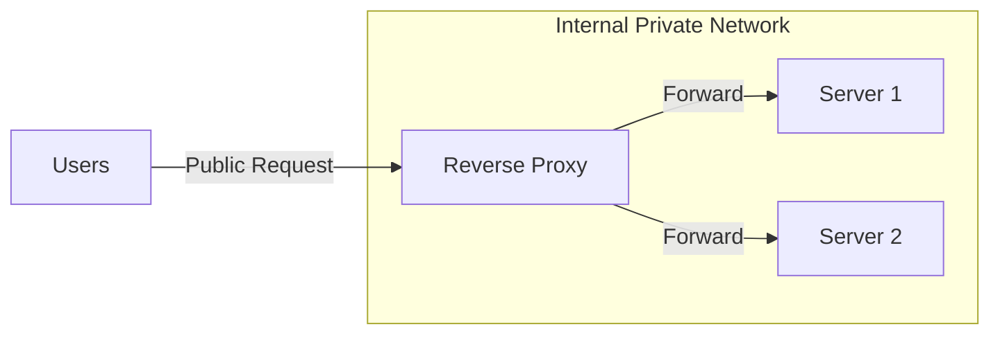

# Reverse Proxies: The Invisible Shield

## 1. Beginner-friendly Hinglish Explanation 🇮🇳
Bhai, **Reverse Proxy** ek "Personal Assistant (PA)" ki tarah hai. 

Jab koi bada celebrity (Server) hota hai, toh aap usse direct nahi milte. Aap pehle uske PA (Reverse Proxy) se milte ho. PA decide karta hai ki aapko milne dena hai ya nahi, aapka message celebrity tak pahunchata hai, aur celebrity ka jawab aapko wapas deta hai. 
System design mein, Reverse Proxy users aur servers ke beech khada hota hai. Iska kaam hai security dena, load balance karna, aur "Caching" ke zariye system ko fast banana.

---

## 2. Deep Technical Explanation
A reverse proxy is a server that sits in front of web servers and forwards client requests to those web servers.

### Reverse Proxy vs. Forward Proxy
- **Forward Proxy**: Protects the **Client** (e.g., a VPN used by a student to access blocked sites).
- **Reverse Proxy**: Protects the **Server** (e.g., Nginx in front of a Node.js app).

### Core Functions
1. **Security**: Hides the IP and identity of the backend servers.
2. **SSL Termination**: Handles the heavy work of HTTPS decryption.
3. **Caching**: Stores copies of static content (images/HTML) to serve them faster.
4. **Compression**: Zips the data before sending it to the user.
5. **A/B Testing**: Sending 10% of users to a new version of the site.

---

## 3. Architecture Diagrams
**Reverse Proxy Layout:**

---

## 4. Scalability Considerations
- **Resource Usage**: A reverse proxy like Nginx can handle 10,000+ connections with very little RAM because it uses an "Asynchronous" event-driven model.
- **Horizontal Scaling**: You can have multiple reverse proxies and balance traffic between them using DNS (Round Robin).

---

## 5. Failure Scenarios
- **Backend Timeouts**: The proxy waits too long for a slow server and eventually returns a `504 Gateway Timeout`.
- **Misconfiguration**: A small typo in the proxy config can leak internal server IPs or crash the entire site.

---

## 6. Tradeoff Analysis
- **Latency vs Security**: Adding a proxy adds a small delay (1-5ms) but significantly increases security.
- **Complexity vs Benefits**: Managing Nginx/Envoy is an extra task, but it saves the app developers from writing Auth/SSL code.

---

## 7. Reliability Considerations
- **Active Health Checks**: The proxy should ping backend servers and stop sending traffic to the ones that are slow or down.
- **Retries**: If Server 1 fails, the proxy can automatically try Server 2 before giving up.

---

## 8. Security Implications
- **DDoS Mitigation**: The proxy can drop "Bad" requests before they even touch the expensive database-heavy backend servers.
- **Header Sanitization**: Removing dangerous headers (like `Server: PHP/5.4`) to prevent hackers from knowing your tech stack.

---

## 9. Cost Optimization
- **Caching**: Serving data from the proxy's memory is 100x cheaper than fetching it from a database.
- **SSL Offloading**: Centralizing SSL on the proxy allows you to use cheaper, lower-CPU backend servers.

---

## 10. Real-world Production Examples
- **Nginx**: The most popular reverse proxy in the world.
- **HAProxy**: Known for extreme performance and high-availability load balancing.
- **Envoy Proxy**: Built by Lyft, used extensively in modern cloud-native (Kubernetes) environments.

---

## 11. Debugging Strategies
- **Access Logs**: Seeing every request that came in and where it was sent.
- **Upstream Logs**: Checking which specific backend server is being "Slow."

---

## 12. Performance Optimization
- **Gzip / Brotli**: Compressing data at the proxy level.
- **HTTP/2 & HTTP/3**: Implementing modern protocols at the proxy so even "Old" backend servers get the benefit.

---

## 13. Common Mistakes
- **Exposing Backends Directly**: Not having a firewall to prevent people from bypassing the proxy and hitting the server IP directly.
- **No Connection Limits**: Letting one user open 1000 connections to the proxy, causing it to run out of file descriptors.

---

## 14. Interview Questions
1. What is the difference between a Forward Proxy and a Reverse Proxy?
2. How does a Reverse Proxy help in a Microservices architecture?
3. What is 'SSL Termination' and why is it useful?

---

## 15. Latest 2026 Architecture Patterns
- **Programmable Proxies (Wasm)**: Using WebAssembly to write custom logic (like Auth or dynamic routing) directly inside the proxy at C++ speeds.
- **Edge Proxies**: Moving the reverse proxy logic to the CDN edge (e.g., Cloudflare Workers) so it's even closer to the user.
- **Mesh Proxies**: Every microservice having its own "Sidecar" reverse proxy for deep observability and security.
