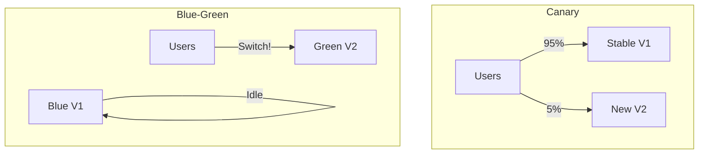

# Traffic Routing Strategies: Directing the Flow

## 1. Beginner-friendly Hinglish Explanation 🇮🇳
Bhai, **Traffic Routing** ka matlab hai "Gadiyon ko sahi mod par bhejna." 

Socho ek bohot badi sadak hai aur aage do raste hain—ek highway hai aur ek gully. 
- **Blue-Green**: Nayi sadak ban gayi hai, ab saari gadiyon ko purani se nayi sadak par bhej do. 
- **Canary**: Nayi sadak kachi hai, toh pehle sirf 5% gadiyon ko wahan bhejo dekhne ke liye ki wo toot toh nahi rahi. 
- **A/B Testing**: Aadhe logon ko "Lal" raste se bhejo aur aadhe ko "Nile" raste se, aur dekho kaunsa rasta logon ko zyada pasand aaya. 
System design mein, routing decide karti hai ki kaunsi request kis version ya kis location par jayegi.

---

## 2. Deep Technical Explanation
Traffic routing is the method of directing user requests to specific instances or versions of an application.

### Major Routing Strategies
1. **Blue-Green Deployment**: Two identical environments (Blue is old, Green is new). Traffic is switched 100% from Blue to Green after testing.
2. **Canary Deployment**: Slowly rolling out a change to a small subset of users (5% -> 25% -> 100%). If errors spike, you roll back immediately.
3. **A/B Testing**: Routing based on user properties (e.g., "Users from India" see version A).
4. **Shadow / Mirror Traffic**: Sending production traffic to a new version but *ignoring* its result. This is used to test performance without affecting real users.
5. **Sticky Sessions**: Routing the same user to the same server to maintain state.

---

## 3. Architecture Diagrams
**Canary vs Blue-Green:**

---

## 4. Scalability Considerations
- **Global Routing**: Routing users to the closest data center (US vs India) to reduce latency and scale globally.
- **Dynamic Routing**: Using a Service Mesh to route traffic based on real-time server health.

---

## 5. Failure Scenarios
- **Deployment Spike**: Switching 100% traffic (Blue-Green) and realizing the new version has a memory leak that crashes it after 5 minutes.
- **Inconsistent UX**: A user seeing "Old" UI on their phone but "New" UI on their laptop because routing is not synced.

---

## 6. Tradeoff Analysis
- **Blue-Green vs Canary**: Blue-Green is faster but riskier. Canary is safer but takes much longer to complete.
- **Mirroring vs Testing**: Mirroring is safe but uses double the resources (Costly).

---

## 7. Reliability Considerations
- **Automatic Rollback**: If the "Error Rate" in the Canary version goes above 1%, the routing should automatically switch back to the Stable version.
- **Database Compatibility**: Ensure that the new version can read/write to the old database schema during a rollout.

---

## 8. Security Implications
- **Header Injection**: Routing based on headers that could be forged by a user (e.g., `X-User-Role: Admin`).
- **Internal Traffic Exposure**: Ensuring that traffic routed between versions is encrypted and authenticated.

---

## 9. Cost Optimization
- **Infrastructure Overhead**: Blue-Green requires double the servers during a deployment. Scaling down the "Idle" environment quickly is essential for saving money.

---

## 10. Real-world Production Examples
- **Netflix**: Uses "Canary Analysis" (Kayenta) to automatically judge if a new version is safe.
- **Facebook**: Uses "Feature Flags" and "Gatekeeper" to roll out features to 1% of users.
- **Stripe**: Uses "Shadow Traffic" to test new versions of their critical payment processing logic.

---

## 11. Debugging Strategies
- **Version Headers**: Adding a `X-App-Version` header to every response so you know which version a user hit.
- **Routing Metrics**: Comparing the latency of V1 vs V2 in real-time.

---

## 12. Performance Optimization
- **Consistent Hashing**: Using a hash of the `UserID` to ensure a user always goes to the same "Canary" version for a consistent experience.
- **Edge Routing**: Making routing decisions at the CDN level (like Cloudflare) to avoid hitting the origin.

---

## 13. Common Mistakes
- **No Rollback Plan**: Deploying a change and realizing you have no easy way to switch the traffic back.
- **Ignoring Database Migrations**: A new version of code that is incompatible with the existing database, causing a total crash during the 50/50 split.

---

## 14. Interview Questions
1. What is the difference between a Canary Deployment and A/B Testing?
2. How do you handle database schema changes in a Blue-Green deployment?
3. What is 'Shadow Traffic' and when would you use it?

---

## 15. Latest 2026 Architecture Patterns
- **AI-Managed Rollouts**: AI that analyzes thousands of metrics (CPU, Latency, Error logs) and decides to "Stop" or "Accelerate" a Canary rollout autonomously.
- **Multi-Cloud Failover Routing**: Automatically routing traffic to Google Cloud if AWS experiences a regional outage.
- **Serverless Versioning**: Using "Lambda Aliases" to handle complex traffic splits between different versions of serverless functions.
