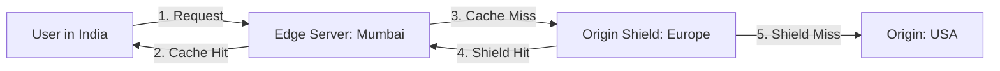

# CDN and Edge Caching: Caching at the Edge of the World

## 1. Beginner-friendly Hinglish Explanation 🇮🇳
Bhai, **CDN (Content Delivery Network)** caching ka matlab hai "Data ko user ke ghar ke paas pahunchana." 

Socho aapka main office (Origin Server) America mein hai. Jab India ka user aapki website kholta hai, toh data ko samundar paar karke aane mein bahut time lagta hai. **Edge Caching** mein hum data (images, videos) ko India ke "Local Servers" (Edge Nodes) par store kar dete hain. Ab user ko data 300ms ke bajaye sirf 20ms mein mil jata hai. Isse aapki website "Chitkiyon mein" khulti hai.

---

## 2. Deep Technical Explanation
Edge caching moves the cache layer from the data center to the network edge, closer to the users.

### Core Concepts
- **Edge Node (PoP)**: Points of Presence located in ISPs and IXPs around the world.
- **Origin Shield**: An intermediate cache layer that protects the origin from redundant requests from multiple edge nodes.
- **TTL (Time to Live)**: Controlled by `Cache-Control` headers.

### What to Cache?
- **Static Assets**: Images, CSS, JS, Fonts.
- **Media**: Video chunks (HLS/DASH).
- **Semi-Dynamic**: Search results or product lists that change every few minutes.

---

## 3. Architecture Diagrams
**Edge Caching Flow:**

---

## 4. Scalability Considerations
- **Global Reach**: CDNs like Cloudflare or Akamai have thousands of PoPs, allowing you to scale to billions of users without adding a single server to your data center.
- **Cache Hit Ratio (CHR)**: The primary metric. If CHR is 95%, only 5% of traffic hits your origin.

---

## 5. Failure Scenarios
- **Origin Timeout**: If the origin is down or slow, the CDN will eventually stop trying and return a `502 Bad Gateway` or `504 Gateway Timeout`.
- **Cache Poisoning**: Malicious headers or content being cached at the edge and served to millions of users.

---

## 6. Tradeoff Analysis
- **Latency vs. Cost**: Premium CDNs are faster but cost more per GB.
- **Dynamic vs. Static**: Caching dynamic content requires complex "Bypass" rules or "Edge Computing" (Lambda@Edge).

---

## 7. Reliability Considerations
- **Failover**: If the Primary Origin is down, the CDN can automatically pull from a Secondary (Backup) Origin.
- **Stale-While-Revalidate**: Serving an old version of a file while the CDN fetches the new one in the background to ensure zero latency.

---

## 8. Security Implications
- **DDoS Mitigation**: CDNs absorb massive attacks at the edge, preventing them from reaching your origin.
- **TLS at the Edge**: Managing SSL certificates globally.
- **Bot Management**: Blocking scrapers and bad bots at the entry point.

---

## 9. Cost Optimization
- **Brotli/Gzip Compression**: Reducing the size of files at the edge to save on egress bandwidth costs.
- **Tiered Caching**: Using "Origin Shielding" to reduce the number of requests that actually reach your expensive cloud origin.

---

## 10. Real-world Production Examples
- **YouTube**: Every popular video is cached on an "Edge Node" inside your ISP's building.
- **Disney+**: Uses multi-CDN strategies to deliver high-quality 4K video globally.
- **Cloudflare**: A pioneer in moving "Logic" to the edge via Workers.

---

## 11. Debugging Strategies
- **Request Headers**: Looking for `CF-Cache-Status` or `X-Cache: HIT`.
- **Edge Trace**: Using tools to see the path a request took through the CDN network.

---

## 12. Performance Optimization
- **Image Resizing at Edge**: Automatically serving a smaller image to a mobile user vs a high-res image to a desktop user.
- **HTTP/3 (QUIC)**: Implementing modern protocols at the edge to make mobile connections faster.

---

## 13. Common Mistakes
- **No Purge Strategy**: Updating your site but users still seeing the old version for days.
- **Caching Private URLs**: Accidentally caching a URL that contains a private session token or personal info.

---

## 14. Interview Questions
1. How does a CDN handle dynamic content?
2. What is an 'Origin Shield' and why is it useful?
3. What are the 'Cache-Control' headers and what do they do?

---

## 15. Latest 2026 Architecture Patterns
- **Serverless Edge (Wasm)**: Running entire backend apps on the CDN nodes using WebAssembly for near-zero latency.
- **AI-Managed Pre-warming**: AI predicting which assets will be needed in which region and pre-loading them.
- **Edge Data Stores**: Storing and syncing small bits of state (like user preferences) globally at the edge without a central DB.
