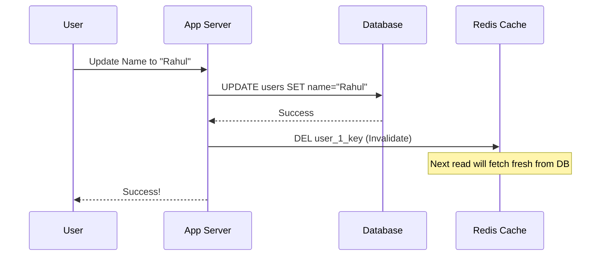

# Cache Invalidation: The Hardest Problem in Computer Science

## 1. Beginner-friendly Hinglish Explanation 🇮🇳
Bhai, **Cache Invalidation** ka matlab hai "Purani yaaddaasht ko mitana." 

Socho aapne apni mom ka birthday yaad kar liya: "10th May." Lekin baad mein pata chala ki unka asli birthday "12th May" hai. Agar aapne purani date nahi bhulayi aur wahi yaad rakhi, toh bada panga ho jayega. 
System design mein, jab Database mein data update hota hai, toh humein purane "Cached data" ko bhi delete ya update karna padta hai. Agar hum ye karna bhul gaye, toh user ko purana (stale) data dikhta rahega. Isse "Consistency" bigad jati hai.

---

## 2. Deep Technical Explanation
There are two hard things in Computer Science: cache invalidation and naming things.

### Why is it Hard?
In a distributed system, updates happen constantly. Keeping the cache perfectly synced with the database requires either complex coordination (slow) or accepting some staleness (risky).

### Strategies
1. **TTL (Time to Live)**: The simplest way. Set an expiration time (e.g., 5 mins). Data is eventually consistent.
2. **Purge (Explicit Invalidation)**: When data changes in the DB, the application explicitly sends a "DELETE" command to the cache for that key.
3. **Write-through Cache**: Update the cache and the DB in the same transaction.
4. **Cache-aside (Lazy Loading)**: Let the cache expire naturally or delete it manually when the DB changes.
5. **Change Data Capture (CDC)**: A system monitors the DB's transaction logs and automatically updates the cache in real-time.

---

## 3. Architecture Diagrams
**Invalidation via Pub/Sub:**

---

## 4. Scalability Considerations
- **Fan-out Invalidation**: If you have 100 edge nodes (CDNs), invalidating a file on all of them simultaneously is a massive distributed challenge.
- **In-memory L1 Caches**: Invalidation is hardest when each app server has its own local cache that isn't shared.

---

## 5. Failure Scenarios
- **Race Condition**: 
    1. Server A reads from DB (Rahul).
    2. Server B updates DB (Zoya) and deletes Cache.
    3. Server A (with old data) writes "Rahul" back to the cache. 
    Now the cache has "Rahul" but DB has "Zoya."

---

## 6. Tradeoff Analysis
- **Consistency vs. Performance**: Deleting cache on every write ensures consistency but reduces performance (more cache misses).
- **TTL vs. Real-time**: Short TTL is safer but hits the DB more often. Long TTL is faster but riskier.

---

## 7. Reliability Considerations
- **Transactional Consistency**: If the DB update succeeds but the cache deletion fails, your system is in a "Broken" state. Use a **Message Queue** to retry the deletion.

---

## 8. Security Implications
- **Privacy Leak**: A user updates their "Private" status to "Hidden," but the cache still shows them as "Public" for 10 more minutes.

---

## 9. Cost Optimization
- **Predictive TTL**: Using shorter TTLs for data that changes often and longer TTLs for static data (like a country list).

---

## 10. Real-world Production Examples
- **Cloudflare**: They allow you to "Purge by Tag," which is a very efficient way to invalidate groups of related files.
- **Debezium**: A popular open-source tool for **Change Data Capture (CDC)** that helps keep caches and databases in sync.

---

## 11. Debugging Strategies
- **Cache Tags**: Grouping keys together so you can see if an entire "Set" was invalidated correctly.
- **Logging Invalidation Events**: Tracking every time a key is deleted to find why a user is seeing old data.

---

## 12. Performance Optimization
- **Versioning**: Instead of deleting `image.jpg`, you upload `image_v2.jpg`. This avoids invalidation altogether and is 100% safe for CDNs.
- **Soft Invalidation**: Marking data as "Stale" but still serving it to the user while fetching the new version in the background (**Stale-While-Revalidate**).

---

## 13. Common Mistakes
- **No TTL**: Assuming your invalidation logic will always work. (It will fail eventually—always have a TTL as a safety net!).
- **Incorrect Key Naming**: Deleting the wrong key because of a naming conflict.

---

## 14. Interview Questions
1. Why is cache invalidation considered so difficult?
2. Explain 'Write-through' vs 'Write-back' caching.
3. How would you handle a race condition during cache invalidation?

---

## 15. Latest 2026 Architecture Patterns
- **AI-Predicted Invalidation**: AI that monitors "Write patterns" and proactively clears the cache before the data is even officially updated in the DB.
- **Distributed Shared Memory (DSM)**: New hardware that makes all servers share the same physical RAM, making invalidation as fast as a single-node system.
- **Stateful Edge Invalidation**: Using **Durable Objects** (Cloudflare) to maintain a single source of truth for cache state globally.
