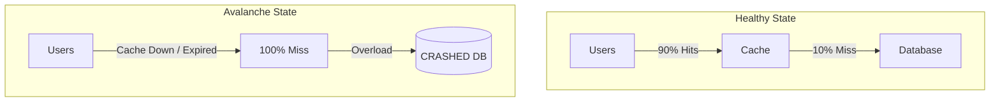

# Caching Failure Modes: When the Cache Breaks

## 1. Beginner-friendly Hinglish Explanation 🇮🇳
Bhai, caching "Jaadu" lagta hai jab tak wo sahi chalta hai, lekin jab ye fail hota hai, toh pura system "Tash ke patton" (House of cards) ki tarah gir sakta hai. 

Socho aapka system ek "Inhaler" par zinda hai. Cache wo inhaler hai. 
- **Cache Avalanche**: Sab keys ek sath expire ho gayi, ab DB par itna load aya ki DB hi "Behosh" ho gaya. 
- **Cache Penetration**: Ek banda wo mang raha hai jo hai hi nahi, aur aap baar-baar DB check kar rahe ho. 
- **Cache Stampede**: Ek bohot "Hote" key expire hui, aur 1000 servers ne ek sath DB ko call kiya wahi key dobara banane ke liye. 
In failure modes ko samajhna system ko "Resilient" banane ke liye zaruri hai.

---

## 2. Deep Technical Explanation
Caching failures can be catastrophic because databases are usually not sized to handle the "Full Load" that the cache usually absorbs.

### 1. Cache Avalanche
Occurs when a large number of cached items expire at the exact same time, or the cache service itself goes down.
- **Result**: Massive spike in DB load.
- **Fix**: Add a **Random Jitter** to TTLs (e.g., 5 mins + random 0-30 seconds) so they expire at different times.

### 2. Cache Penetration
Occurs when a request is made for a key that exists neither in the cache nor in the database.
- **Result**: Every request hits the DB.
- **Fix**: Cache the "Null" result for a short time, or use a **Bloom Filter** to quickly check if the key is valid.

### 3. Cache Stampede (Thundering Herd)
Occurs when a very popular key (e.g., a viral post) expires, and hundreds of app servers try to re-generate it at the same time.
- **Result**: Multiple redundant (and expensive) DB queries.
- **Fix**: Use **Locking/Promises** so only one server fetches the data while others wait, or "Pre-warm" the cache before the key expires.

---

## 3. Architecture Diagrams
**Cache Avalanche Scenario:**

---

## 4. Scalability Considerations
- **Blast Radius**: The larger your cache, the bigger the disaster if it fails.
- **Circuit Breakers**: Essential for protecting the DB during a cache failure.

---

## 5. Failure Scenarios
- **Cold Start**: Starting a brand new cache cluster with zero data. The first 10 minutes will be very slow as the cache "Warms up" from the DB.

---

## 6. Tradeoff Analysis
- **Complexity vs. Resilience**: Implementing Bloom filters and locking adds complexity but is the only way to survive massive traffic spikes.
- **Freshness vs. Safety**: Longer TTLs reduce avalanche risk but increase the risk of stale data.

---

## 7. Reliability Considerations
- **Fail-Open vs. Fail-Closed**: If Redis is down, do you allow requests to hit the DB?
- **Distributed Locks**: Using Redis itself (via Redlock) to ensure only one worker re-populates a "Hot" key.

---

## 8. Security Implications
- **Denial of Service (DoS)**: An attacker purposefully triggering "Cache Penetration" by requesting millions of non-existent IDs.

---

## 9. Cost Optimization
- **Monitoring Cache Hit Ratio**: If it drops below 80%, you are wasting money on the cache layer and potentially over-stressing your DB.

---

## 10. Real-world Production Examples
- **Facebook**: Had a massive outage in 2010 caused by a feedback loop between their cache and database during a configuration change.
- **Instagram**: Uses "Lease-based" caching to prevent stampedes.

---

## 11. Debugging Strategies
- **Tracing Cache Misses**: Seeing which specific keys are missing most often.
- **DB Connection Monitoring**: Seeing if DB connections spike exactly when the cache hit ratio drops.

---

## 12. Performance Optimization
- **Jitter in TTL**: `ttl = base_ttl + random.uniform(0, max_jitter)`.
- **Probabilistic Early Recomputation**: Re-calculating the cache value *just before* it expires based on a probability function.

---

## 13. Common Mistakes
- **No TTL Jitter**: Setting "All product pages expire in exactly 24 hours."
- **Over-reliance on Cache**: Building a system where the DB *cannot* survive even 10% of the normal traffic.

---

## 14. Interview Questions
1. How do you prevent a 'Cache Stampede'?
2. What is a 'Bloom Filter' and how does it help with 'Cache Penetration'?
3. Explain 'Cache Avalanche' and give two ways to mitigate it.

---

## 15. Latest 2026 Architecture Patterns
- **AI-Managed TTL Jitter**: AI that dynamically adjusts the "Jitter" based on real-time DB load.
- **Edge-native Bloom Filters**: Implementing penetration protection at the CDN level using Wasm.
- **Zero-downtime Cache Resizing**: Dynamically adding memory to Redis without losing a single key.
	
