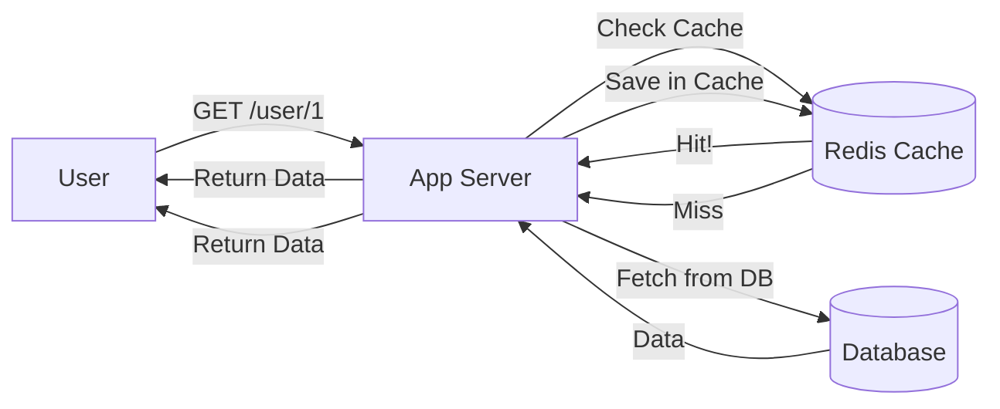

# Caching Fundamentals: The Power of RAM

## 1. Beginner-friendly Hinglish Explanation 🇮🇳
Bhai, **Caching** ka matlab hai "Yaaddaasht (Memory)." 

Socho aapse kisi ne pucha: "India ka PM kaun hai?" Aapne turant jawab diya. Kyun? Kyunki ye aapke dimaag (Cache) mein hai. Agar aapko ye baat Google (Database) par search karni padti, toh time zyada lagta. 
System design mein, hum expensive aur slow queries ka result "Fast RAM" (like Redis) mein save kar lete hain. Jab agli baar wahi request aati hai, toh hum Database tak nahi jaate, balki RAM se hi jawab de dete hain. Isse system fast hota hai aur DB par load kam hota hai.

---

## 2. Deep Technical Explanation
Caching is the process of storing copies of data in a temporary storage location (cache) so that future requests for that data can be served faster.

### The Caching Layers
1. **Client-side (Browser)**: HTML, CSS, JS stored in the user's computer.
2. **CDN (Edge)**: Images and static assets stored in servers close to the user.
3. **Web / Proxy Cache**: Nginx caching a full HTML page.
4. **Application Cache (L1/L2)**: Caching data in the app's local RAM.
5. **Distributed Cache (L3)**: Redis or Memcached shared by all servers.
6. **Database Cache**: The DB's internal buffer pool.

### Key Metrics
- **Cache Hit**: Data was found in the cache. (Fast!).
- **Cache Miss**: Data was not found; had to go to the DB. (Slow).
- **Cache Hit Ratio**: (Hits) / (Hits + Misses). Higher is better.

---

## 3. Architecture Diagrams
**Typical Caching Flow:**

---

## 4. Scalability Considerations
- **Scalability Through Caching**: Caching can handle 100x more traffic than a raw Database. It's often the cheapest way to scale.
- **Hotspots**: One specific key (e.g., a viral video) being requested 1 million times a second, overwhelming a single Redis node.

---

## 5. Failure Scenarios
- **Cache Avalanche**: Many keys expiring at the exact same time, causing 100% of traffic to hit the Database at once and crashing it.
- **Cache Penetration**: A hacker requesting data that *never* exists (like `user_id: -999`), forcing the system to hit the DB every time.

---

## 6. Tradeoff Analysis
- **Latency vs. Freshness**: Caching is fast but can show "Old" data if the DB was updated but the cache wasn't.
- **Cost vs. Performance**: RAM is 100x more expensive than Disk. You must decide what is "Worth" caching.

---

## 7. Reliability Considerations
- **Eviction Policies**: What happens when the cache is full?
    - **LRU (Least Recently Used)**: Delete the oldest data. (Most common).
    - **LFU (Least Frequently Used)**: Delete the least popular data.
    - **FIFO (First In First Out)**: Delete whatever came first.

---

## 8. Security Implications
- **Sensitive Data in Cache**: Never cache a user's password, bank details, or PII (Personally Identifiable Information) in a shared cache without encryption.
- **Cache Poisoning**: Malicious data being injected into the cache.

---

## 9. Cost Optimization
- **Cache Warming**: Pre-loading the cache with "Popular" data before the site goes live (e.g., before a big sale starts).
- **Tiered Caching**: Using cheap RAM for less critical data.

---

## 10. Real-world Production Examples
- **Twitter**: Uses a massive Redis cluster to store your "Timeline" so it loads instantly.
- **Facebook (McRouter)**: They created a specialized proxy just to manage their millions of Memcached nodes.
- **Stack Overflow**: Caches almost everything in local RAM, allowing them to run on very few servers.

---

## 11. Debugging Strategies
- **Redis CLI**: Using `MONITOR` or `KEYS *` to see what is happening in the cache in real-time.
- **Latency Tracking**: Measuring how long it takes to talk to the cache vs the database.

---

## 12. Performance Optimization
- **Object Serialization**: Using binary formats (like Protobuf) instead of JSON for the cache to save memory and parsing time.
- **Local In-memory Cache**: Keeping the top 100 "Hottest" keys in the app's local RAM to avoid even a network call to Redis.

---

## 13. Common Mistakes
- **Caching Everything**: Using up all your RAM for data that is only accessed once a month.
- **No TTL (Time to Live)**: Forgetting to set an expiration time, leading to data that stays "Old" forever.

---

## 14. Interview Questions
1. What is the difference between Redis and Memcached?
2. Explain 'Cache Avalanche' and how to prevent it.
3. How do you handle 'Cache Invalidation'? (It's one of the 2 hardest things in CS!).

---

## 15. Latest 2026 Architecture Patterns
- **AI-Managed TTL**: AI that predicts when a specific data point will change and sets the expiration time dynamically.
- **Persistent Memory (PMEM)**: Using hardware that is as fast as RAM but doesn't lose data when the power goes out, making "Cache Warming" unnecessary.
- **Global Edge Caching**: Caching database results at the CDN level (like Cloudflare KV) to provide <50ms response times globally.
