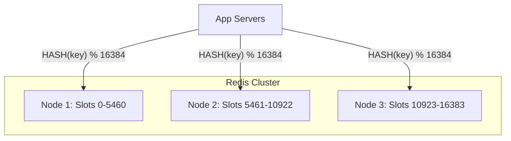

# Redis and Distributed Caching: Scaling the Memory Layer

## 1. Beginner-friendly Hinglish Explanation 🇮🇳
Bhai, **Redis** distributed caching ka "King" hai. 

Socho aapke paas 10 servers hain. Agar har server apna alag cache rakhega, toh data "Inconsistent" ho jayega (Server 1 par purana data, Server 2 par naya). **Distributed Caching** mein hum ek central, super-fast "Data Store" (Redis) banate hain jise saare servers share karte hain. Redis sirf cache nahi hai, ye ek "Data Structure Store" hai jisme aap Lists, Sets, aur Maps bhi save kar sakte ho.

---

## 2. Deep Technical Explanation
Redis (Remote Dictionary Server) is an open-source, in-memory data structure store used as a database, cache, and message broker.

### Why Redis?
- **Speed**: Operations are performed in RAM (<1ms latency).
- **Data Structures**: Supports Strings, Hashes, Lists, Sets, Sorted Sets, Bitmaps, and HyperLogLogs.
- **Persistence**: Unlike Memcached, Redis can save data to disk (RDB/AOF).
- **Pub/Sub**: Built-in support for real-time messaging.

### Distributed Caching Patterns
- **Redis Sentinel**: Provides high availability (monitoring, notification, automatic failover).
- **Redis Cluster**: Provides horizontal scalability by automatically sharding data across multiple nodes.

---

## 3. Architecture Diagrams
**Redis Cluster Sharding:**

---

## 4. Scalability Considerations
- **Sharding**: Redis uses "Hash Slots" (16,384 slots) to distribute keys across the cluster.
- **Read Replicas**: You can scale read traffic by adding slave nodes to each master.

---

## 5. Failure Scenarios
- **Master Node Failure**: Sentinel must detect the failure and promote a slave to master. During this time (seconds), the cluster might be read-only or unavailable.
- **Memory Fragmentation**: Redis uses memory efficiently, but over time, fragmentation can cause it to use more RAM than it actually needs.

---

## 6. Tradeoff Analysis
- **Redis vs. Memcached**: Redis is more powerful (complex data types, persistence); Memcached is simpler and sometimes faster for raw string storage.
- **Persistence vs. Speed**: Turning on AOF (Append Only File) persistence increases safety but slightly reduces performance.

---

## 7. Reliability Considerations
- **Replication**: Asynchronous replication to slaves.
- **Persistence Modes**:
    - **RDB (Snapshotting)**: Point-in-time snapshots (Fastest recovery, potential data loss).
    - **AOF**: Log of every write (Slowest recovery, no data loss).

---

## 8. Security Implications
- **No Default Password**: Historically, Redis had no password. Always enable `requirepass` and use **mTLS**.
- **Internal Only**: Never expose Redis to the public internet. Use a private VPC.

---

## 9. Cost Optimization
- **Eviction Strategy**: Using `allkeys-lru` to ensure the most important data stays in the expensive RAM.
- **Data Compression**: Compressing large values (like big JSON blobs) before storing them in Redis to save memory.

---

## 10. Real-world Production Examples
- **Twitter**: Stores every user's "Home Timeline" as a **Redis List** for instant scrolling.
- **Instagram**: Uses Redis Sorted Sets to manage their "Activity Feed."
- **GitHub**: Uses Redis to store session data and background job queues (Resque).

---

## 11. Debugging Strategies
- **Slowlog**: A command (`SLOWLOG GET`) that shows you which operations are taking too long.
- **INFO Command**: Provides a massive dump of stats (Memory usage, connected clients, CPU, etc.).

---

## 12. Performance Optimization
- **Pipelines**: Sending multiple commands in a single network request to save on Round-Trip Time (RTT).
- **Lua Scripting**: Running complex logic inside Redis so you don't have to move data back and forth to the app server.

---

## 13. Common Mistakes
- **Using 'KEYS *'**: This is a blocking command. Running it on a large production database will freeze the entire system. (Use `SCAN` instead!).
- **Storing Massive Blobs**: Putting a 50MB image in Redis. Redis is optimized for small, fast objects.

---

## 14. Interview Questions
1. How does Redis Cluster handle sharding?
2. What is the difference between RDB and AOF persistence?
3. Explain how you would use Redis to implement a 'Global Rate Limiter'.

---

## 15. Latest 2026 Architecture Patterns
- **Multi-threaded Redis (Redis 7+)**: Finally using multiple cores for I/O and deletion while keeping the core command execution single-threaded for safety.
- **Redis over NVMe**: Using new SSD technologies to extend Redis memory capacity to Terabytes with only 10% performance loss.
- **Vector Search in Redis**: Using **RedisVL** to store and search AI embeddings (Vector search) directly in the cache layer.
	
