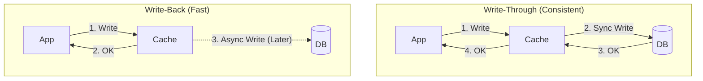

# Write-Through vs. Write-Back: Choosing Your Cache Strategy

## 1. Beginner-friendly Hinglish Explanation 🇮🇳
Bhai, ye do tarike hain data ko "Save" karne ke jab aap cache use kar rahe ho. 

- **Write-Through**: Ye aisa hai ki aapne ek book likhi aur turant uski copy "Library" (Cache) mein bhi rakh di aur "Main Store" (DB) mein bhi. Isme time thoda zyada lagta hai par aap hamesha "Safe" rehte ho—cache aur DB hamesha ek jaise rehte hain. 
- **Write-Back (Write-Behind)**: Ye thoda "Lazy" hai. Aapne sirf "Library" (Cache) mein book rakhi aur bhul gaye. Library wala banda baad mein (e.g., raat ko) saari books "Main Store" mein dal dega. Ye bohot fast hai lekin risky hai—agar raat ko library mein aag lag gayi, toh wo books kabhi store tak nahi pahunchengi (Data Loss).

---

## 2. Deep Technical Explanation
The write strategy defines how data is persisted across the caching layer and the primary data store.

### Write-Through
1. Application writes data to the cache.
2. Cache immediately writes data to the database.
3. Once the DB confirms, the application gets a "Success" response.
- **Pros**: Strong consistency, no data loss if the cache crashes.
- **Cons**: High latency (must wait for DB).

### Write-Back (Write-Behind)
1. Application writes data to the cache.
2. Application immediately gets a "Success" response.
3. Data is synced to the database asynchronously (after a delay or in batches).
- **Pros**: Ultra-low latency, handles massive write spikes.
- **Cons**: Risk of data loss if the cache node fails before syncing to the DB.

### Write-Around
Data is written directly to the DB, bypassing the cache. The cache is only updated during the first "Read."
- **Pros**: Prevents the cache from being "Flooded" with data that might never be read again.
- **Cons**: The first read will always be a "Cache Miss" (Slow).

---

## 3. Architecture Diagrams
**Write-Through vs Write-Back:**

---

## 4. Scalability Considerations
- **Write-Back is King for Scale**: If your app handles 100,000 writes/second (like a game or high-traffic counter), Write-Back is the only way to avoid crashing your Database.

---

## 5. Failure Scenarios
- **Write-Back Data Loss**: The Redis node crashes before it can flush its memory to MySQL. The user thinks their data was saved, but it's gone forever. (Fix: **Replication** and **Persistence**).

---

## 6. Tradeoff Analysis
- **Latency vs. Durability**: Do you want it "Now" (Write-back) or do you want it "Safe" (Write-through)?
- **DB Load**: Write-back reduces DB load by "Batching" updates (e.g., updating a Like count once every 1000 likes instead of 1000 times).

---

## 7. Reliability Considerations
- **Transactional Safety**: In Write-through, use a transaction to ensure both Cache and DB are updated or neither is.
- **Acknowledgement (Ack)**: In Write-back, the worker must successfully "Ack" the message only after the DB write is confirmed.

---

## 8. Security Implications
- **Inconsistent State**: An admin revokes a user's access (Write-back), but the user can still use the app for 30 seconds because the "Access Revoked" flag hasn't reached the DB yet.

---

## 9. Cost Optimization
- **Reducing DB IOPS**: Write-back significantly reduces the number of expensive "Write operations" on your Database, saving thousands of dollars in cloud costs.

---

## 10. Real-world Production Examples
- **Operating Systems**: Use Write-back caching for disk writes (why you should "Safely Remove" a USB drive).
- **Gaming Leaderboards**: Use Write-back to handle millions of score updates per second.
- **Banking Systems**: ALWAYS use Write-through (or direct DB writes) because they cannot afford to lose even 1 cent.

---

## 11. Debugging Strategies
- **Dirty Bit Monitoring**: Checking how much data in the cache is "Dirty" (not yet synced to the DB).
- **Sync Logs**: Tracking when and why a write-back failed.

---

## 12. Performance Optimization
- **Batching in Write-back**: Collecting 1000 updates for the same row and writing them in one single SQL command.

---

## 13. Common Mistakes
- **Using Write-back for Financial Data**: A guaranteed way to lose your job when the system crashes and money disappears.
- **No Persistence in Write-back**: Using a cache that only lives in RAM without a "Replication" node.

---

## 14. Interview Questions
1. When would you choose Write-back over Write-through?
2. How do you mitigate the risk of data loss in a Write-back strategy?
3. What is 'Write-around' and when is it useful?

---

## 15. Latest 2026 Architecture Patterns
- **NVMe Write-Back**: Using ultra-fast NVMe storage as a "Staging area" for writes, providing the safety of disk with the speed of RAM.
- **AI-Managed Write-Back**: AI that detects when the Database is "Idle" and flushes the cache during those low-traffic windows.
- **Durable Cache Layers**: New technologies like **Durable Objects** that combine caching with guaranteed persistence.
