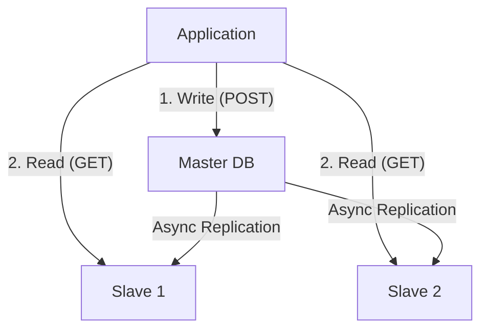

# Database Scaling: From One Server to a Data Empire

## 1. Beginner-friendly Hinglish Explanation 🇮🇳
Bhai, **Database Scaling** sabse mushkil kaam hai. 

Application servers ko scale karna asaan hai (Sirf copy-paste kar do), lekin Database ko scale karna matlab "Chalti train ke pahiye badalna." 
- **Vertical**: Database server ko aur bada banana (RAM/CPU).
- **Read Replicas**: Database ki "Photocopies" banana taaki ek server "Likhne" ka kaam kare aur baaki sirf "Padhne" (Read) ka.
- **Sharding**: Data ko alag-alag tukdon mein todkar alag-alag servers par rakhna.
System design interviews mein database scaling hi "Senior" vs "Junior" engineer ka farq batata hai.

---

## 2. Deep Technical Explanation
Database scaling aims to handle increased QPS (Queries Per Second) and storage volume.
- **Read Replicas**: Master-Slave architecture. The **Master** handles all Writes ($+$ updates slaves). The **Slaves** handle all Reads.
    - **Replication Lag**: Slaves might be a few milliseconds behind.
- **Vertical Scaling (Up)**: The first step. Move from `db.t3.micro` to `db.m5.4xlarge`.
- **Horizontal Scaling (Out)**: Sharding or Distributed Databases.
- **Federation**: Splitting the DB by function (e.g., Users DB, Products DB).

---

## 3. Architecture Diagrams
**Master-Slave with Read Replicas:**

---

## 4. Scalability Considerations
- **Write Bottleneck**: Read replicas help with "Reads," but if you have too many "Writes," the Master becomes the bottleneck. This is when you need **Sharding**.
- **Join Constraints**: Once you scale horizontally (Sharding), you lose the ability to do "Joins" across different database servers.

---

## 5. Failure Scenarios
- **Master Down**: The whole system cannot "Write" anymore. You must promote a Slave to be the new Master (**Failover**).
- **Replication Lag Storm**: If the Master is doing too much work, the Slaves fall minutes behind. Users see "Old Data," leading to confusion.

---

## 6. Tradeoff Analysis
- **Consistency vs. Performance**: Master-Slave is usually **Eventually Consistent**. If you need **Strong Consistency**, you must read from the Master (which slows it down).
- **Complexity vs. Cost**: Sharding is 10x more complex to code but 10x cheaper than the world's biggest single server.

---

## 7. Reliability Considerations
- **Multi-AZ (Availability Zones)**: Keeping your Slave in a different data center so a "Fire" in one building doesn't kill your data.
- **Automated Backups**: Essential for recovery after a "Human Error" (e.g., `DROP TABLE users;`).

---

## 8. Security Implications
- **Read-only Users**: Using different database credentials for Read-only apps so they can't accidentally "Delete" data.
- **Encryption at Rest**: Ensuring the scaled disks are encrypted using KMS keys.

---

## 9. Cost Optimization
- **Right-sizing Replicas**: Slaves don't always need as much CPU as the Master.
- **Aurora/Serverless**: Databases that "Shrink" at night when nobody is using them to save money.

---

## 10. Real-world Production Examples
- **Pinterest**: Famously sharded their MySQL databases into thousands of nodes to handle their massive growth.
- **Amazon Aurora**: A cloud-native database that scales reads up to 15 replicas automatically.
- **Slack**: Uses a system called **Vitess** to scale MySQL horizontally.

---

## 11. Debugging Strategies
- **Show Processlist**: Seeing which queries are blocking the Master.
- **Slave Status**: Checking `Seconds_Behind_Master` to monitor replication lag.

---

## 12. Performance Optimization
- **Connection Pooling**: Using **PgBouncer** or **HikariCP** so the DB doesn't spend time on handshakes.
- **Index Tuning**: A scaled DB is useless if it's doing "Full Table Scans."

---

## 13. Common Mistakes
- **Scaling without Indexing**: Thinking a "Bigger Server" will fix a query that doesn't have an index.
- **Manual Sharding**: Trying to write your own "Sharding logic" in the app code. (Use a middleware like Vitess!).

---

## 14. Interview Questions
1. How do you scale a 'Write-heavy' database?
2. What is 'Replication Lag' and how do you handle it in the UI?
3. When should you promote a Slave to a Master?

---

## 15. Latest 2026 Architecture Patterns
- **Database Proxy (RDS Proxy)**: A layer that manages thousands of connections so the DB stays fast during auto-scaling events.
- **Distributed SQL (CockroachDB)**: A database that handles replication and sharding "Automatically" and looks like a single SQL DB to the developer.
- **AI-Managed Scaling**: AI that predicts a "Viral Event" and starts 5 new Read Replicas *before* the traffic arrives.
	
