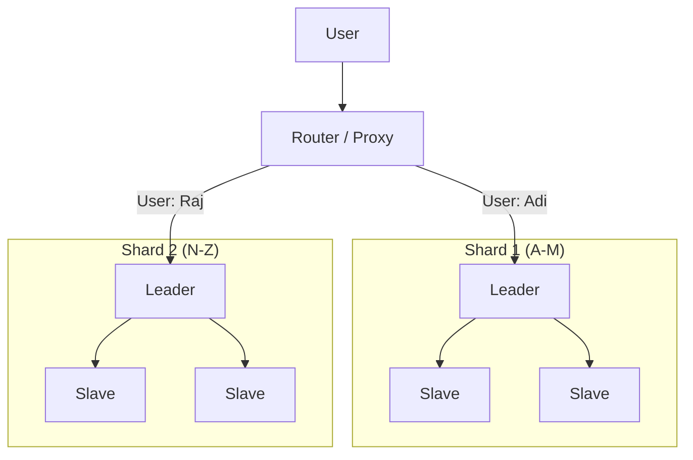

# Replication and Sharding: Deep Dive into Distributed Data

## 1. Beginner-friendly Hinglish Explanation 🇮🇳
Bhai, **Replication** aur **Sharding** distributed systems ke "Do pillar" hain. 

- **Replication (Copying)**: Ye data ki "Duplicates" banane jaisa hai. Agar ek server mar gaya, toh doosre ke paas data hai. Ye system ko "Safe" banata hai. (Main goal: **Availability**).
- **Sharding (Splitting)**: Ye ek badi "Almirah" (Data) ko 10 choti almirahs mein todne jaisa hai. Har almirah mein alag-alag alphabet ke users (e.g., A-M in Shard 1, N-Z in Shard 2) honge. Ye system ko "Fast" banata hai. (Main goal: **Scalability**).
Asli bade systems (Google, FB) in dono ko ek sath use karte hain.

---

## 2. Deep Technical Explanation
- **Replication Strategies**:
    - **Synchronous**: Wait for all replicas to ACK. (Safe but Slow).
    - **Asynchronous**: Leader returns instantly. (Fast but Risk of loss).
    - **Semi-Synchronous**: Wait for at least one replica to ACK.
- **Sharding Strategies**:
    - **Hash Sharding**: `Shard = Hash(User_ID) % N`. Uniform distribution.
    - **Range Sharding**: `Shard 1: 1 to 1000, Shard 2: 1001 to 2000`. Easy range queries but risky (Hotspots).
    - **Directory-based**: A separate "Lookup Table" tells you where each record is.

---

## 3. Architecture Diagrams
**Sharded Replication:**

---

## 4. Scalability Considerations
- **Infinite Scale**: Sharding allows you to store Petabytes of data by just adding more $1,000 servers.
- **Read Throughput**: Replication allows you to handle millions of "Read" requests by adding $100 servers.

---

## 5. Failure Scenarios
- **Resharding Failure**: Moving data from 2 shards to 3 shards while the app is live is a "High-risk" operation.
- **Master-Master Conflict**: In multi-leader replication, two people might edit the same row at the same time. You need a "Conflict Resolver" (Last Write Wins).

---

## 6. Tradeoff Analysis
- **Consistency vs. Performance**: Sync replication is 100% safe but increases Latency.
- **Simplicity vs. Scale**: Sharding breaks "Joins" and "Transactions." Your app code must become "Shard-aware."

---

## 7. Reliability Considerations
- **Consistent Hashing**: Minimizes data movement when shards are added/removed.
- **Anti-Entropy (Merkle Trees)**: A technique to quickly compare data between replicas and find "What is missing."

---

## 8. Security Implications
- **Data Locality**: Sharding by "Country" helps follow **GDPR** laws (Keeping EU data in EU).
- **Audit Logging**: You must ensure logs from all shards are aggregated to find "Suspicious activity" across the whole system.

---

## 9. Cost Optimization
- **Tiered Storage**: Using expensive SSDs for the "Leader" and cheaper HDDs for the "Slaves."
- **Compression**: Sharded data is often compressed to save on disk costs.

---

## 10. Real-world Production Examples
- **Facebook Messenger**: Uses a custom sharding logic to handle billions of messages per day.
- **Vitess**: A tool built by **YouTube** to run MySQL at a massive scale using sharding.
- **Cassandra**: A "Leaderless" system where replication and sharding are built-in from day one.

---

## 11. Debugging Strategies
- **Global Trace ID**: Essential to find which shard handled a failed request.
- **Shard Health Monitor**: Seeing if one shard is "Hotter" (More traffic) than others.

---

## 12. Performance Optimization
- **Parallel Queries**: Sending a query to all shards at once and "Merging" the result (Scatter-Gather).
- **Secondary Indexes**: Creating "Global" indexes so you don't have to scan every shard to find a user by their "Email."

---

## 13. Common Mistakes
- **Bad Shard Key**: Sharding by `State` (e.g., Delhi, Goa) means the 'Delhi' shard will crash while 'Goa' is idle. Use `User_ID` or `Hash`.
- **No Replication on Shards**: Sharding data but not replicating it. If one shard dies, 10% of your users lose their data forever!

---

## 14. Interview Questions
1. What is the difference between Replication and Sharding?
2. What is 'Consistent Hashing' and why is it useful for Sharding?
3. How do you handle a 'Join' between two tables that are on different shards?

---

## 15. Latest 2026 Architecture Patterns
- **Serverless Sharding**: Cloud databases (like DynamoDB) that shard your data automatically as it grows, without you ever knowing.
- **Quantum-Resilient Replication**: Syncing data between continents using encryption that cannot be broken by future quantum computers.
- **AI-Driven Shard Balancing**: An AI that "Re-shards" your database in real-time based on shifting traffic patterns.
	
