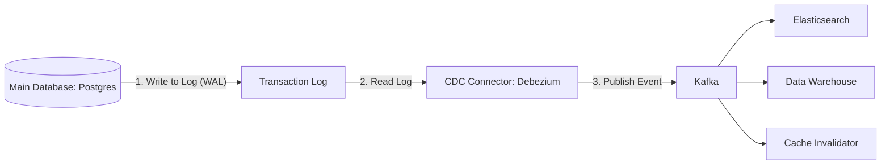

# Change Data Capture (CDC): Keeping the World in Sync

## 1. Beginner-friendly Hinglish Explanation 🇮🇳
Bhai, **Change Data Capture (CDC)** ka matlab hai "Database ki jasoosi karna." 

Socho aapka ek main "SQL Database" hai. Jab bhi koi user apna profile update karta hai, aap chahte ho ki wo change apne aap "Search Engine" (Elasticsearch) aur "Analytics" (BigQuery) mein bhi chala jaye. 
- **Purana Tarika**: Code mein har jagah `update_db()` ke saath `update_search()` aur `update_analytics()` likho. (Ye bohot ganda tarika hai!). 
- **CDC Tarika**: Ek tool (Jaise **Debezium**) database ke "Transaction Logs" ko read karta hai. Jaise hi DB mein koi row badalti hai, CDC use "Pakadta" hai aur Kafka mein bhej deta hai. Phir baaki saare systems Kafka se update le lete hain. 
Isse aapka main app simple rehta hai aur saare systems hamesha "In-sync" rehte hain.

---

## 2. Deep Technical Explanation
CDC is a set of software design patterns used to determine and track the data that has changed so that action can be taken using the changed data.

### How it works (Log-based CDC)
Most databases (Postgres, MySQL, Oracle) have a **Write-Ahead Log (WAL)** or **Binlog** where they record every change before committing it. 
1. CDC connector connects to the database as a "Replica."
2. It reads the raw log files in real-time.
3. It converts the log entries into a structured format (JSON/Avro).
4. It publishes the change event to a message bus (Kafka).

### Key Benefits
- **Zero Impact on Application**: No changes needed in the application code.
- **Low Latency**: Changes are captured almost instantly (milliseconds).
- **Guaranteed Order**: Since logs are sequential, events are sent in the exact order they happened.

---

## 3. Architecture Diagrams
**CDC Workflow:**

---

## 4. Scalability Considerations
- **High Throughput**: Handling 100k database updates per second. (Requires: **Partitioning the Kafka topic** by Primary Key).
- **Initial Snapshot**: When you start CDC, it has to read the *entire* existing database first before it starts tracking "New" changes.

---

## 5. Failure Scenarios
- **Log Rotation**: If the database deletes its old log files before the CDC tool can read them, you lose data! (Fix: **Increase log retention time**).
- **Connector Crash**: The CDC tool stops. When it restarts, it must remember its last "Offset" to avoid missing or duplicating data.

---

## 6. Tradeoff Analysis
- **Query-based vs Log-based**: Query-based (e.g., `SELECT * FROM table WHERE updated_at > ...`) is slow and puts load on the DB. Log-based is fast and invisible to the app, but harder to set up.

---

## 7. Reliability Considerations
- **Schema Evolution**: What happens if you add a new column to the database? The CDC tool must be smart enough to update the Kafka schema too.

---

## 8. Security Implications
- **Sensitive Data Filtering**: Ensuring that "Passwords" or "SSN" columns are stripped out of the CDC events before they are sent to the message bus.

---

## 9. Cost Optimization
- **Exclude Tables**: Not tracking "Logs" or "Temporary" tables to save on Kafka storage and processing costs.

---

## 10. Real-world Production Examples
- **Shopify**: Uses CDC to keep their massive product search index in sync with their main databases.
- **Debezium**: The industry-standard open-source CDC tool (built on top of Kafka Connect).
- **AWS Database Migration Service (DMS)**: A managed CDC service for moving data to the cloud.

---

## 11. Debugging Strategies
- **Log Position Monitoring**: Checking if the CDC tool is "Falling behind" the database's latest transaction.
- **Event Validation**: Comparing a row in the DB with the latest event in Kafka to ensure they match perfectly.

---

## 12. Performance Optimization
- **Batch Commits**: Sending 1000 changes to Kafka in one go to reduce network calls.
- **Parallel Connectors**: Running separate connectors for different tables to speed up the initial snapshot.

---

## 13. Common Mistakes
- **No Error Handling**: Letting the CDC connector stop forever because of one "Bad" row in the database.
- **Ignoring Deletes**: Forgetting to handle "DELETE" events, which leads to "Ghost Data" in the search engine.

---

## 14. Interview Questions
1. How does Log-based CDC differ from Query-based CDC?
2. What is 'Debezium' and why is it used?
3. How do you handle 'Schema Changes' in a CDC pipeline?

---

## 15. Latest 2026 Architecture Patterns
- **Database-Native CDC**: Databases (like **Neon** or **CockroachDB**) that have built-in "Webhooks" or "Streams" for CDC, making third-party tools like Debezium unnecessary.
- **AI-Driven Data Transformation**: CDC pipelines that use AI to automatically translate database schemas into "Analytics-ready" formats.
- **Edge-to-Cloud CDC**: Capturing data changes on local "Edge" databases and syncing them to a central global cloud database in real-time.
	
