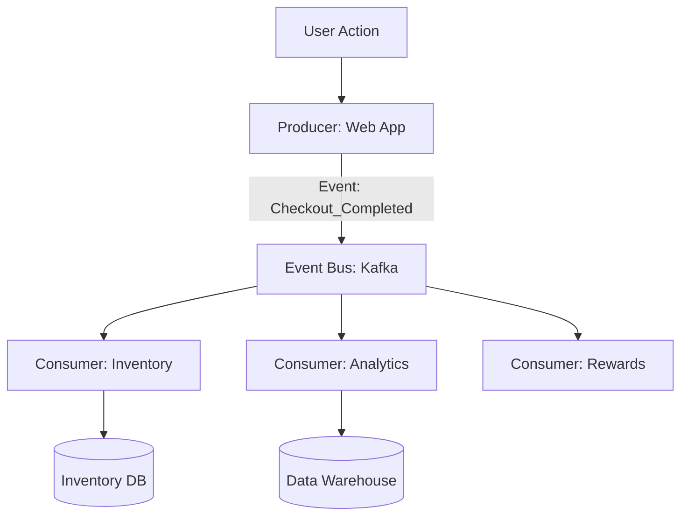

# Event-Driven Architecture (EDA): Building a Reactive System

## 1. Beginner-friendly Hinglish Explanation 🇮🇳
Bhai, **Event-Driven Architecture (EDA)** ka matlab hai "Mera kaam khatam, ab tum dekho." 

Traditional app mein: Service A, Service B ko "Order" deti hai (Call karti hai). 
EDA mein: Service A bas chilla kar (Broadcast) kehti hai: "**ORDER PLACED!**" 
Ab jis-jis ko isse matlab hai (Inventory, Payment, Shipping), wo khud apna kaam shuru kar dete hain. 
Fayda? Service A ko ye yaad nahi rakhna padta ki "Mujhe kis-kis ko batana hai." Isse system bohot "Loose" (Flexible) ho jata hai aur asani se naye features add ho sakte hain.

---

## 2. Deep Technical Explanation
Event-Driven Architecture is a software architecture pattern promoting the production, detection, consumption of, and reaction to events.

### Core Components
1. **Event Producers**: Detect a state change and emit an event.
2. **Event Channels**: The pipes that carry the event (Kafka, Kinesis, SNS).
3. **Event Consumers**: Listen to events and perform actions.
4. **Event Registry/Schema**: A central place to define what an "Event" looks like.

### Two Main Patterns
- **Event Notification**: Send a small message: "ID 123 changed." Consumer then calls an API to get the full data.
- **Event-Carried State Transfer**: Send the *full data* in the event: "ID 123 changed to {Name: 'Rahul', Age: 25}." Consumer doesn't need to call any API.

---

## 3. Architecture Diagrams
**Event-Driven Flow:**

---

## 4. Scalability Considerations
- **Infinite Fan-out**: Adding 100 new services that react to the same "Order_Placed" event without changing a single line of code in the "Order Service."
- **Throughput**: Using a distributed event bus to handle millions of events per second.

---

## 5. Failure Scenarios
- **Non-Atomic Operations**: You updated the database but the "Event Bus" was down, so the event was never sent. (Fix: **Transactional Outbox Pattern**).
- **Event Loss**: A consumer was down and the message expired from the bus.

---

## 6. Tradeoff Analysis
- **Decoupling vs. Debugging**: EDA is ultra-flexible, but it's much harder to "Follow the path" of a request across 10 services.

---

## 7. Reliability Considerations
- **Idempotency**: Consumers must be ready to receive the same event twice (e.g., if the network failed during Ack).
- **Dead Letter Queues**: Handling "Bad" events that keep crashing the consumers.

---

## 8. Security Implications
- **Event Payload Encryption**: Ensuring sensitive data inside an event is encrypted so other "Observers" on the bus can't read it.
- **Topic-Level Access**: Restricting who can "Publish" and who can "Subscribe."

---

## 9. Cost Optimization
- **Data Pruning**: Only sending the "Necessary" data in the event to save on network costs.
- **Serverless Eventing**: Using **AWS EventBridge** which only charges you when an event is actually sent.

---

## 10. Real-world Production Examples
- **Ebay**: Uses EDA to handle millions of bids and auctions in real-time.
- **Capital One**: Uses an event-driven approach for real-time fraud detection on credit card swipes.
- **Zillow**: Every "Price Change" in a house is an event that triggers emails, app alerts, and database updates.

---

## 11. Debugging Strategies
- **Tracing (OpenTelemetry)**: Attaching a `trace_id` to the event so you can see it moving across the entire architecture.
- **Event Replay**: Re-running yesterday's events through a new service to see if it works correctly.

---

## 12. Performance Optimization
- **Binary Serializers**: Using **Avro** or **Protobuf** instead of JSON to make events 80% smaller and 5x faster to parse.
- **Parallel Processing**: Running multiple consumer instances to handle a large "Backlog" of events.

---

## 13. Common Mistakes
- **Giant Event Payloads**: Sending a 10MB PDF inside an event. (Send a "Link" to S3 instead!).
- **Assuming Order**: Thinking that Event A will always arrive before Event B. (Distributed systems don't work that way!).

---

## 14. Interview Questions
1. What is the 'Transactional Outbox Pattern'?
2. What are the pros and cons of 'Event-Carried State Transfer'?
3. How do you handle 'Data Consistency' in an event-driven system?

---

## 15. Latest 2026 Architecture Patterns
- **GitOps for Events**: Managing your "Event Schemas" and "Topic Configurations" inside a Git repository.
- **Serverless Event-Mesh**: A global network of event buses that spans across AWS, Azure, and Google Cloud seamlessly.
- **AI-Native Event Routing**: AI that analyzes the "Importance" of an event and routes it to "Fast" or "Slow" consumers based on priority.
	
