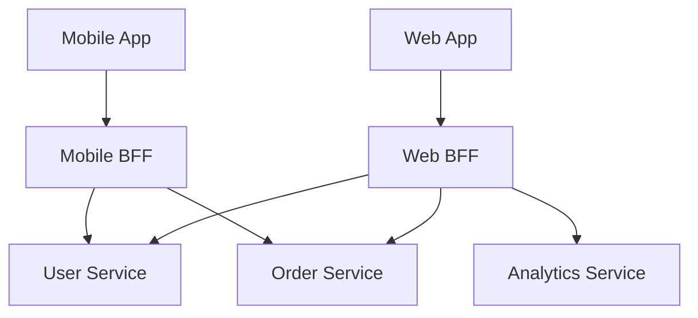

# API Gateway and BFF: The Front Door of Microservices

## 1. Beginner-friendly Hinglish Explanation 🇮🇳
Bhai, **API Gateway** ka matlab hai "Building ka Receptionist." 

Agar user ko 5 alag microservices se data chahiye (Profile, Orders, Notifications), toh wo har service ko alag se call nahi karega. Wo sirf Gateway ko bolta hai. Gateway piche se sabka data laake ek baar mein de deta hai. 
- **BFF (Backend for Frontend)**: Ye ek special gateway hai jo sirf ek specific device ke liye bana hai. (E.g., Mobile ke liye chota data, aur Desktop ke liye bada data). 
Isse "Security" bhi asan ho jati hai kyunki aap sirf ek jagah par login (Auth) check karte ho.

---

## 2. Deep Technical Explanation
An API Gateway acts as a reverse proxy to route requests from clients to various microservices.

### Core Responsibilities
1. **Routing**: Mapping a URL (e.g., `/orders`) to the correct backend service.
2. **Authentication/Authorization**: Verifying tokens (JWT) before the request hits the services.
3. **Rate Limiting**: Preventing one user from spamming the system.
4. **Request Aggregation**: Calling 3 services and combining their JSON into 1 response.
5. **SSL Termination**: Handling encrypted traffic at the gateway to save CPU on backend services.

### BFF Pattern
Instead of one giant "General" gateway, you have:
- **Mobile BFF**: Optimized for low bandwidth and small screens.
- **Web BFF**: Optimized for rich dashboards and high bandwidth.

---

## 3. Architecture Diagrams
**Gateway and BFF Flow:**

---

## 4. Scalability Considerations
- **High Throughput**: The gateway is a bottleneck. It must be horizontally scalable (e.g., running 10 instances of NGINX/Kong).
- **Caching at the Edge**: The gateway can cache common responses (like "Product Details") so it doesn't even have to call the microservices.

---

## 5. Failure Scenarios
- **Gateway Outage**: If the gateway is down, the whole system is inaccessible. (Fix: **Active-Passive High Availability**).
- **Timeouts**: One slow microservice causes the Gateway's threads to fill up. (Fix: **Circuit Breakers**).

---

## 6. Tradeoff Analysis
- **One Giant Gateway vs. Multiple BFFs**: One gateway is easier to manage, but BFFs give a better user experience (UX) for different devices.

---

## 7. Reliability Considerations
- **Retries**: The gateway should automatically retry a failed request if the backend service had a temporary glitch.

---

## 8. Security Implications
- **WAF (Web Application Firewall)**: Blocking SQL injection and DDoS attacks at the entry point.
- **Protocol Translation**: Converting "Public HTTP" into "Internal gRPC" for better security and speed.

---

## 9. Cost Optimization
- **Payload Reduction**: Using the BFF to "Filter out" 50 fields that the mobile app doesn't need, saving on data costs.

---

## 10. Real-world Production Examples
- **Kong / KrakenD / Tyk**: Popular open-source API gateways.
- **AWS API Gateway / Azure API Management**: Managed cloud services.
- **Netflix (Zuul)**: Their custom-built gateway for massive scale.

---

## 11. Debugging Strategies
- **Correlation ID**: Attaching a unique ID to every request at the gateway to track it through all microservices.
- **Metric Dashboards**: Monitoring "Requests per Second" and "Error Rates" specifically for the gateway.

---

## 12. Performance Optimization
- **Asynchronous Aggregation**: Calling backend services in parallel using `Promise.all` or Go routines.
- **Response Compression**: Gzipping the JSON before sending it to the user.

---

## 13. Common Mistakes
- **Logic in the Gateway**: Putting complex business logic (like "Calculate Tax") in the gateway. (Gateways should be for "Routing" only!).
- **No Rate Limiting**: Letting a bot crash your system by calling the gateway 1 million times.

---

## 14. Interview Questions
1. What is the difference between an API Gateway and a Load Balancer?
2. Explain the BFF (Backend for Frontend) pattern.
3. How do you prevent 'Cascading Failures' at the API Gateway?

---

## 15. Latest 2026 Architecture Patterns
- **GraphQL Federation**: Using a GraphQL gateway that "Stitches" together different sub-graphs from various microservices.
- **Wasm-Powered Plugins**: Running custom security/logic code inside the gateway using WebAssembly for extreme speed.
- **AI-Native Gateways**: Gateways that automatically detect "Anomalous" traffic patterns and block them using built-in AI models.
	
