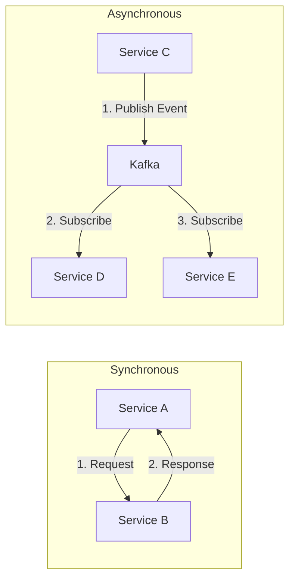

# Microservices Communication Patterns: How Services Talk

## 1. Beginner-friendly Hinglish Explanation 🇮🇳
Bhai, **Microservices Communication** ka matlab hai "Phone call vs WhatsApp." 

- **Synchronous (Phone Call)**: Aapne Service A ko call kiya, aur jab tak wo jawab nahi deti, aap ruke rehte ho. (E.g., **REST**, **gRPC**). 
- **Asynchronous (WhatsApp Message)**: Aapne message bhej diya aur apna kaam karne lage. Jawab jab aayega tab dekh lenge. (E.g., **Kafka**, **RabbitMQ**). 
Asli system design mein hum dono ko mix karte hain. Payment ke liye Synchronous (turant result chahiye) aur Notification ke liye Asynchronous (baad mein bhej do toh bhi chalega).

---

## 2. Deep Technical Explanation
Effective communication is critical for a decoupled microservice architecture.

### Communication Styles
1. **Request-Response (Sync)**: Client sends a request and waits for a response. High coupling. (HTTP/REST, gRPC).
2. **Event-Driven (Async)**: Service A publishes an "Event" (e.g., "Order Placed"). Any service interested (Shipping, Email) reacts to it. Low coupling.
3. **Message Queuing**: Service A puts a "Task" in a queue for Service B to process when it has time.

### Service Discovery
How does Service A find the IP address of Service B? 
- **Client-Side**: Service A checks a "Phonebook" (Consul/Eureka) and calls the IP directly.
- **Server-Side**: Service A calls a Load Balancer, which knows where Service B is.

---

## 3. Architecture Diagrams
**Communication Flow:**

---

## 4. Scalability Considerations
- **Non-blocking I/O**: Using asynchronous libraries so a service doesn't waste time "Waiting" for another service.
- **Batching**: Sending 100 requests as one single message to reduce network overhead.

---

## 5. Failure Scenarios
- **The "Dead Letter Queue" (DLQ)**: If a message fails 5 times, it is moved to a special queue for manual inspection instead of blocking the main queue.
- **Network Latency**: A request taking 2 seconds because of a slow router.

---

## 6. Tradeoff Analysis
- **REST vs gRPC**: REST is easy to use (human-readable), but gRPC is much faster and uses less bandwidth (binary).

---

## 7. Reliability Considerations
- **Retries with Exponential Backoff**: If a call fails, try again after 1s, then 2s, then 4s, then 8s.
- **Idempotency**: Ensuring that if a request is sent twice (due to a retry), the result is the same (e.g., charging the user only once).

---

## 8. Security Implications
- **Mutual TLS (mTLS)**: Both services must show their "ID Cards" (Certificates) to each other before talking.
- **API Keys / Secrets**: Managing passwords for services using **HashiCorp Vault**.

---

## 9. Cost Optimization
- **Binary Protocols**: Using Protobuf/Avro to shrink the data size, which saves on "Egress" (bandwidth) costs in the cloud.

---

## 10. Real-world Production Examples
- **Stripe**: Uses REST for their public APIs but internal gRPC for speed.
- **LinkedIn**: Built **Kafka** to handle their massive event-driven communication.
- **Airbnb**: Uses a Service Mesh to manage thousands of inter-service connections.

---

## 11. Debugging Strategies
- **Service Graph**: Visualizing which services are talking to which. (E.g., **Kiali** dashboard).
- **Latency Histograms**: Seeing if 99% of requests are fast but 1% are extremely slow.

---

## 12. Performance Optimization
- **HTTP/2 & HTTP/3**: Reusing one single connection for multiple requests to avoid the "Handshake" delay.
- **Compression**: Using **Zstandard** or **Gzip** to shrink messages.

---

## 13. Common Mistakes
- **Hardcoding IPs**: Putting `192.168.1.5` in the code. (Use **Service Discovery** instead!).
- **Sync Chains**: Service A calls B, which calls C, which calls D. (If D is slow, the whole app is slow!).

---

## 14. Interview Questions
1. Compare REST and gRPC. When would you use each?
2. What is an 'Event-Driven' architecture and what are its benefits?
3. How do you handle 'Schema Evolution' in a message-based system?

---

## 15. Latest 2026 Architecture Patterns
- **WebTransport over QUIC**: A new protocol for even faster bi-directional communication between services.
- **Sidecar-less Service Mesh**: Moving the "Communication Logic" into the Linux Kernel (eBPF) to save RAM and CPU.
- **AI-Driven Routing**: AI that predicts which server is about to get busy and routes traffic elsewhere before it happens.
	
