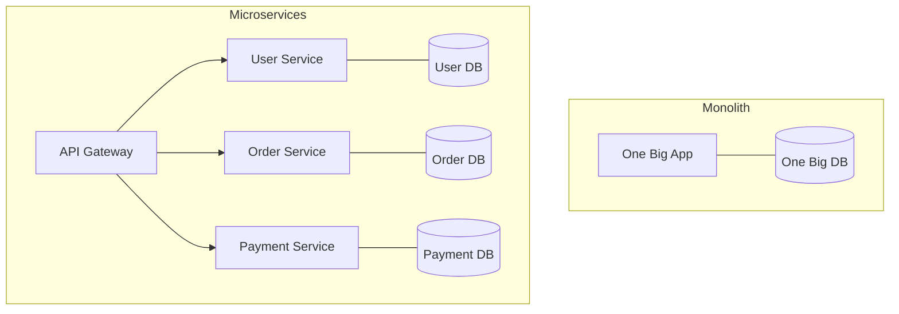

# Monolith to Microservices: The Great Migration

## 1. Beginner-friendly Hinglish Explanation 🇮🇳
Bhai, **Microservices** ka matlab hai ek bade "Haathi" (Monolith) ko chote-chote "Sheron" (Services) mein baant dena. 

- **Monolith**: Ek hi badi file/codebase jisme sab kuch hai—User, Payment, Inventory. Agar ek bhi cheez fail hui, toh poora app band! 
- **Microservices**: Har kaam ke liye ek alag chota app. User ke liye alag, Payment ke liye alag. 
Iska fayda? Agar Payment service down hai, toh user kam se kam products toh dekh sakta hai. Isse "Scaling" bhi asan ho jati hai—jis service par traffic zyada hai, sirf use bada karo!

---

## 2. Deep Technical Explanation
Microservices architecture is an approach to developing a single application as a suite of small services, each running in its own process and communicating with lightweight mechanisms.

### Core Principles
1. **Single Responsibility**: Each service does one thing well (e.g., handles only Orders).
2. **Database per Service**: Services should not share the same database to ensure loose coupling.
3. **Decentralized Governance**: Different services can use different languages (Polyglot).
4. **Resilience**: Failure in one service should not cascade to others.

---

## 3. Architecture Diagrams
**Monolith vs Microservices:**

---

## 4. Scalability Considerations
- **Independent Scaling**: Scale only the "Heavy" services (like Image Processing) without wasting resources on the "Light" ones (like About Us).
- **Service Mesh**: Using **Istio** or **Linkerd** to manage communication between 100s of services.

---

## 5. Failure Scenarios
- **Cascading Failure**: Service A waits for Service B, which is slow. Service A's threads get full, and it also fails. (Fix: **Circuit Breaker**).
- **Data Inconsistency**: User updated their name in the User Service, but the Order Service still has the old name. (Fix: **Eventual Consistency**).

---

## 6. Tradeoff Analysis
- **Complexity vs. Agility**: Microservices give you 10x more speed in releasing features, but 10x more complexity in networking and debugging.

---

## 7. Reliability Considerations
- **Health Checks**: Every service must have a `/health` endpoint so the orchestrator (Kubernetes) knows when to restart it.

---

## 8. Security Implications
- **Auth Propagation**: How does Service B know the user is logged in if Service A handled the login? (Fix: **JWT tokens**).
- **Network Security**: Encrypting communication between services (mTLS).

---

## 9. Cost Optimization
- **Right-sizing**: Giving each service exactly the RAM/CPU it needs, rather than one giant expensive server for everything.

---

## 10. Real-world Production Examples
- **Amazon**: Famously moved to microservices in the early 2000s ("Two Pizza Teams").
- **Netflix**: Runs 1000+ microservices on AWS to handle global streaming.
- **Uber**: Moved from a Python monolith to a massive Go-based microservice architecture.

---

## 11. Debugging Strategies
- **Distributed Tracing**: Using **Jaeger** or **Zipkin** to follow a request as it jumps through 10 different services.
- **Centralized Logging**: Sending all logs to one place (ELK Stack) so you don't have to SSH into 50 servers.

---

## 12. Performance Optimization
- **gRPC**: Using binary communication instead of JSON for 5x faster inter-service calls.
- **BFF (Backend for Frontend)**: Creating a specific "Gateway" for mobile and another for web to reduce over-fetching.

---

## 13. Common Mistakes
- **Distributed Monolith**: Sharing a database between services. (If you change the schema, all services break!).
- **Nano-services**: Breaking things down too much (e.g., "Add Service" and "Subtract Service").

---

## 14. Interview Questions
1. When should you NOT move to microservices?
2. What is a 'Circuit Breaker' and why is it important?
3. How do you handle 'Data Consistency' across multiple services?

---

## 15. Latest 2026 Architecture Patterns
- **Serverless Microservices**: Running each service as a Lambda/Cloud Function to achieve "Zero Idle Cost."
- **Cell-based Architecture**: Grouping services into "Cells" (e.g., a "Mumbai Cell") for extreme fault isolation.
- **AI-Managed Orchestration**: AI that automatically moves services between cloud regions to save on latency and cost.
	
