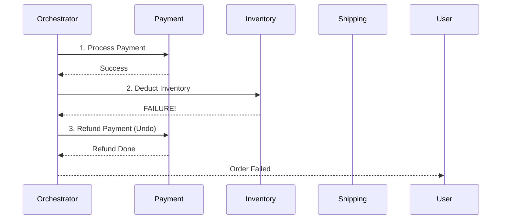

# Saga Pattern: Managing Transactions in Microservices

## 1. Beginner-friendly Hinglish Explanation 🇮🇳
Bhai, **Saga Pattern** ka matlab hai "Distributed Transaction ka backup plan." 

Socho aap ek ticket book kar rahe ho. 
1. Payment service ne paise kaat liye. 
2. Seat service ne seat book karne ki koshish ki, par "Failure" ho gaya. 
Ab kya? Paise toh kat gaye par ticket nahi mili! 
**Saga Pattern** sikhata hai ki agar step 2 fail hua, toh step 1 ko "Reverse" (Undo) kaise karein (Refund generate karo). Isse "Compensating Transaction" kehte hain. Isse poora system "Consistency" mein rehta hai.

---

## 2. Deep Technical Explanation
In microservices, a single business transaction can span multiple services and databases. Since 2-Phase Commit (2PC) is slow and non-scalable, we use the Saga pattern.

### Two Types of Saga
1. **Choreography**: Each service produces and listens to events. Service A finishes -> publishes event -> Service B hears it and starts. (Decentralized).
2. **Orchestration**: A central "Brain" (Orchestrator) tells each service what to do and when. If something fails, the brain tells other services to undo their work. (Centralized).

### Compensating Transactions
For every "Action," you must write an "Undo Action."
- **Action**: Book Hotel.
- **Undo**: Cancel Hotel and Refund.

---

## 3. Architecture Diagrams
**Orchestration-based Saga:**

---

## 4. Scalability Considerations
- **Stateful Orchestrators**: Using tools like **Temporal** or **AWS Step Functions** to manage long-running sagas (that might take days to finish).

---

## 5. Failure Scenarios
- **The "Undo" Fails**: You tried to refund the money but the payment gateway is down. (Fix: **Persistent Retry Queue** and **Alerting**).
- **Service Crashes**: The Orchestrator crashes in the middle of a saga. (Fix: **Write State to DB at every step**).

---

## 6. Tradeoff Analysis
- **Consistency vs. Complexity**: Saga gives you "Eventual Consistency" (data might be messy for a few seconds), but it's much faster than locking everyone's database (2PC).

---

## 7. Reliability Considerations
- **Idempotency**: Every undo action must be safe to run 10 times. (If I refund twice, the user should only get their money once).

---

## 8. Security Implications
- **Fraud Prevention**: Ensuring that an "Undo" request (like a refund) is actually coming from the system and not a hacker.

---

## 9. Cost Optimization
- **Event-Driven Sagas**: Using "Choreography" (Kafka) is cheaper to run than a complex "Orchestrator" service.

---

## 10. Real-world Production Examples
- **Uber**: Uses a saga-like pattern for their complex trip-booking process.
- **Starbucks**: "How to handle coffee orders" (Pay -> Make Coffee -> Give to User) is a classic Saga example.
- **Temporal.io**: A powerful open-source engine specifically designed to run Sagas.

---

## 11. Debugging Strategies
- **Trace Visualization**: Seeing exactly which step of the Saga failed.
- **Saga Status DB**: A table that shows every active saga and its current state (Pending, Success, Reverting).

---

## 12. Performance Optimization
- **Parallel Sagas**: If Step 2 and Step 3 are independent, run them at the same time to finish the transaction faster.

---

## 13. Common Mistakes
- **No Undo Logic**: Implementing the "Happy Path" but forgetting to write the code that handles failures.
- **Circular Dependencies**: Service A triggers B, which triggers A again.

---

## 14. Interview Questions
1. Compare Choreography and Orchestration.
2. What is a 'Compensating Transaction'?
3. Why is the Saga pattern better than 2-Phase Commit (2PC) for microservices?

---

## 15. Latest 2026 Architecture Patterns
- **Transactional Outbox Pattern**: Combining your "Database Update" and "Event Publish" into one single atomic step using a log-reader (CDC).
- **Serverless Orchestrators**: Using **Cloudflare Workflows** to manage complex business logic at the Edge.
- **AI-Managed Sagas**: AI that predicts which step is likely to fail (e.g., "The warehouse is busy") and picks a different path for the saga.
	
