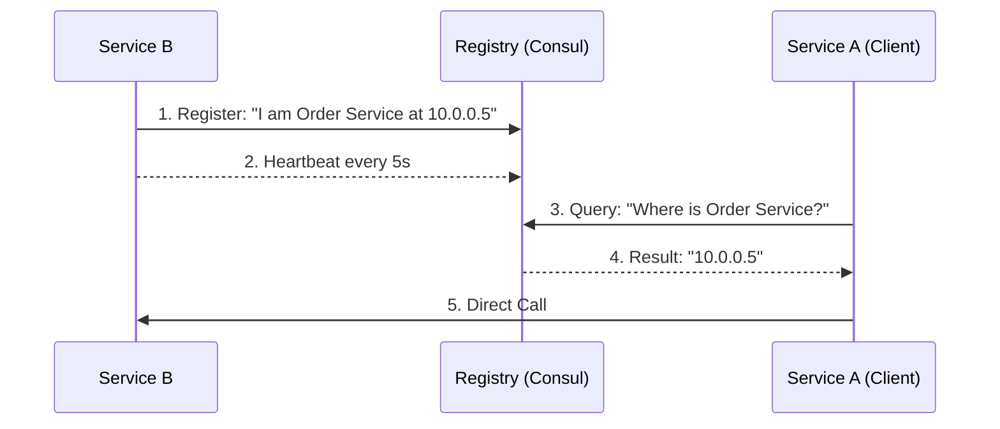

# Service Discovery and Registry: The Phonebook of Microservices

## 1. Beginner-friendly Hinglish Explanation 🇮🇳
Bhai, **Service Discovery** ka matlab hai "Microservices ki Directory." 

Socho aapke paas 50 servers hain jo "Order" handle karte hain. Inka IP address hamesha badalta rehta hai (Kyunki servers restart hote hain ya naye servers aate hain). 
- **Service Registry**: Ye ek central "Phonebook" hai. Har naya server apna naam aur IP yahan "Register" karta hai. 
- **Service Discovery**: Jab "Payment" service ko "Order" service ko call karna hota hai, toh wo Registry se puchti hai: "Bhai, abhi Order service kahan hai?" 
Bina iske, aapko har bar manually IP address change karna padega, jo ki impossible hai!

---

## 2. Deep Technical Explanation
Service discovery is the process of automatically detecting devices and services on a computer network.

### Two Main Patterns
1. **Client-Side Discovery**: The client (Service A) queries the Service Registry (Eureka/Consul) to get the list of IPs for Service B and picks one. (Better for custom load balancing).
2. **Server-Side Discovery**: The client calls a Load Balancer (AWS ELB/NGINX). The Load Balancer queries the registry and routes the traffic. (Easier for the developer).

### The "Heartbeat"
Every service must send a "Heartbeat" (Ping) to the registry every few seconds. If the registry doesn't get a ping, it assumes the service is "Dead" and removes it from the phonebook.

---

## 3. Architecture Diagrams
**Registry Workflow:**

---

## 4. Scalability Considerations
- **Highly Available Registry**: If the Registry dies, the whole app dies. (Fix: **Replicated Registry** like an Etcd cluster).
- **Consistency vs. Performance**: Do you want the "Perfectly accurate" IP (Consistent) or the "Fastest response" (Available)?

---

## 5. Failure Scenarios
- **Stale Registry**: A service died but the registry still thinks it's alive (until the next heartbeat timeout). (Fix: **Aggressive health checks**).
- **Network Partition**: The Registry can't talk to the servers, so it deletes all IPs. (Fix: **Self-preservation mode**—keep the old IPs if 90% of servers "disappear" at once).

---

## 6. Tradeoff Analysis
- **Consul vs. Eureka**: Consul is strongly consistent (good for security), Eureka is highly available (good for massive scale).

---

## 7. Reliability Considerations
- **Client-Side Caching**: Service A should keep a local copy of the registry's phonebook, so it can still work for a few minutes even if the Registry is down.

---

## 8. Security Implications
- **Access Control (ACL)**: Ensuring that only "Authorized" services can join the registry or see the IP addresses.
- **Service-to-Service Encryption**: Using certificates provided by the registry for mTLS.

---

## 9. Cost Optimization
- **DNS-based Discovery**: Using internal DNS (CoreDNS) which is lighter and cheaper to run than a full-blown Consul cluster.

---

## 10. Real-world Production Examples
- **Kubernetes (K8s)**: Uses a built-in Service Registry and DNS (CoreDNS) for all pods.
- **Netflix (Eureka)**: Created Eureka to manage thousands of AWS instances.
- **HashiCorp (Consul)**: A popular enterprise tool for service discovery and configuration.

---

## 11. Debugging Strategies
- **DNS Lookup**: Running `nslookup service-name` inside a container to see if it resolves to the correct IP.
- **Registry Dashboard**: Checking the Consul/Eureka UI to see which servers are "Red" (Down).

---

## 12. Performance Optimization
- **Push-based Updates**: The registry "Pushes" the new IP to all clients instantly, rather than the clients "Polling" every 30 seconds.

---

## 13. Common Mistakes
- **No Health Checks**: Registering a server but never checking if it's actually working.
- **Single Point of Failure**: Running only one instance of your Service Registry.

---

## 14. Interview Questions
1. Compare Client-Side and Server-Side Service Discovery.
2. How does a Service Registry handle 'Heartbeats'?
3. What happens if the Service Registry itself goes down?

---

## 15. Latest 2026 Architecture Patterns
- **Envoy/Istio (Service Mesh)**: Moving the discovery logic into a "Sidecar" proxy so the application developer doesn't even have to think about it.
- **eBPF-based Discovery**: High-speed discovery handled at the Linux Kernel level for zero-latency lookups.
- **AI-Predictive Scaling**: The registry telling the auto-scaler to "Start 5 more servers" because it predicts a traffic spike in 10 minutes.
	
