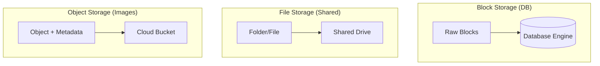

# Object vs. Block vs. File Storage: Choosing the Right Disk

## 1. Beginner-friendly Hinglish Explanation 🇮🇳
Bhai, **Storage** ka matlab hai "Data ko digital almari mein rakhna." Lekin her cheez ke liye alag almari hoti hai. 

1. **File Storage (The Office Cabinet)**: Jaise aapke computer mein folders aur files hoti hain. Ye "Hierarchical" hota hai. (E.g., NAS, Shared Drives). 
2. **Block Storage (The Warehouse)**: Ye data ko "Raw blocks" mein tod deta hai. Ye bahut fast hai aur databases ke liye best hai. Ye aisa hai ki aapke paas ek khaali zameen hai aur aap us par apna khud ka system bana sakte ho. (E.g., AWS EBS, Hard Drives). 
3. **Object Storage (The Valet Parking)**: Aapne ek file (Object) di aur unhone aapko ek "Ticket" (ID/URL) de diya. Aapko nahi pata wo kahan rakhi hai, bas ticket dikhao aur file le lo. Ye images aur videos ke liye best hai. (E.g., AWS S3).

---

## 2. Deep Technical Explanation
Understanding the storage medium is critical for choosing where to put your data based on access patterns and performance needs.

### Block Storage
- **How it works**: Data is broken into fixed-size blocks (e.g., 512 bytes). No metadata beyond the address.
- **Protocol**: iSCSI, Fibre Channel, NVMe.
- **Best For**: Databases, Virtual Machines (VMs), Boot volumes.
- **Scalability**: High performance, but hard to share between multiple servers.

### File Storage
- **How it works**: Data is stored as files in a hierarchy (folders). Includes metadata like "Date Created."
- **Protocol**: NFS, SMB/CIFS.
- **Best For**: Shared documents, local dev environments.
- **Scalability**: Limited; performance drops as the folder tree gets deeper.

### Object Storage
- **How it works**: Data is stored in a "Flat" structure as an object with extensive metadata and a unique ID.
- **Protocol**: HTTP/REST.
- **Best For**: Static assets, backups, Big Data (Data Lakes).
- **Scalability**: Virtually infinite. Can store petabytes of data easily.

---

## 3. Architecture Diagrams
**Storage Types Visualization:**

---

## 4. Scalability Considerations
- **Object Storage Scalability**: Since there is no "Hierarchy" (folders) to manage, adding 1 billion more objects doesn't slow down the system.
- **Block Storage Scaling**: Usually requires "Resizing" the volume or using "Striping" (RAID) across multiple disks.

---

## 5. Failure Scenarios
- **Bit Rot**: Data on a disk slowly getting corrupted over years. (Fix: **Checksums**).
- **NAS Bottleneck**: 100 servers trying to read from the same File Storage server at once, crashing the network.

---

## 6. Tradeoff Analysis
- **Performance vs. Accessibility**: Block is the fastest (Low Latency) but only for one server. Object is slower (High Latency) but accessible by the whole world via HTTP.

---

## 7. Reliability Considerations
- **Durability (The 11 Nines)**: Object storage like S3 is designed for 99.999999999% durability by replicating data across multiple data centers automatically.

---

## 8. Security Implications
- **Bucket Leaks**: Forgetting to make your S3 bucket private and exposing all your users' photos to the internet.
- **Encryption at Rest**: Mandatory for Block storage containing DB files.

---

## 9. Cost Optimization
- **Lifecycle Policies**: Automatically moving data from "Expensive SSD Object Storage" to "Cheap Glacier Archive" after 30 days.

---

## 10. Real-world Production Examples
- **AWS S3**: The world's largest object store.
- **AWS EBS**: The default block storage for EC2 instances.
- **Google Cloud Filestore**: A managed NFS service for file storage.

---

## 11. Debugging Strategies
- **IOPS Monitoring**: Checking if your Block storage is hitting its performance limit.
- **Throughput Metrics**: Measuring how many MB/s you can push to your Object store.

---

## 12. Performance Optimization
- **Cold vs Hot Storage**: Keeping frequent data on SSDs and infrequent on HDDs.
- **Multipart Upload**: Uploading large files to Object storage in small parallel chunks to speed it up.

---

## 13. Common Mistakes
- **Running a DB on NFS (File Storage)**: This will be extremely slow and lead to data corruption. (Use Block storage!).
- **Using Object Storage for Small Files**: Storing millions of 1KB files in S3 is slow and expensive (per-request costs).

---

## 14. Interview Questions
1. What is the difference between Block and Object storage?
2. When would you use File Storage (NFS) in a microservices architecture?
3. How does 'Durability' differ from 'Availability' in storage?

---

## 15. Latest 2026 Architecture Patterns
- **Unified Storage Fabric**: Systems that let you access the same data as a File, a Block, or an Object depending on what you need.
- **AI-Managed Data Tiering**: AI that predicts which "Blocks" of data will be needed soon and moves them from slow disk to fast RAM/SSD proactively.
- **NVMe-over-Fabrics (NVMe-oF)**: Making remote block storage as fast as a local NVMe drive.
