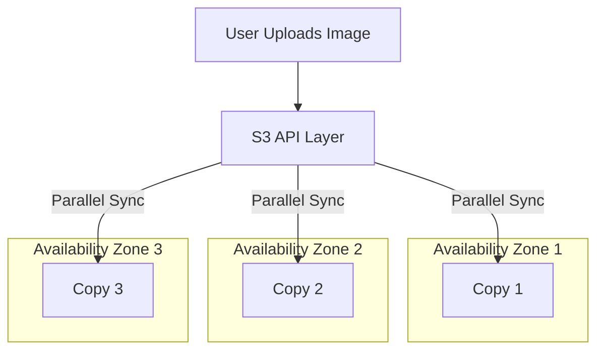

# S3 and Distributed Object Storage: The Internet's Hard Drive

## 1. Beginner-friendly Hinglish Explanation 🇮🇳
Bhai, **S3 (Simple Storage Service)** ek "Infinite Hard Drive" ki tarah hai. 

Aapne bas ek "Bucket" banayi aur usme files (Objects) dalna shuru kar diya. 
- Na aapko disk size ki chinta karni hai. 
- Na aapko "Backup" ki chinta karni hai (Amazon khud 3 jagah save karta hai). 
- Na aapko "Speed" ki chinta karni hai (Poori duniya se log ek sath access kar sakte hain). 
Ye modern app development ka sabse important part hai. Aaj kal koi bhi company images ya videos apne "Server" par nahi rakhti, sab S3 par rakhte hain.

---

## 2. Deep Technical Explanation
S3 is a distributed object storage service that provides industry-leading scalability, data availability, security, and performance.

### Key Concepts
- **Buckets**: Containers for objects. Names must be globally unique.
- **Objects**: The files being stored + Metadata + Key (the name/path).
- **Consistency Model**: **Strong Read-after-write Consistency**. (Since 2020, if you write a new object, you can immediately read it back and see the latest version).
- **Versioning**: Keeping multiple versions of an object (for recovery from accidental deletes).

### Storage Classes
- **Standard**: For frequent access.
- **Intelligent Tiering**: Automatically moves data between tiers based on access.
- **Glacier**: For long-term archiving (takes minutes to hours to retrieve).

---

## 3. Architecture Diagrams
**S3 Internal High Availability:**

---

## 4. Scalability Considerations
- **Request Rate**: S3 can handle 3,500 PUT and 5,500 GET requests *per second per prefix*. (If you need more, you just use more prefixes like `/a/`, `/b/`).
- **Data Size**: No limit. You can store 1KB or 5TB in a single object.

---

## 5. Failure Scenarios
- **Regional Outage**: If the entire AWS region goes down, your bucket is gone. (Fix: **Cross-Region Replication**).
- **Accidental Delete**: A bug in your code runs `DeleteObject` on everything. (Fix: **MFA Delete** and **Versioning**).

---

## 6. Tradeoff Analysis
- **S3 vs. Local SSD**: S3 is much slower (100ms+ latency) but infinitely more durable and accessible.
- **Public vs. Private**: Making a bucket public is easy for CDNs but risky for security.

---

## 7. Reliability Considerations
- **Durability (11 Nines)**: Designed to lose only one object every 10,000 years if you store 10 million objects.
- **Availability (99.99%)**: The service is up and running almost 100% of the time.

---

## 8. Security Implications
- **IAM Policies**: Restricting exactly which server or user can access which bucket.
- **Bucket Policies**: Global rules (e.g., "Only allow uploads from my corporate IP").
- **Presigned URLs**: Generating a temporary link that allows a user to upload/download a file without needing AWS credentials.

---

## 10. Real-world Production Examples
- **Netflix**: Stores their entire movie library (Petabytes) on S3 and streams it to the whole world.
- **Airbnb**: Uses S3 to store millions of house photos and user documents.
- **Dropbox**: Started by building on top of S3 before building their own storage system.

---

## 11. Debugging Strategies
- **S3 Access Logs**: Seeing who accessed which file and when.
- **CloudTrail**: Seeing who changed the "Bucket Policy" or "Permissions."

---

## 12. Performance Optimization
- **Multipart Upload**: Mandatory for files > 100MB. Uploads parts in parallel.
- **S3 Transfer Acceleration**: Using Amazon's global edge network to speed up uploads from far-away countries.
- **S3 Select**: Fetching only a subset of data from a large CSV/JSON file inside S3 without downloading the whole file.

---

## 13. Common Mistakes
- **Public Buckets**: Leaving a bucket open to the world. (The #1 cause of data breaches).
- **Hardcoding Bucket Names**: Not being able to change the bucket name easily when moving from 'Dev' to 'Prod'.

---

## 14. Interview Questions
1. How does S3 handle data durability and availability?
2. What is 'Strong Consistency' in S3 and when was it introduced?
3. How do you share a private file in S3 with a user for only 5 minutes? (Presigned URLs).

---

## 15. Latest 2026 Architecture Patterns
- **Object Lambda**: Running custom code (like watermarking an image or redacting a PDF) *on the fly* as the object is being downloaded from S3.
- **S3 Multi-Region Access Points**: A single global URL that automatically routes users to the closest bucket across multiple continents.
- **AI-Native Buckets**: Buckets that automatically "Tag" and "Index" their contents using AI (OCR on images, transcription on audio) as soon as they are uploaded.
