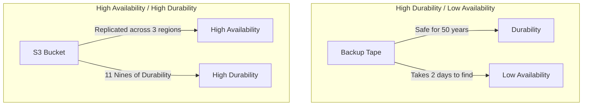

# Storage Reliability and Availability: The Non-Stop Data Layer

## 1. Beginner-friendly Hinglish Explanation 🇮🇳
Bhai, **Reliability** aur **Availability** storage mein sabse bade "Vade" (Promises) hain. 

- **Reliability (Durability)**: Ye ek "Vada" hai ki aapka data kabhi "Khoyega" nahi. (E.g., Agar mera photo S3 par hai, toh wo 10 saal baad bhi wahi rahega). 
- **Availability**: Ye ek "Vada" hai ki aapka data hamesha "Access" kiya ja sakega. (E.g., Agar main abhi apni photo dekhna chahta hoon, toh server down nahi hona chahiye). 
System design mein hum chahte hain ki dono 100% ho, lekin ye bohot mehanga hota hai, isliye hum "SLA" (Service Level Agreements) banate hain.

---

## 2. Deep Technical Explanation
Storage reliability and availability are measured by different metrics and achieved through different architectures.

### Reliability (Durability)
The probability that data will remain intact and readable over a period of time.
- **Metric**: Annual Failure Rate (AFR) or Mean Time Between Failures (MTBF).
- **Achieved By**: Redundancy (RAID), Checksumming, Backups, and Geo-replication.

### Availability
The probability that the storage system is operational and accessible at any given time.
- **Metric**: Uptime percentage (e.g., "Five Nines" = 99.999% = 5 mins downtime per year).
- **Achieved By**: Clustering, Load Balancing, Failover mechanisms, and Multi-AZ deployments.

---

## 3. Architecture Diagrams
**Availability vs. Durability:**

---

## 4. Scalability Considerations
- **The "CAP" of Storage**: As you scale to petabytes, maintaining "High Availability" across the globe becomes extremely hard because of network partitions and the speed of light.

---

## 5. Failure Scenarios
- **Grey Failure**: A disk is "Working" but returning data with 10-second latency, slowing down the entire high-availability cluster.
- **Human Error**: An engineer accidentally running `rm -rf /data` on the primary storage. (No amount of RAID can save you from this!).

---

## 6. Tradeoff Analysis
- **Replication Factor**: 3 copies (Standard) vs 2 copies (Cheaper but riskier during a rebuild).
- **Sync vs Async Replication**: Sync ensures durability (no data loss) but reduces availability/performance during network spikes.

---

## 7. Reliability Considerations
- **Self-Healing**: Modern storage systems (like Ceph) automatically detect a failed drive and start re-replicating its data without human intervention.
- **Data Scrubbing**: Periodically reading every bit of data to find "Silent corruption" before it's too late.

---

## 8. Security Implications
- **Immutable Storage**: Marking a backup as "Undeletable" for 30 days to protect against **Ransomware** attacks that try to delete your backups.

---

## 9. Cost Optimization
- **SLA Matching**: Using 99.9% availability storage for "Log files" (cheaper) and 99.999% for "User Balances" (expensive).

---

## 10. Real-world Production Examples
- **Amazon S3**: The gold standard for durability (11 Nines).
- **Google Cloud Spanner**: Uses "TrueTime" to provide high availability and strong consistency globally.
- **Azure Cool Blob Storage**: High durability but lower availability/speed for cheap storage.

---

## 11. Debugging Strategies
- **Error Budget Monitoring**: Seeing how many "Minutes of downtime" you have left this month before you break your SLA.
- **RPO/RTO Metrics**:
    - **Recovery Point Objective (RPO)**: How much data loss is acceptable? (E.g., 5 mins).
    - **Recovery Time Objective (RTO)**: How long can the system stay down? (E.g., 1 hour).

---

## 12. Performance Optimization
- **Predictive Failover**: If a disk's error rate starts increasing, move the "Master" role to another node *before* the disk actually dies.

---

## 13. Common Mistakes
- **Confusing Backup with High Availability**: Thinking that because you have a RAID mirror, you don't need a backup. (If you get hacked, the hacker deletes both mirrors!).
- **No Disaster Recovery (DR) Plan**: Having high availability in one building (Mumbai), but no plan for what happens if the whole city loses power.

---

## 14. Interview Questions
1. What is the difference between Durability and Availability?
2. How do you design a storage system for 'Five Nines' of availability?
3. What are RPO and RTO and why do they matter for storage design?

---

## 15. Latest 2026 Architecture Patterns
- **Active-Active Global Storage**: New protocols that allow you to read and write to the same "Folder" from New York and Tokyo simultaneously with near-zero conflict.
- **Quantum-Safe Backups**: Using physical "Cold-storage" mediums that are immune to future quantum decryption.
- **Autonomous DR**: AI that constantly "Simulates" disasters and automatically updates the Failover configurations to ensure they actually work.
