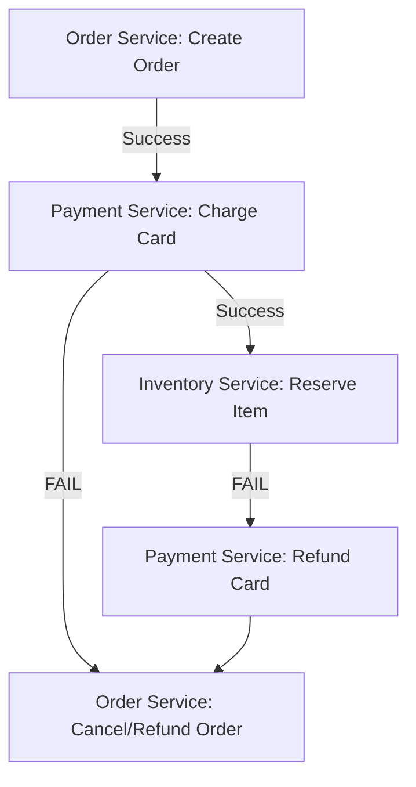

# Distributed Transactions and Sagas: Managing Multi-Service State

## 1. Beginner-friendly Hinglish Explanation 🇮🇳
Bhai, **Distributed Transactions** ka matlab hai "Multiple services ka kaam ek sath 'Ha' ya 'Na' hona." 

Socho aap ek flight ticket book kar rahe ho. 
1. Payment Service ne paise kaat liye. 
2. Booking Service fail ho gayi ticket book karne mein. 
Ab aapke paise toh gaye par ticket nahi mili! **Distributed Transactions** ye ensure karte hain ki ya toh dono kaam ho, ya dono "Rollback" (Cancel) ho jayein. 
Kyunki microservices mein ek central database nahi hota, isliye hum **Saga Pattern** use karte hain—jisme har action ke liye ek "Compensating Action" (e.g., Refund) taiyaar rehta hai.

---

## 2. Deep Technical Explanation
Managing transactions across multiple independent services is one of the hardest problems in microservices.

### 2PC (Two-Phase Commit)
- **Phase 1 (Prepare)**: Coordinator asks all services if they are ready.
- **Phase 2 (Commit)**: If all say yes, coordinator tells all to commit.
- **Issue**: Blocking. If the coordinator dies during Phase 2, resources stay locked forever.

### Saga Pattern (The Modern Way)
A Saga is a sequence of local transactions. If one local transaction fails, the Saga executes a series of **Compensating Transactions** that undo the changes made by the previous transactions.
- **Choreography**: Each service produces an event and other services react. (Decentralized).
- **Orchestration**: A central "Saga Manager" tells each service what to do. (Centralized).

---

## 3. Architecture Diagrams
**The Saga Pattern (Refund Flow):**

---

## 4. Scalability Considerations
- **Avoid 2PC at Scale**: 2PC doesn't scale well because of the synchronous locking. Sagas are much more scalable because they use asynchronous events.

---

## 5. Failure Scenarios
- **Interrupted Saga**: The server running the Saga Orchestrator crashes in the middle of a refund. (Fix: **State Machines** and **Persistent Event Logs**).
- **The "Lost Update"**: Service A reads data, Service B updates it, then Service A updates it based on old data. (Fix: **Semantic Locking**).

---

## 6. Tradeoff Analysis
- **ACID vs. BASE**: Distributed transactions trade the "I" (Isolation) of ACID for performance and availability.

---

## 7. Reliability Considerations
- **Idempotency**: Every step in a Saga MUST be idempotent. If the "Refund" event is sent twice, the user shouldn't get two refunds!

---

## 8. Security Implications
- **Compensating Vulnerability**: An attacker intentionally triggering failures to get a "Refund" without having actually paid.

---

## 9. Cost Optimization
- **Reducing Retries**: Using smart timeouts to decide when to "Give up" and start the compensation flow instead of retrying a dead service forever.

---

## 10. Real-world Production Examples
- **Uber**: Uses a massive orchestration engine called **Cadence** (now **Temporal**) to manage complex long-running Sagas.
- **Booking.com**: Uses Sagas to coordinate hotel, flight, and car bookings.

---

## 11. Debugging Strategies
- **State Machine Visualization**: Seeing exactly which "Step" a multi-day transaction is currently in.
- **Compensation Logs**: Monitoring how often things fail and require a "Rollback."

---

## 12. Performance Optimization
- **Parallel Sagas**: Running independent steps (like "Send Email" and "Check Inventory") in parallel instead of one after another.

---

## 13. Common Mistakes
- **No Isolation**: Forgetting that other users can see the "Partial state" of a Saga while it's still running.
- **Missing Compensation**: Writing the "Charge Money" code but forgetting the "Refund Money" code.

---

## 14. Interview Questions
1. What is the difference between 2PC and the Saga Pattern?
2. Explain 'Choreography' vs 'Orchestration' in Sagas.
3. How do you handle 'Partial Failures' in a distributed transaction?

---

## 15. Latest 2026 Architecture Patterns
- **Temporal.io**: The standard for "Durable Execution." It makes writing Sagas feel like writing normal, sequential code while handling retries and state automatically.
- **TCC (Try-Confirm-Cancel)**: A variant of 2PC that is more flexible and doesn't hold long-lived database locks.
- **Transactional Outbox Pattern**: Ensuring that a database update and a message publish happen atomically using a "Local Outbox Table."
	
