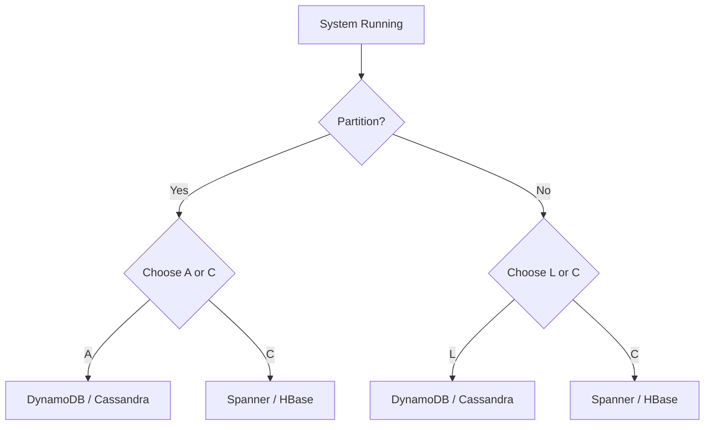

# PACELC Theorem: Beyond CAP

## 1. Beginner-friendly Hinglish Explanation 🇮🇳
Bhai, **PACELC** (pass-elk) CAP theorem ka bada bhai hai. 

CAP theorem sirf ye batata hai ki "Jab network toot-ta hai (Partition) toh kya hota hai." Lekin 99% time toh network sahi chalta hai! **PACELC** humein batata hai ki normal time mein kya hota hai. 
Iska matlab hai: 
- **P** (Partition) ke waqt: Choose karo **A** (Availability) ya **C** (Consistency). 
- **E** (Else - jab network sahi hai): Choose karo **L** (Latency - yaani speed) ya **C** (Consistency - yaani correctness). 
Ye humein batata hai ki "Strong Consistency" ki keemat sirf failure ke waqt nahi, balki normal time mein bhi "Speed" (Latency) de kar chukani padti hai.

---

## 2. Deep Technical Explanation
PACELC is an extension of the CAP theorem. It states that in a distributed system:
- **If there is a Partition (P)**: One must choose between Availability (A) and Consistency (C).
- **Else (E)** (when the system is running normally): One must choose between Latency (L) and Consistency (C).

### The LC Tradeoff (Normal Operation)
Even if everything is working, if you want "Strong Consistency" (C), every node must sync before replying to the user. This takes time (Latency). If you want "Speed" (L), you reply to the user immediately and sync in the background, but the next user might read the old data (Consistency loss).

---

## 3. Architecture Diagrams
**PACELC Logic Flow:**

---

## 4. Scalability Considerations
- **High Throughput (EL)**: Systems that prioritize Latency during normal times are the most scalable because nodes don't have to wait for each other.
- **Strict Compliance (EC)**: Systems that prioritize Consistency during normal times are limited by the speed of the slowest node.

---

## 5. Failure Scenarios
- **The "Slow Node" Problem**: In an EC system, if one server has a "Laggy" network, every single write becomes slow for every single user.

---

## 6. Tradeoff Analysis
- **User Experience (Latency) vs. Correctness (Consistency)**: In an e-commerce app, showing an incorrect "Stock Count" for 100ms is usually worth it for a 10ms faster page load.

---

## 7. Reliability Considerations
- **Tunable Consistency**: Modern databases let you configure the PACELC tradeoff at the client level (e.g., `ConsistencyLevel.LOCAL_QUORUM`).

---

## 8. Security Implications
- **Double Spending**: In financial systems, prioritizing Latency (L) over Consistency (C) could allow a user to spend the same money twice before the system realizes it's gone.

---

## 9. Cost Optimization
- **Bandwidth Usage**: EC systems use more internal network bandwidth to constantly sync data compared to EL systems.

---

## 10. Real-world Production Examples
- **DynamoDB / Cassandra**: PA/EL systems. They favor Availability during partitions and Latency during normal operations.
- **Google Spanner / CockroachDB**: PC/EC systems. They favor Consistency at all times, even if it means slower performance.

---

## 11. Debugging Strategies
- **Latency Attribution**: Measuring how much of your total response time is spent on "Consistency Wait" vs "Actual Logic."

---

## 12. Performance Optimization
- **Predictive Prefetching**: In an EL system, predicting what the next "Correct" value will be to hide the eventual consistency lag.

---

## 13. Common Mistakes
- **Designing for PACELC when CAP is enough**: Making a simple app too complex by obsessing over millisecond latency tradeoffs.
- **Ignoring the 'Else'**: Assuming that just because the network is up, your system is perfectly consistent.

---

## 14. Interview Questions
1. How does PACELC differ from the CAP theorem?
2. Why is the 'Latency vs Consistency' tradeoff important in normal operation?
3. Which database would you use for a system that requires PA/EL behavior?

---

## 15. Latest 2026 Architecture Patterns
- **Context-Aware PACELC**: AI that automatically switches a user from "Latency-optimized" to "Consistency-optimized" if it detects they are doing a sensitive operation (like changing a password).
- **Quantum Entanglement Networking**: New research attempting to achieve "Zero-latency Consistency" over long distances (The holy grail of distributed systems).
- **Edge-Core Consistency Mesh**: Maintaining strict consistency (EC) in small clusters at the Edge while keeping eventual consistency (EL) between global regions.
