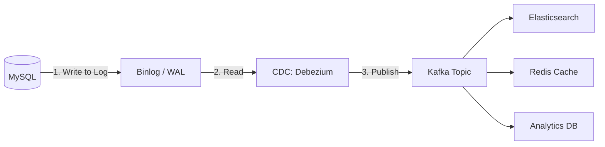

# Change Data Capture (CDC): Bridging DBs and Streams

## 1. Beginner-friendly Hinglish Explanation 🇮🇳
Bhai, **Change Data Capture (CDC)** ka matlab hai "Database ki jaasoosi karna." 

Socho aapka primary database (MySQL) update hua. Ab aap chahte ho ki: 
- Search Index (Elasticsearch) bhi update ho jaye. 
- Cache (Redis) bhi update ho jaye. 
- Analytics (ClickHouse) mein bhi entry chali jaye. 
Agar aap ye sab "Application code" se karoge, toh code ganda ho jayega aur agar ek cheez fail hui toh system inconsistent ho jayega. **CDC** database ke "Transaction Logs" (binlog) ko chupke se padhta hai aur har "Change" (Insert/Update/Delete) ko ek stream mein bhej deta hai. Isse baaki saare systems hamesha "Sync" mein rehte hain.

---

## 2. Deep Technical Explanation
CDC is a set of software design patterns used to determine and track the data that has changed so that action can be taken using the changed data.

### How it Works (Log-based CDC)
1. **Source**: The DB (MySQL/Postgres) writes every change to a **Write-Ahead Log (WAL)** or **Binary Log**.
2. **Reader**: A CDC tool (like **Debezium**) tails this log file.
3. **Stream**: The tool converts the log entries into a structured format (JSON/Avro) and publishes them to a Message Queue (Kafka).
4. **Sink**: Other services consume the stream and update their local state.

### Why not "Dual Writes"?
Dual writes (writing to DB and Kafka in app code) are unreliable. If the DB write succeeds but the Kafka write fails, your system is broken. CDC ensures that if it happened in the DB, it *will* eventually be in the stream.

---

## 3. Architecture Diagrams
**CDC Pipeline Workflow:**

---

## 4. Scalability Considerations
- **Low Impact**: CDC has near-zero performance impact on the primary database because it's just reading a log file from disk, not running queries.
- **Ordered Streams**: CDC ensures that if Update 1 happened before Update 2 in the DB, they appear in that same order in the Kafka stream.

---

## 5. Failure Scenarios
- **Log Rotation**: If the CDC tool is down for too long and the DB deletes its old logs (Log rotation), the tool might miss some changes. (Fix: **Initial Snapshots**).
- **Schema Migration**: If you add a column to the DB, the CDC stream must handle the new format without crashing.

---

## 6. Tradeoff Analysis
- **Eventual Consistency**: There is a small delay (milliseconds) between the DB update and the stream update. Not suitable for "Strongly Consistent" needs.

---

## 7. Reliability Considerations
- **Debezium**: The industry standard for CDC. It handles snapshots, offset tracking, and schema management automatically.

---

## 8. Security Implications
- **Log Access**: The CDC user must have high-level "Replication" permissions on the DB. This user must be strictly protected.

---

## 9. Cost Optimization
- **Filtering at Source**: Only capturing changes for "Important" tables and ignoring "Temporary/Audit" tables to save on Kafka costs.

---

## 10. Real-world Production Examples
- **Shopify**: Uses CDC to sync their main MySQL database with their Search and Cache layers.
- **Netflix**: Uses CDC to feed their complex event-driven architecture from their primary databases.
- **Uber**: Uses CDC to populate their global data lake from thousands of microservice databases.

---

## 11. Debugging Strategies
- **Kafka Tooling**: Inspecting the CDC messages to see the "Before" and "After" state of the row.
- **Offset Check**: Monitoring how far behind the CDC reader is from the DB's latest log position.

---

## 12. Performance Optimization
- **Snapshot Isolation**: Taking a "Point-in-time" snapshot of the DB when first starting the CDC tool to avoid missing historical data.

---

## 13. Common Mistakes
- **Relying on Timestamps**: Trying to do CDC by running `SELECT * FROM table WHERE updated_at > last_sync_time`. (This misses "Deletes"!).
- **Incorrect Partitioning**: Sending all changes for a table to a single Kafka partition, creating a bottleneck. (Fix: **Partition by Primary Key**).

---

## 14. Interview Questions
1. Why is 'Log-based CDC' better than 'Query-based CDC'?
2. How do you handle 'Schema Changes' in a CDC pipeline?
3. What are 'Dual Writes' and why should they be avoided?

---

## 15. Latest 2026 Architecture Patterns
- **Database-Native Streams**: Databases like **ScyllaDB** or **MongoDB** that have CDC-like "Change Streams" built directly into their API.
- **Real-time Feature Stores**: Using CDC to feed "Feature Stores" for AI models, so they always have the absolute latest data for prediction.
- **Serverless CDC (AWS Database Migration Service)**: Fully managed CDC pipelines that scale based on the volume of changes in your database.
	
