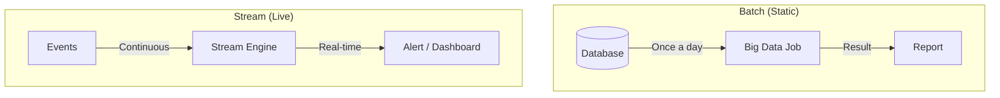

# Stream Processing Fundamentals: Computing on the Fly

## 1. Beginner-friendly Hinglish Explanation 🇮🇳
Bhai, **Stream Processing** ka matlab hai "Behte paani se bijli banana." 

- **Batch Processing**: Ye aisa hai ki aapne poore din ka kachra jama kiya aur raat ko ek sath saaf kiya. (E.g., Raat ko salary generate karna). 
- **Stream Processing**: Ye aisa hai ki jaise hi kachra aaya, aapne use turant saaf kar diya. (E.g., Jaise hi credit card swipe hua, fraud check karna). 
System design mein hum "Data in motion" ki baat karte hain—yaani data database mein save hone se pehle hi us par "Logic" lagana aur decision lena.

---

## 2. Deep Technical Explanation
Stream processing is the practice of taking action on data as it's generated, rather than waiting for a batch to be completed.

### Core Concepts
- **Unbounded Data**: Data that has no end (e.g., clicks, sensor data).
- **Windowing**: Cutting a stream into "Time chunks" to do math (e.g., "Calculate average price every 1 minute").
    - **Tumbling Window**: Fixed, non-overlapping (12:00-12:05, 12:05-12:10).
    - **Sliding Window**: Overlapping (12:00-12:05, 12:01-12:06).
    - **Session Window**: Based on activity (starts when user clicks, ends after 5 mins of silence).
- **Watermarks**: A way to handle "Late data." If a message from 12:00 arrives at 12:05, the watermark decides if we should still include it in the 12:00 calculation.

---

## 3. Architecture Diagrams
**Batch vs Stream Processing:**

---

## 4. Scalability Considerations
- **Parallelism**: Processing 1 million events/sec by splitting the stream into 100 parallel "Workers."
- **State Management**: If you are calculating a "Moving Average," your worker must store the current sum in memory (or a fast DB like RocksDB).

---

## 5. Failure Scenarios
- **Late Data**: A mobile phone was offline for 2 hours. When it comes online, it sends old data. Should you update your "Real-time Dashboard" for 2 hours ago?
- **Out-of-order Data**: Event A happened before B, but B arrived first because of network lag.

---

## 6. Tradeoff Analysis
- **Accuracy vs. Latency**: Do you want an "Approximate" result right now, or a "Perfect" result 5 minutes later?

---

## 7. Reliability Considerations
- **Exactly-once Semantics**: Ensuring that even if a worker crashes, the event isn't counted twice in your sum. (Achieved via **Checkpoints**).
- **At-least-once**: The standard for most real-time systems.

---

## 8. Security Implications
- **Real-time Threat Detection**: Using stream processing to detect an ongoing DDoS attack and block IPs instantly.

---

## 9. Cost Optimization
- **Reducing State Size**: Not storing every raw event, but only the "Summary" (e.g., store only the `count`, not every `user_id`).

---

## 10. Real-world Production Examples
- **Uber**: Uses stream processing to calculate "Surge Pricing" in real-time based on supply and demand.
- **Stock Markets**: Analyzing millions of price changes per second to execute automated trades.
- **Credit Card Companies**: Checking for fraud *during* the 2 seconds it takes to process your swipe.

---

## 11. Debugging Strategies
- **Data Replay**: Replaying the last 1 hour of Kafka events through your stream engine to see why a specific alert fired.
- **Metric Monitoring**: Tracking "Watermark Lag"—how far behind the system is from "Real-time."

---

## 12. Performance Optimization
- **State Partitioning**: Ensuring that all data for "User 123" always goes to the same worker so it can use its local cache.
- **Backpressure**: If the stream engine is slow, it tells the data source (Kafka) to "Slow down" instead of crashing.

---

## 13. Common Mistakes
- **Assuming Everything is Real-time**: Trying to build a stream processor for something that is only needed once a month.
- **Ignoring Time Zones**: Not handling the difference between "Event Time" (when it happened) and "Processing Time" (when the server saw it).

---

## 14. Interview Questions
1. What is the difference between Batch and Stream processing?
2. Explain the difference between 'Tumbling' and 'Sliding' windows.
3. How do 'Watermarks' handle late data in a stream?

---

## 15. Latest 2026 Architecture Patterns
- **Unified Batch-Stream (Beam)**: Writing code once that runs as both a batch job and a stream job (Google Dataflow / Apache Beam).
- **Stream-to-Vector**: Real-time embedding generation for AI models using **Flink ML**.
- **Edge-Streaming**: Doing initial data filtering and "Windowing" on the user's device or CDN to reduce cloud data costs.
	
