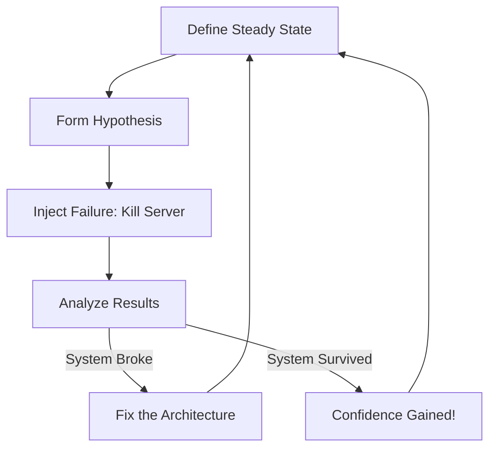

# Chaos Engineering Basics: Breaking Things to Build Strength

## 1. Beginner-friendly Hinglish Explanation 🇮🇳
Bhai, **Chaos Engineering** ka matlab hai "Apne system ko jaan-boojh kar thappad maarna." 

Socho aap ek boxer ho. Aap sirf shadow-boxing karke "World Champion" nahi ban sakte. Aapko kisi se "Punch" khana padega taaki aapka sharir mazboot ho sake. 
**Chaos Engineering** mein hum production system mein errors "Inject" karte hain (Jaise: Ek server band kar dena, network ko slow kar dena, ya database ko crash kar dena). Isse humein ye pata chalta hai ki: 
- Kya hamara "Failover" kaam kar raha hai? 
- Kya hamare alerts baj rahe hain? 
- Kya user ko "Error" dikh raha hai ya system handle kar raha hai?

---

## 2. Deep Technical Explanation
Chaos Engineering is the discipline of experimenting on a software system in production in order to build confidence in the system's capability to withstand turbulent and unexpected conditions.

### The Four Steps of Chaos
1. **Define Steady State**: Measure how the system looks when everything is healthy (e.g., "99.9% success rate, 50ms latency").
2. **Formulate Hypothesis**: "If I kill one database node, the success rate will stay above 99%."
3. **Inject Experiment**: Intentionally fail a component (kill a process, add 200ms latency).
4. **Analyze & Improve**: Compare the result with your steady state. If it broke, fix the system.

### Principles of Chaos
- **Build a Hypothesis around Steady State**.
- **Vary Real-world Events** (Kill servers, cut network, increase CPU).
- **Run Experiments in Production** (Yes, production! That's the only way to find real bugs).
- **Automate Experiments to Run Continuously**.
- **Minimize Blast Radius** (Don't kill the whole app; only affect 1% of users).

---

## 3. Architecture Diagrams
**The Chaos Experiment Cycle:**

---

## 4. Scalability Considerations
- **Testing at Scale**: Some bugs only happen when you have 1 million users. Chaos engineering is the only way to find those "Scale-specific" failure modes.

---

## 5. Failure Scenarios
- **The "Big Red Button"**: Always have a way to stop the chaos experiment instantly if things go wrong.
- **Cascading Failures**: A small experiment (killing a cache) accidentally triggering a total system collapse.

---

## 6. Tradeoff Analysis
- **Risk vs. Resilience**: Running chaos in production is risky, but NOT running it is riskier because you'll find the bugs during a real crisis when you're not prepared.

---

## 7. Reliability Considerations
- **Confidence Building**: Chaos engineering transforms "Hope" into "Proof" that your high-availability design actually works.

---

## 8. Security Implications
- **Testing Security Faults**: Injecting "Auth Failures" to see if your system "Fails closed" (Secured) or "Fails open" (Vulnerable).

---

## 9. Cost Optimization
- **Reducing On-call Burnout**: By finding and fixing bugs during the day (Chaos), you prevent middle-of-the-night emergency calls for SREs.

---

## 10. Real-world Production Examples
- **Netflix (Chaos Monkey)**: The pioneer of this field. They created a tool that randomly kills EC2 instances in production to ensure their microservices are resilient.
- **Amazon (GameDay)**: Regular events where teams try to "Break" each other's services to find weaknesses.
- **Gremlin**: A "Chaos-as-a-Service" platform used by large enterprises.

---

## 11. Debugging Strategies
- **Observability Alignment**: During a chaos experiment, check if your dashboards and alerts actually show what's happening. If you kill a server and the dashboard says "Green," your monitoring is broken!

---

## 12. Performance Optimization
- **Latency Injection**: Adding a small amount of latency (10-50ms) to every request to see if it causes a timeout chain-reaction in other services.

---

## 13. Common Mistakes
- **Running Chaos without Monitoring**: If you can't see the result, the experiment is useless.
- **Testing things you KNOW will break**: Fix the obvious bugs first! Chaos is for finding "Unknown-Unknowns."

---

## 14. Interview Questions
1. What is the goal of Chaos Engineering?
2. Why should you run chaos experiments in Production?
3. How do you 'Minimize Blast Radius' during an experiment?

---

## 15. Latest 2026 Architecture Patterns
- **AI-Generated Chaos**: AI that analyzes your architecture and automatically finds the "Weakest point" to run an experiment on.
- **Chaos Mesh (Kubernetes)**: Native tools that can inject network, disk, and pod failures into any K8s cluster with one command.
- **Deterministic Chaos**: Replaying a production outage exactly as it happened (same timing, same nodes) in a sandbox to ensure the fix is 100% effective.
	
