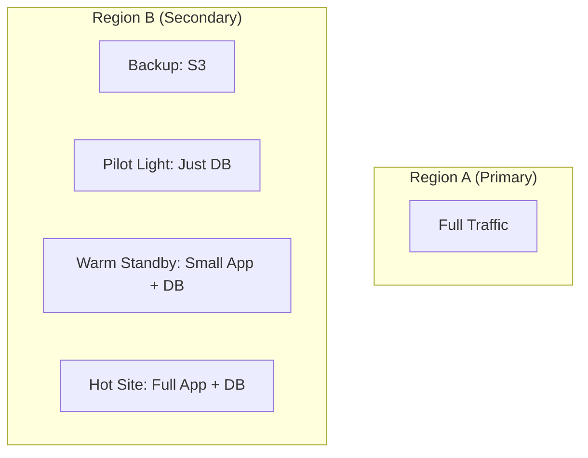

# Fault Tolerance and Disaster Recovery: The Survival Guide

## 1. Beginner-friendly Hinglish Explanation 🇮🇳
Bhai, **Fault Tolerance** aur **Disaster Recovery (DR)** ka matlab hai "Maut se ladna." 

- **Fault Tolerance**: Iska matlab hai ki agar system ka ek part kharab ho jaye (e.g., ek hard drive phat jaye), toh system bina ruke chalta rahega. Ye "Real-time" hota hai. 
- **Disaster Recovery**: Ye tab hota hai jab kuch "Bada Kaand" ho jaye (e.g., poore data center mein aag lag gayi ya earthquake aa gaya). Isme hum baat karte hain ki kitni jaldi hum "Backups" se system khada kar sakte hain. 
Basically, Fault Tolerance "Choti chote choton" se bachata hai, aur DR "Badi tabaahi" se.

---

## 2. Deep Technical Explanation
Fault tolerance is the property that enables a system to continue operating properly in the event of the failure of some of its components.

### Fault Tolerance Strategies
1. **Replication**: Running identical copies of a process on different hardware.
2. **Checkpointing**: Saving the state of a long-running task so it can restart from where it left off.
3. **Graceful Degradation**: Turning off non-essential features (like "Comments") to keep core features (like "Viewing Content") alive during a failure.

### Disaster Recovery Metrics
- **RPO (Recovery Point Objective)**: How much data loss is okay? (E.g., "We can lose 1 hour of data").
- **RTO (Recovery Time Objective)**: How fast must we be back up? (E.g., "We must be back up in 4 hours").

### DR Strategies
- **Backup & Restore**: Slow but cheap.
- **Pilot Light**: Keeping a tiny version of the system always running in another region.
- **Warm Standby**: Keeping a scaled-down version of the system ready to go.
- **Multi-site (Hot Site)**: Full system running in two places at once.

---

## 3. Architecture Diagrams
**Disaster Recovery Strategies:**

---

## 4. Scalability Considerations
- **Geo-Replication Scalability**: Replicating data across continents is limited by the speed of light. You have to decide between "Slow writes" (Sync) or "Potential data loss" (Async).

---

## 5. Failure Scenarios
- **Ransomware**: An attacker encrypting your primary storage. (Fix: **Air-gapped Backups**).
- **DNS Hijacking**: Someone pointing your domain to their server. (Fix: **DNSSEC**).

---

## 6. Tradeoff Analysis
- **RTO vs. Cost**: A 5-minute RTO (Hot site) costs 100x more than a 24-hour RTO (Backup & Restore).

---

## 7. Reliability Considerations
- **Immutable Backups**: Backups that cannot be deleted or changed even by an admin, protecting against inside threats or ransomware.

---

## 8. Security Implications
- **DR Site Security**: Your disaster recovery site must be just as secure as your primary site. Often, hackers target the weaker "Secondary" site.

---

## 9. Cost Optimization
- **Cold Storage for DR**: Storing snapshots on **AWS Glacier** to save 90% on storage costs compared to live SSDs.

---

## 10. Real-world Production Examples
- **AWS (S3)**: Designed to survive the loss of two entire data centers simultaneously.
- **Banks**: Required by law to have a "DR Site" at least 100km away from their primary data center.
- **GitHub**: Survived a massive database outage in 2018 using their "Orchestrator" tool for automated failover.

---

## 11. Debugging Strategies
- **DR Drills**: Actually turning off your primary data center once a year to see if the team can bring up the DR site within the RTO. (If you don't test it, it doesn't work!).

---

## 12. Performance Optimization
- **Database Snapshots**: Using storage-level snapshots for instant backups without slowing down the database.

---

## 13. Common Mistakes
- **No Off-site Backups**: Keeping your backups in the same building as your servers.
- **Ignoring RPO**: Realizing after a crash that you haven't backed up the data for 3 days.

---

## 14. Interview Questions
1. What is the difference between Fault Tolerance and Disaster Recovery?
2. Explain 'RPO' and 'RTO' with a real-world example.
3. What are 'Pilot Light' and 'Warm Standby' strategies?

---

## 15. Latest 2026 Architecture Patterns
- **Continuous DR (Zero-RPO)**: Using high-speed global networks to mirror every single byte to another continent in real-time.
- **Cloud-Agnostic DR**: Running your primary on AWS and your DR on Azure to survive a total failure of a cloud provider.
- **AI-Managed DR Orchestration**: AI that automatically detects a "Disaster" and starts the recovery process on a different cloud provider without any human intervention.
	
