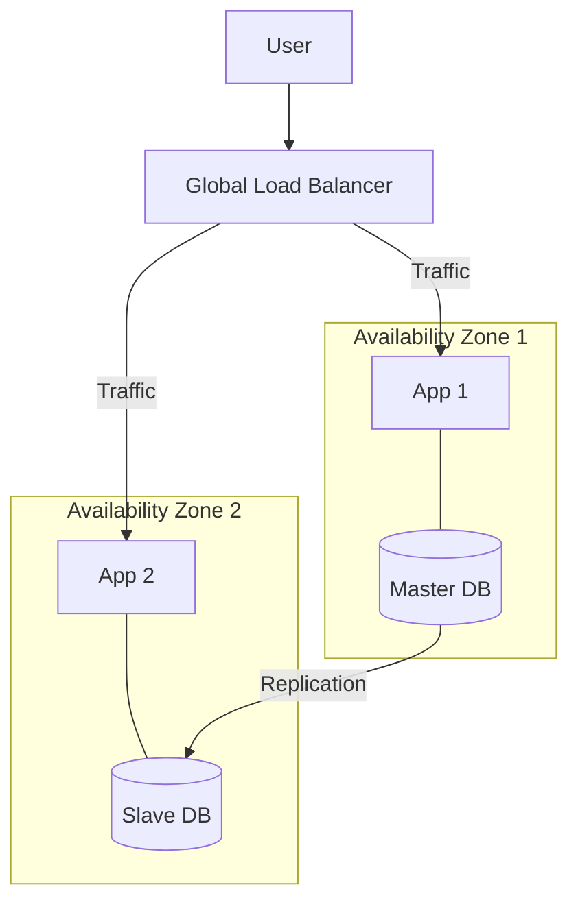

# High Availability Design: Building Systems That Never Die

## 1. Beginner-friendly Hinglish Explanation 🇮🇳
Bhai, **High Availability (HA)** ka matlab hai "System ka zinda rehna." 

Socho aap ek hospital chala rahe ho. Agar light chali gayi, toh aap ye nahi bol sakte: "Sorry, generator nahi hai." Aapke paas backups aur redundant systems hone chahiye. 
System design mein, HA ka matlab hai ki system 99.999% time ("Five Nines") chalta rehna chahiye. Iske liye hum: 
- Ek ki jagah do servers lagate hain (**Redundancy**). 
- Servers ko alag-alag shehron mein rakhte hain (**Geo-distribution**). 
- Aur ek system fail ho toh dusra turant kaman sambhal leta hai (**Failover**).

---

## 2. Deep Technical Explanation
HA is a characteristic of a system which aims to ensure an agreed level of operational performance, usually uptime, for a higher than normal period.

### The "Nines" of Availability
- **3 Nines (99.9%)**: ~9 hours of downtime/year. (Standard apps).
- **4 Nines (99.99%)**: ~52 mins of downtime/year. (Critical enterprise apps).
- **5 Nines (99.999%)**: ~5 mins of downtime/year. (Banking, Healthcare).

### Core Strategies
1. **Redundancy**: Having multiple instances of every component (Load Balancers, Apps, DBs).
2. **Failover**: Automatic detection of failure and switching to a healthy backup.
3. **Health Checks**: Constant monitoring of every component's pulse.
4. **Active-Active vs Active-Passive**: 
    - **Active-Active**: All servers handle traffic. If one dies, others pick up the slack.
    - **Active-Passive**: One server works, one waits. If the active one dies, the passive one wakes up.

---

## 3. Architecture Diagrams
**Multi-AZ High Availability:**

---

## 4. Scalability Considerations
- **Statelessness**: HA is much easier if your app servers are stateless. If a server dies, the user can just be routed to another server without losing their "Session."

---

## 5. Failure Scenarios
- **Region Outage**: An entire cloud region (e.g., AWS US-East-1) goes offline. (Fix: **Multi-region Architecture**).
- **Split Brain**: During a failover, two database nodes think they are both the "Master," leading to data corruption.

---

## 6. Tradeoff Analysis
- **Cost vs. Availability**: 5 Nines is 100x more expensive than 3 Nines because you need massive redundancy and complex automation.
- **Complexity**: More moving parts (Failover scripts, heartbeats) means more things that can break.

---

## 7. Reliability Considerations
- **Mean Time to Recovery (MTTR)**: How fast can you fix it?
- **Mean Time Between Failures (MTBF)**: How often does it break?

---

## 8. Security Implications
- **Fail-Open vs Fail-Closed**: If your firewall/auth service is down, do you let everyone in (High Availability) or block everyone (High Security)?

---

## 9. Cost Optimization
- **Auto-scaling**: Only running the "High Availability" extra servers when the traffic is high, and scaling down to a minimum during the night.

---

## 10. Real-world Production Examples
- **Google Search**: Designed to be always available. Even if thousands of servers die, the search results still show up.
- **Amazon.com**: Every minute of downtime costs millions of dollars, so their HA design is extreme.
- **WhatsApp**: Uses a massive distributed Erlang architecture to maintain connections for billions of users simultaneously.

---

## 11. Debugging Strategies
- **Post-mortems**: Analyzing every outage to ensure the same failure never happens again.
- **Chaos Engineering**: Intentionally killing servers in production to see if the HA failover actually works.

---

## 12. Performance Optimization
- **Anycast Routing**: Using DNS to route the user to the "Healthy" and "Closest" data center automatically.
- **Gossip Protocols**: For fast, decentralized failure detection across thousands of nodes.

---

## 13. Common Mistakes
- **Single Point of Failure (SPOF)**: Having 100 servers but only 1 Load Balancer. (If the LB dies, the 100 servers are useless!).
- **No Manual Failover Test**: Having a failover script that has never been tested and fails when a real outage happens.

---

## 14. Interview Questions
1. How do you design for 'Five Nines' of availability?
2. What is the difference between 'Active-Active' and 'Active-Passive'?
3. What is a 'Single Point of Failure' and how do you find it in a system?

---

## 15. Latest 2026 Architecture Patterns
- **Cloud-Native Cell Architecture**: Dividing the system into isolated "Cells" so that a failure in one only affects 1% of users.
- **Serverless HA**: Using services like **AWS Lambda** where the cloud provider handles all the HA and failover logic for you.
- **Self-Healing Infrastructure**: AI that monitors system logs and automatically re-provisions or restarts services before they even crash.
	
