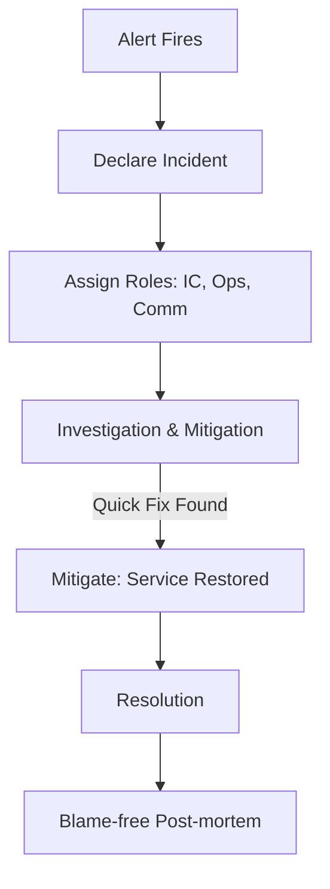

# Incident Management and Response: Fighting Fires Like a Pro

## 1. Beginner-friendly Hinglish Explanation 🇮🇳
Bhai, **Incident Management** ka matlab hai "Aag bujhana (Firefighting)." 

Jab system down hota hai, toh sab log ghabra jate hain (Panic). Ek achi company wo hai jiske paas "Emergency Protocol" hota hai. 
- **Detection**: Pata lagao ki kuch galat hua hai (Alerts). 
- **Triage**: Dekho ki kitni badi problem hai (P1 vs P3). 
- **Mitigation**: Sabse pehle user ke liye system thik karo (Chahe temporary "Restart" hi kyun na ho). 
- **Post-mortem**: Shanti se baitho aur dekho ki "Aag lagi kyun thi?" taaki wo dobara na lage. 
Ye pura process ek "SRE" team ka sabse bada imtihan hota hai.

---

## 2. Deep Technical Explanation
Incident Management is a set of processes to identify, analyze, and correct hazards to prevent a future reoccurrence.

### The Incident Lifecycle
1. **Identification**: Automated alerts (Prometheus/Datadog) or customer reports.
2. **Declaration**: Formally starting an incident and assigning roles.
3. **Investigation & Mitigation**: Finding the "Quick fix" (Revert code, Scale up, Flush cache). **Goal: Restore service, not find the root cause.**
4. **Resolution**: The system is back to its "Steady State."
5. **Post-mortem**: Documenting the event, finding the root cause, and creating "Action items" to prevent it.

### Key Roles (Incident Command System)
- **Incident Commander (IC)**: The leader. Makes decisions, coordinates teams.
- **Communications Lead**: Updates customers and internal stakeholders.
- **Operations Lead**: The person actually running the commands to fix the system.

---

## 3. Architecture Diagrams
**Incident Response Workflow:**

---

## 4. Scalability Considerations
- **Communication Overload**: In a massive outage, 1000 people might join the "War room" Zoom call. (Fix: **Strict Role Management** and using Slack for sub-tasks).

---

## 5. Failure Scenarios
- **Blind Mitigation**: Restarting a server without taking a "Heap dump" or "Logs," meaning the evidence of the bug is gone forever.
- **Communication Blackout**: The system is down for 5 hours but the "Status Page" still says "Green."

---

## 6. Tradeoff Analysis
- **Speed to Mitigate vs. Data Integrity**: Sometimes you have to "Truncate" a corrupted table to get the app back up. You fix the users now, but lose some data forever.

---

## 7. Reliability Considerations
- **On-Call Health**: Ensuring that SREs aren't woken up every single night. If a service is too "Noisy," its developers must fix the bugs before they are allowed to deploy new features.

---

## 8. Security Implications
- **Incident or Attack?**: Every technical failure should be checked to see if it's actually a "Security Breach" (DDoS or Hacker) masquerading as a bug.

---

## 9. Cost Optimization
- **Status Page Automation**: Using tools to automatically update the status page based on metrics, reducing the need for manual manual labor.

---

## 10. Real-world Production Examples
- **PagerDuty**: The platform most companies use to manage alerts and on-call rotations.
- **Google SRE**: Follows a strict ICS (Incident Command System) based on how fire departments and hospitals handle emergencies.
- **Atlassian (Statuspage)**: The standard tool for telling the world: "Yes, we are down, we are working on it."

---

## 11. Debugging Strategies
- **Change Logs**: The first question in any incident: "What changed in the last 30 minutes?". 90% of outages are caused by a "Code Deploy" or "Config Change."

---

## 12. Performance Optimization
- **Automated Reverts**: If the "Error Rate" spikes after a deploy, the system should automatically rollback the code without waiting for a human.

---

## 13. Common Mistakes
- **Finding Blame**: Saying "It was Rahul's fault." (Rahul will now never tell you when he makes a mistake).
- **Working without an IC**: Everyone trying to fix different things at once and making the problem worse.

---

## 14. Interview Questions
1. What are the steps you take when a P1 incident is reported?
2. What is a 'Blame-free Post-mortem' and why is it important?
3. How do you handle 'Communication' during a major outage?

---

## 15. Latest 2026 Architecture Patterns
- **AI War Rooms**: AI agents that join the incident Slack channel and automatically provide "Recent code changes," "Relevant logs," and "Past similar incidents" to help the humans.
- **Zero-Touch Mitigation**: Using AI to automatically apply "Proven fixes" (like scaling a cluster or restarting a pod) while notifying the humans.
- **Live-Post-mortems**: The system automatically generates the "Incident Report" as the event is happening by recording all Slack messages and terminal commands.
	
