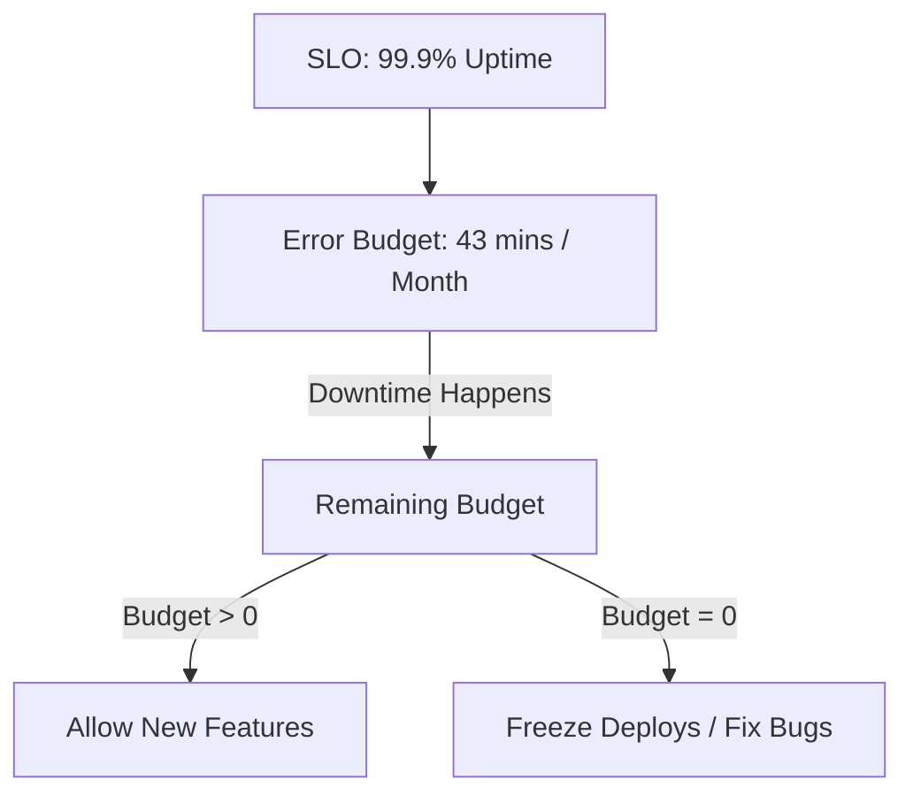

# SRE Principles and SLOs: Engineering Reliability

## 1. Beginner-friendly Hinglish Explanation 🇮🇳
Bhai, **SRE (Site Reliability Engineering)** ka matlab hai "Reliability ko code ki tarah treat karna." 

Google ne ye term banaya tha. SRE ka mantra hai ki: "Operation ka kaam boring aur manual nahi hona chahiye." 
- **SLI (Service Level Indicator)**: Ek metric (Jaise: Response time kitna hai?). 
- **SLO (Service Level Objective)**: Aapka target (Jaise: 99.9% requests fast honi chahiye). 
- **SLA (Service Level Agreement)**: Business ka vada (Jaise: Agar app 99.9% se zyada down raha toh hum aapko paise refund karenge). 
SREs "Error Budgets" use karte hain—yaani agar system bohot stable hai, toh aap naye features tezi se deploy kar sakte ho, lekin agar budget khatam ho gaya, toh deployments stop!

---

## 2. Deep Technical Explanation
SRE is what happens when you ask a software engineer to design an operations team.

### The Five Pillars of SRE
1. **Accept Risk**: No system is 100% reliable. Manage it using **Error Budgets**.
2. **Set Standards**: Use SLIs, SLOs, and SLAs to measure success.
3. **Reduce Toil**: Automate manual, repetitive tasks. (If you do it twice, automate it).
4. **Monitor Everything**: You can't fix what you can't see.
5. **Release Engineering**: Using CI/CD to ensure safe and predictable deployments.

### SLI vs SLO vs SLA
- **SLI**: A specific metric (e.g., Error Rate).
- **SLO**: A goal for that metric (e.g., < 0.1% errors over 30 days).
- **SLA**: A legal contract based on the SLO.

---

## 3. Architecture Diagrams
**Error Budget Workflow:**

---

## 4. Scalability Considerations
- **Toil Management**: As you scale from 10 to 10,000 servers, your SRE team shouldn't scale linearly. You must use **Automation** to manage 1000x more servers with the same number of people.

---

## 5. Failure Scenarios
- **Blind SLOs**: Setting an SLO for "CPU usage" but the "Website" is actually broken. (Always set SLOs based on **User Experience**).
- **Manual Overhead**: An SRE team spending 100% of their time just "Fixing servers" instead of writing code to prevent them from breaking.

---

## 6. Tradeoff Analysis
- **Velocity vs. Reliability**: Moving fast (More features) vs. Moving safe (More stability). The Error Budget is the tool that balances this.

---

## 7. Reliability Considerations
- **Post-mortems**: Blame-free reviews of every outage. The goal is to find the "Systemic cause," not the "Person to blame."

---

## 8. Security Implications
- **Safety in Automation**: Automated deployments are more secure because they reduce the chance of a human making a configuration mistake.

---

## 9. Cost Optimization
- **Right-sizing SLOs**: Not every app needs "Five Nines." A "Internal Testing Tool" can have 95% uptime, saving 90% on infrastructure costs.

---

## 10. Real-world Production Examples
- **Google**: Every service has an SLO and a dedicated SRE team that can "Refuse" to deploy new code if the error budget is gone.
- **LinkedIn**: Uses "On-call" rotations and strict incident management based on SRE principles.

---

## 11. Debugging Strategies
- **Observability Overload**: Having 10,000 metrics but no one knows which ones actually matter. (Focus on the **Four Golden Signals**: Latency, Traffic, Errors, Saturation).

---

## 12. Performance Optimization
- **Eliminating Toil**: Using tools like **Ansible**, **Terraform**, and **Kubernetes** to manage infrastructure as code.

---

## 13. Common Mistakes
- **Punishing Failure**: Blaming a developer for an outage (This makes people hide their mistakes).
- **Unrealistic SLOs**: Setting 100% uptime (It's impossible and will paralyze development).

---

## 14. Interview Questions
1. What is the difference between an SLI, an SLO, and an SLA?
2. What is an 'Error Budget' and how is it used?
3. What are the 'Four Golden Signals' of monitoring?

---

## 15. Latest 2026 Architecture Patterns
- **AIOps (AI for SRE)**: AI that automatically correlates alerts and suggests fixes (or even applies them) during an incident.
- **Infrastructure as Code (IaC) 2.0**: Using LLMs to generate and validate Terraform/K8s manifests based on natural language reliability requirements.
- **Continuous Reliability (CR)**: Integrating SLO checks directly into the CI/CD pipeline so that code is automatically "Reverted" if it breaks an SLO in production.
	
