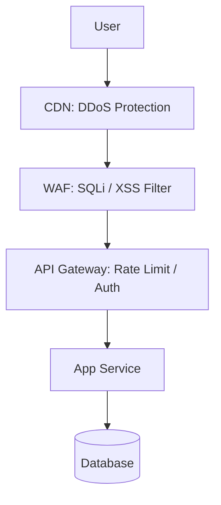

# API Security and Protection: Shielding the Entry Point

## 1. Beginner-friendly Hinglish Explanation 🇮🇳
Bhai, **API Security** ka matlab hai "Apne ghar ke main gate ko mazboot banana." 

Internet par hazaron bots aur hackers ghum rahe hain jo aapki API ko todne ki koshish karenge. 
- **Rate Limiting**: Ek banda 1 second mein 1000 baar "Login" try nahi kar sakta. 
- **WAF (Web Application Firewall)**: Ye "Security guard" hai jo pehchanta hai ki kaunsa request "Normal" hai aur kaunsa "Attack" (SQL Injection). 
- **Encryption**: Data ko aise "Code" mein badal dena ki beech mein koi use na padh sake (HTTPS/TLS). 
In sabke bina, aapki API "Khuli kitab" ki tarah hai.

---

## 2. Deep Technical Explanation
API security involves protecting APIs from attacks, ensuring only authorized users have access, and preventing data leakage.

### Top API Threats (OWASP API Security Top 10)
1. **Broken Object Level Authorization (BOLA)**: Accessing `/api/orders/123` when you only own order `456`.
2. **Broken User Authentication**: Weak passwords or flawed token management.
3. **Mass Assignment**: Sending `{ "is_admin": true }` in a "Update Profile" request and actually becoming an admin.
4. **Lack of Resources & Rate Limiting**: Crashing the server with too many requests.

---

## 3. Architecture Diagrams
**Multi-layer API Protection:**

---

## 4. Scalability Considerations
- **Distributed Rate Limiting**: If you have 10 servers, you need a central place (like Redis) to track how many requests a user has made globally.

---

## 5. Failure Scenarios
- **DDoS Attack**: An attacker using 10,000 computers to call your "Search" API, making it so busy that real users can't use it.
- **Log Leakage**: An API error returning a raw database query, showing the attacker your table names and structure.

---

## 6. Tradeoff Analysis
- **Security vs. Friction**: 2FA and complex passwords are "Secure" but they make the user experience "Worse."
- **Encryption Overheads**: mTLS (encryption between services) adds latency and CPU load.

---

## 7. Reliability Considerations
- **Fail-Safe**: If the security service (e.g., WAF) is slow, does it slow down the whole app? (Fix: **Bypass on timeout** or **Async analysis**).

---

## 8. Security Implications
- **TLS 1.3**: The modern standard. It's faster and more secure than 1.2.
- **API Keys vs Tokens**: API keys are for servers; Tokens (JWT) are for users. Never use an API key in a browser/mobile app!

---

## 9. Cost Optimization
- **Edge Protection**: Using **Cloudflare/Akamai** to block attacks before they even reach your cloud, saving you thousands of dollars in "Egress" and "Compute" costs.

---

## 10. Real-world Production Examples
- **Stripe**: Provides "Idempotency-Keys" so that even if a request is retried, the user is never charged twice.
- **Cloudflare WAF**: Protects millions of websites from common attacks automatically.
- **AWS WAF**: Allows you to write "Rules" to block specific IP ranges or countries.

---

## 11. Debugging Strategies
- **Burp Suite**: A tool used by security researchers to "Intercept" and "Modify" API calls to find bugs.
- **WAF Logs**: Checking which requests were blocked and why.

---

## 12. Performance Optimization
- **JWT Local Validation**: Verifying the user at the Gateway without calling the Auth DB.
- **Hardware Acceleration**: Using specialized CPU chips (TLS Offloading) to handle encryption.

---

## 13. Common Mistakes
- **No Input Validation**: Assuming that `?id=123` is always a number. (It could be `123; DROP TABLE users`).
- **Exposing Internal IDs**: Using incremental IDs (`/user/1`, `/user/2`). (Use **UUIDs** or **ULIDs** instead!).

---

## 14. Interview Questions
1. What are the 'OWASP API Top 10' and why do they matter?
2. How do you prevent 'Mass Assignment' vulnerabilities?
3. What is the difference between an 'API Gateway' and a 'WAF'?

---

## 15. Latest 2026 Architecture Patterns
- **AI-Managed Rate Limiting**: Instead of a fixed "100 req/min," the AI detects "Abnormal patterns" for a specific user and throttles them dynamically.
- **API Security Posture Management (ASPM)**: Tools that automatically scan your code and production traffic to find "Hidden" (Shadow) APIs that you forgot to secure.
- **GraphQL-Specific Protection**: Special firewalls that analyze query complexity and depth to prevent "Billion Laughs" style attacks.
	
