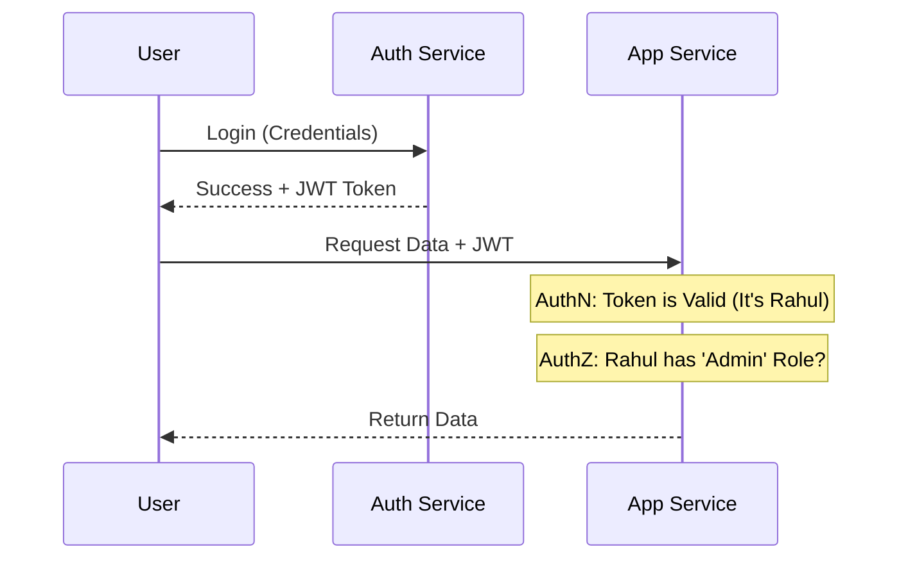

# Authentication and Authorization: The Guardrails of Identity

## 1. Beginner-friendly Hinglish Explanation 🇮🇳
Bhai, **Authentication (AuthN)** aur **Authorization (AuthZ)** mein log aksar confuse ho jate hain, lekin inka farak simple hai. 

- **Authentication (Who are you?)**: Ye "Identity card" dikhane jaisa hai. (E.g., Username/Password, OTP, ya Fingerprint). Isse server ko pata chalta hai ki aap "Rahul" ho. 
- **Authorization (What can you do?)**: Ye "Chabi" (Key) milne jaisa hai. Kya Rahul ke paas "Admin panel" kholne ki permission hai? Ya wo sirf apni "Profile" dekh sakta hai? 
System design mein, AuthN pehla step hai aur AuthZ dusra. Agar ye galat hue, toh aapka poora data "Open" ho sakta hai.

---

## 2. Deep Technical Explanation
Securing a distributed system requires robust identity management across many services.

### Authentication (AuthN)
- **Methods**: Passwords (salted/hashed), Multi-Factor Authentication (MFA), Biometrics, Magic Links.
- **Protocols**: SAML (Enterprise), LDAP, OIDC (Consumer).

### Authorization (AuthZ)
- **RBAC (Role-Based Access Control)**: Permissions assigned to roles (Admin, Editor, Viewer). Simple but can get messy.
- **ABAC (Attribute-Based Access Control)**: Permissions based on attributes (User, Resource, Environment). E.g., "Can access only if user is in 'HR' AND time is '9 AM - 5 PM'."
- **ReBAC (Relationship-Based Access Control)**: Based on relationships (e.g., "User is a 'Friend' of the post owner"). (Used by Google/Facebook).

---

## 3. Architecture Diagrams
**AuthN vs AuthZ Flow:**

---

## 4. Scalability Considerations
- **Centralized Auth**: Every request hits the Auth service. This is a massive bottleneck. (Fix: **JWTs** with local validation).
- **Statelessness**: Using tokens allows any server to authenticate the user without needing a central session database.

---

## 5. Failure Scenarios
- **Token Leakage**: Someone steals a user's token. (Fix: **Short expiration** and **Refresh tokens**).
- **Broken AuthZ**: A user changes the `user_id` in the URL from `/user/5` to `/user/6` and can see someone else's data (**IDOR**).

---

## 6. Tradeoff Analysis
- **Passwords vs Passwordless**: Passwords are familiar but hard to manage securely. Magic links are more secure but "Annoying" for some users.
- **RBAC vs ABAC**: RBAC is fast and easy to build. ABAC is more powerful but much more complex to implement and debug.

---

## 7. Reliability Considerations
- **Auth Availability**: If your Auth Service is down, NO ONE can use your app. (Fix: **Replicated Auth DBs** and **Edge Caching of Public Keys**).

---

## 8. Security Implications
- **Hashing Algorithms**: NEVER store plain text passwords. Use **Argon2**, **bcrypt**, or **scrypt** with a unique "Salt" for every user.
- **MFA**: Essential for modern systems. Use TOTP (Google Authenticator) over SMS (which is vulnerable to SIM swapping).

---

## 9. Cost Optimization
- **Third-party Auth (Auth0/Clerk)**: Expensive per user but saves months of engineering time and reduces the risk of getting hacked.

---

## 10. Real-world Production Examples
- **Google (Zanzibar)**: Their internal ReBAC system that handles permissions for billions of users across Drive, Photos, and YouTube.
- **Netflix**: Uses **Passport** (not the JS library) to pass identity info between microservices.

---

## 11. Debugging Strategies
- **JWT Debugger (jwt.io)**: Seeing exactly what data is inside a token.
- **Auth Logs**: Tracking "Failed login attempts" to detect brute-force attacks.

---

## 12. Performance Optimization
- **Local Validation**: Using asymmetric keys (RS256) so services can verify a JWT using a "Public Key" without calling the Auth service.

---

## 13. Common Mistakes
- **Storing JWTs in LocalStorage**: Vulnerable to XSS. (Use **HttpOnly Cookies**!).
- **No Rate Limiting on Login**: Allowing an attacker to try 10,000 passwords per second.

---

## 14. Interview Questions
1. What is the difference between Authentication and Authorization?
2. How do JWTs help in scaling microservices?
3. What is 'IDOR' and how do you prevent it?

---

## 15. Latest 2026 Architecture Patterns
- **Passkeys (FIDO2)**: The end of passwords! Using the phone's hardware security to authenticate users without any password.
- **Zanzibar-style AuthZ (Oso/SpiceDB)**: Open-source versions of Google's permission system for any developer.
- **Continuous Authentication**: AI that monitors user behavior (typing speed, location, mouse movement) and asks for MFA again if something looks "Fishy."
	
