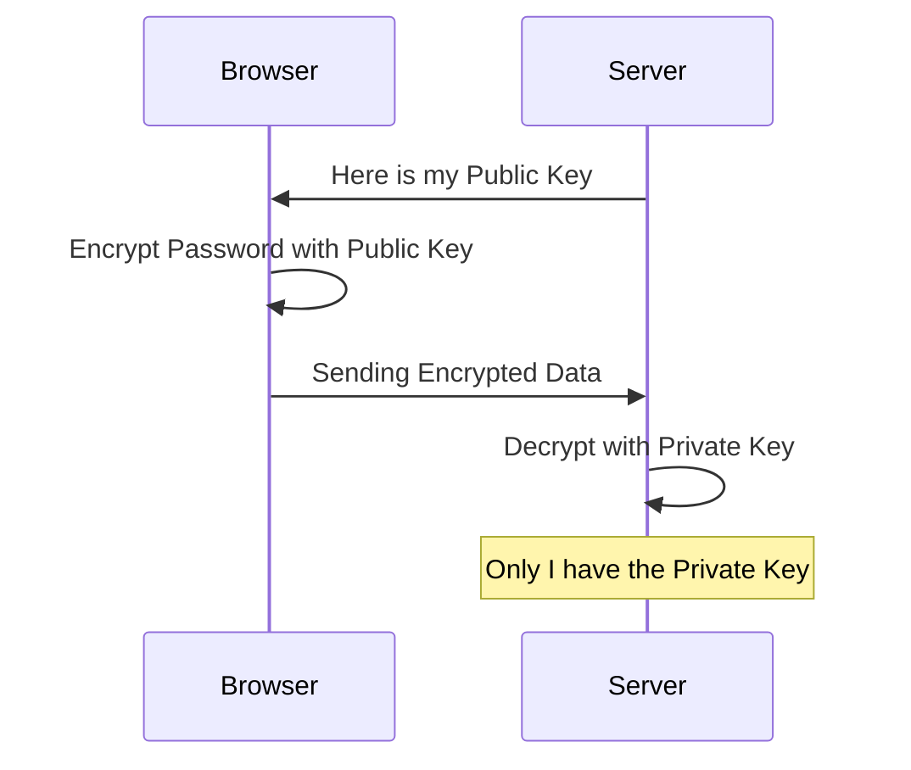

# Data Encryption and Privacy: The Art of Secrecy

## 1. Beginner-friendly Hinglish Explanation 🇮🇳
Bhai, **Data Encryption** ka matlab hai "Data ko ek aise lock mein band karna jiski chabi sirf aapke paas ho." 

- **At Rest**: Jab data disk par baitha hai. (E.g., Agar koi server chura le jaye, tab bhi wo data nahi padh payega). 
- **In Transit**: Jab data network par travel kar raha hai. (E.g., Aapka password browser se server tak "Lock" hokar jata hai). 
- **In Use**: Jab CPU data process kar raha hai. (Ye sabse naya aur advanced hai). 
Privacy ka matlab hai ki aapke user ka data sirf wahi dekh sake jise permission ho, aur "GDPR" jaise kanoon (Laws) ka palan karna.

---

## 2. Deep Technical Explanation
Encryption is the process of encoding information so that only authorized parties can access it.

### Types of Encryption
1. **Symmetric (AES)**: Same key for locking and unlocking. Very fast. (Used for files/disks).
2. **Asymmetric (RSA/Elliptic Curve)**: Different keys (Public/Private). One locks, the other unlocks. Slower but better for sharing keys.
3. **Hashing (SHA-256)**: One-way process. You can't "Decrypt" it. (Used for passwords).

### Privacy Frameworks
- **GDPR**: European law. Users have the "Right to be forgotten" (Delete all their data).
- **Differential Privacy**: Adding "Noise" to data so you can see trends (e.g., "Average Salary") without knowing any individual's data.

---

## 3. Architecture Diagrams
**Public Key Encryption (In Transit):**

---

## 4. Scalability Considerations
- **Key Rotation**: When you have 10,000 servers, changing the encryption keys without downtime is a massive challenge. (Fix: **AWS KMS / HashiCorp Vault**).

---

## 5. Failure Scenarios
- **Key Loss**: If you lose the encryption key for your database, your data is gone forever. Even the cloud provider can't help you!
- **Quantum Threat**: Future quantum computers could break today's RSA encryption in seconds.

---

## 6. Tradeoff Analysis
- **Security vs. Speed**: Encrypting every single field in a database makes it "Super secure" but makes search and filtering almost impossible.

---

## 7. Reliability Considerations
- **KMS (Key Management Service)**: Using a dedicated service for keys so you don't have to store them in your application code or config files.

---

## 8. Security Implications
- **Encryption at the Application Layer**: Encrypting sensitive data (like `credit_card`) *before* it even hits the database, so even a DB admin can't read it.
- **PFS (Perfect Forward Secrecy)**: Ensuring that even if a future key is leaked, past communications stay encrypted.

---

## 9. Cost Optimization
- **Hardware Security Modules (HSM)**: Using specialized, expensive hardware for critical keys (like Root CA), but using software-based KMS for daily app data.

---

## 10. Real-world Production Examples
- **WhatsApp**: Uses "End-to-End Encryption" (Signal Protocol) so even Facebook can't read your chats.
- **Apple**: Uses a "Secure Enclave" (a separate chip) to store your FaceID/Fingerprint data.
- **Banks**: Use HSMs to process every ATM transaction.

---

## 11. Debugging Strategies
- **Packet Sniffing**: Using Wireshark to see if the data on the wire is actually encrypted (it should look like garbage).
- **Key Audit Logs**: Seeing who accessed a specific key and when.

---

## 12. Performance Optimization
- **AES-NI**: Using special instructions in modern Intel/AMD CPUs to do encryption 10x faster.
- **Envelop Encryption**: Encrypting data with a "Data Key" and then encrypting the "Data Key" with a "Master Key."

---

## 13. Common Mistakes
- **Rolling your own Crypto**: Never, ever write your own encryption algorithm. (Use standard libraries like **OpenSSL** or **NaCl**).
- **Hardcoding Secrets**: Putting `ENCRYPTION_KEY="secret123"` in your Git repository.

---

## 14. Interview Questions
1. What is the difference between Symmetric and Asymmetric encryption?
2. What is 'Salting' and why is it used in password hashing?
3. How do you handle 'Data Deletion' requests under GDPR?

---

## 15. Latest 2026 Architecture Patterns
- **Homomorphic Encryption**: Math that allows you to "Perform calculations" (like `SUM`) on encrypted data without ever decrypting it.
- **Confidential Computing (TEE)**: Using "Enclaves" (Intel SGX) to process data in a protected part of the CPU where even the Cloud Provider/OS cannot see it.
- **Post-Quantum Cryptography (PQC)**: Moving to new algorithms (like **Kyber**) that are safe from future quantum computers.
	
