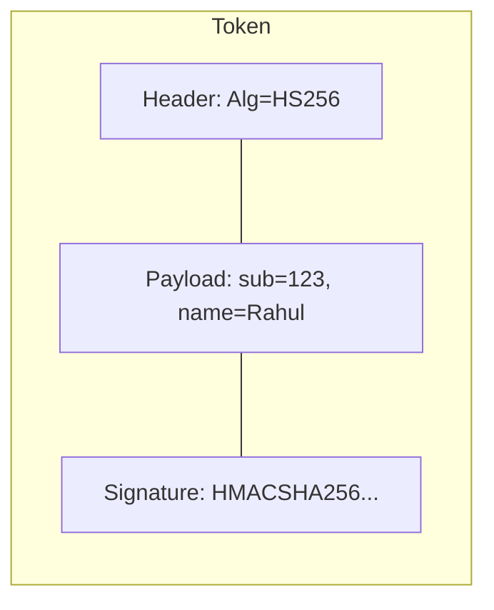

# JWT and Session Management: Stateless vs. Stateful

## 1. Beginner-friendly Hinglish Explanation 🇮🇳
Bhai, **JWT (JSON Web Token)** aur **Sessions** do tarike hain ye yaad rakhne ke ki "Banda login hai ya nahi." 

1. **Sessions (The Diary)**: Server ek diary (Database/Redis) mein likhta hai: "ID 123 login hai." User ko sirf ek ID milti hai. Har baar user aata hai, server diary check karta hai. Ye "Safe" hai par scale karna mushkil hai (agar 10 crore log hain toh diary bohot badi ho jayegi). 
2. **JWT (The Stamp)**: Server ek parchi par stamp laga deta hai: "Ye Rahul hai, ye iska email hai, aur main ye verify karta hoon." User ye parchi hamesha saath rakhta hai. Server ko koi diary dekhne ki zarurat nahi, wo bas "Stamp" check karta hai. Ye scale ke liye "Best" hai.

---

## 2. Deep Technical Explanation
Session management ensures that a user's authenticated state persists across multiple HTTP requests.

### Sessions (Stateful)
- **Storage**: Server-side (Memory, DB, or Redis).
- **Client Identifier**: Session ID stored in a cookie.
- **Pros**: Easy to revoke (just delete from DB), small cookie size.
- **Cons**: Difficult to scale across multiple regions, creates a single point of failure (Session DB).

### JWT (Stateless)
- **Storage**: Client-side (Cookie or LocalStorage).
- **Structure**: Header (Algorithm) . Payload (Data) . Signature (Verification).
- **Pros**: No server-side storage, works across different domains and microservices.
- **Cons**: Impossible to revoke before it expires (unless you add a blacklist), larger payload size.

---

## 3. Architecture Diagrams
**JWT Anatomy:**

---

## 4. Scalability Considerations
- **JWT for Microservices**: A microservice can verify a JWT using just a "Public Key" without calling the Auth service. This is the only way to scale to thousands of services.

---

## 5. Failure Scenarios
- **Secret Key Compromise**: If an attacker gets the private key used to sign JWTs, they can create tokens for ANY user and become an admin.
- **XSS Attack**: If JWT is in `LocalStorage`, a malicious script can steal it.

---

## 6. Tradeoff Analysis
- **Revocation vs. Scalability**: Do you need the power to instantly "Kick out" a user? If yes, use Sessions or JWT with a Blacklist. If you value raw speed, use pure JWT.

---

## 7. Reliability Considerations
- **Token Expiration (exp)**: Always set a short expiration (e.g., 15 mins). Use a **Refresh Token** (stored in a secure DB) to get a new Access Token.

---

## 8. Security Implications
- **HttpOnly & Secure Cookies**: Always store tokens in cookies that cannot be accessed by Javascript (prevents XSS) and are only sent over HTTPS.
- **Signing Algorithms**: Use `RS256` (Asymmetric) instead of `HS256` (Symmetric) for better security in microservices.

---

## 9. Cost Optimization
- **Payload Size**: Don't put "Profile Pictures" or "Bios" inside a JWT. It's sent on EVERY request, wasting bandwidth. Keep it under 1KB.

---

## 10. Real-world Production Examples
- **Amazon**: Uses stateful sessions for the shopping cart (durability is key).
- **Auth0 / Firebase**: Use JWTs as the primary way to manage identity.
- **Legacy Banks**: Still use stateful sessions for maximum control and security.

---

## 11. Debugging Strategies
- **jwt.io**: The go-to tool for decoding and inspecting JWTs.
- **Cookie Inspector**: Checking if the `Secure` and `HttpOnly` flags are actually set.

---

## 12. Performance Optimization
- **Stateless Validation**: Services performing cryptographic verification in <1ms without any network IO.

---

## 13. Common Mistakes
- **No Expiration**: Creating a JWT that lasts for 1 year. (If it's stolen, the user is hacked for a year!).
- **Using 'none' algorithm**: An old vulnerability where the server accepts tokens with `alg: none` (no signature).

---

## 14. Interview Questions
1. What is the difference between a Session and a JWT?
2. How do you revoke a JWT if it's stolen?
3. What are the three parts of a JWT?

---

## 15. Latest 2026 Architecture Patterns
- **Paseto (Platform-Agnostic SEcurity TOkens)**: A "Fix" for JWT's design flaws, removing complex algorithm choices and making it "Secure by default."
- **Biscuit Tokens**: Next-gen tokens that allow "Offline attenuation"—you can take a token and create a "Restricted version" of it without calling the server.
- **Stateful-JWT Hybrid**: Using a stateless JWT for data but checking a "Version number" in a fast Redis cache to allow instant revocation.
	
