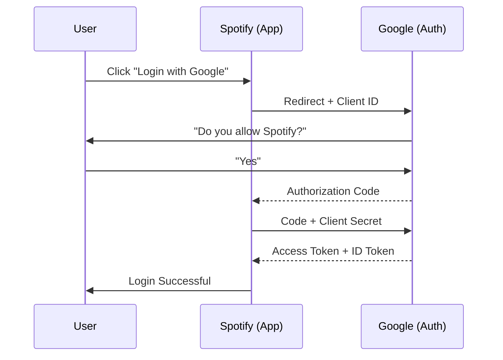

# OAuth 2.0 and OIDC Deep Dive: Delegating Identity

## 1. Beginner-friendly Hinglish Explanation 🇮🇳
Bhai, **OAuth 2.0** ka matlab hai "Apni chabi kisi aur ko dena, par sirf thode der ke liye." 

Socho aap ek hotel mein ho. Aapne apna "Master Key" (Password) kisi ko nahi diya. Aapne reception par apna ID dikhaya (**OIDC**) aur unhone aapko ek "Key Card" (**OAuth Token**) de diya. Is card se aap sirf "Room 302" khol sakte ho, pura hotel nahi. 
- **OAuth 2.0**: Permission manage karta hai (E.g., "Can I access your Google Contacts?"). 
- **OIDC (OpenID Connect)**: Identity manage karta hai (E.g., "Who are you?"). 
Jab aap "Login with Google" par click karte ho, toh piche yahi dono protocols kaam kar rahe hote hain.

---

## 2. Deep Technical Explanation
OAuth 2.0 is an authorization framework; OIDC is an identity layer on top of it.

### OAuth 2.0 Roles
1. **Resource Owner**: The User.
2. **Client**: The App (e.g., Spotify).
3. **Authorization Server**: The ID Provider (e.g., Google).
4. **Resource Server**: The API holding the data (e.g., Google Contacts).

### The Authorization Code Flow (Most Common)
1. **Redirect**: App sends user to Google.
2. **Consent**: User says "Yes, Spotify can see my email."
3. **Code**: Google sends a short-lived "Code" back to the App.
4. **Exchange**: App sends the "Code" + "Client Secret" to Google.
5. **Token**: Google returns an **Access Token** (to call APIs) and an **ID Token** (OIDC - to see user info).

---

## 3. Architecture Diagrams
**OAuth 2.0 Flow:**

---

## 4. Scalability Considerations
- **Global Auth Servers**: Auth servers must be fast and globally distributed because they are in the "Critical Path" of every new login.

---

## 5. Failure Scenarios
- **CSRF Attack**: An attacker tricks a user into logging into the attacker's account. (Fix: **PKCE** and **State** parameters).
- **Secret Leak**: If your `Client Secret` is leaked (e.g., hardcoded in a mobile app), anyone can impersonate your app.

---

## 6. Tradeoff Analysis
- **Access Token Life**: Long life (Easy for user) vs. Short life (Secure but requires more refreshes).

---

## 7. Reliability Considerations
- **Uptime of IDP**: If Google is down, your "Login with Google" users can't enter your app. (Fix: **Multiple Login Options**).

---

## 8. Security Implications
- **Scopes**: Always ask for the "Minimum" permissions. Don't ask for `Full Drive Access` if you only need to `Read one file`.
- **PKCE (Proof Key for Code Exchange)**: Mandatory for mobile and SPA apps where secrets cannot be kept safe.

---

## 9. Cost Optimization
- **Token Introspection**: Reducing the number of times you call the Auth server to check if a token is valid by using "Self-contained" JWTs.

---

## 10. Real-world Production Examples
- **Login with Facebook/Google/GitHub**: Every site uses OIDC for this.
- **Slack App Directory**: Uses OAuth 2.0 to let you add "Trello" or "Jira" to your Slack workspace.

---

## 11. Debugging Strategies
- **OAuth Debugger**: Tools that let you manually go through each step of the flow to see where it breaks.
- **Network Tab**: Checking the `Location` header during redirects.

---

## 12. Performance Optimization
- **OIDC Discovery**: Using `.well-known/openid-configuration` to automatically find the Auth server's endpoints.

---

## 13. Common Mistakes
- **Implicit Flow**: Using the old "Implicit Flow" (which sends the token in the URL). It's deprecated and dangerous! (Use **Auth Code Flow + PKCE**).
- **No Token Rotation**: Never changing the keys used to sign the tokens.

---

## 14. Interview Questions
1. What is the difference between OAuth 2.0 and OIDC?
2. Explain the 'Authorization Code Flow' step-by-step.
3. What is 'PKCE' and why is it needed for mobile apps?

---

## 15. Latest 2026 Architecture Patterns
- **FAPI (Financial-grade API)**: A super-secure version of OAuth for banks and healthcare.
- **DPoP (Demonstrating Proof-of-Possession)**: A new way to "Bind" a token to a specific device so that even if it's stolen, it cannot be used on another computer.
- **Verifiable Credentials (VC)**: Moving beyond OIDC to "Decentralized Identity" where the user owns their own identity data.
	
