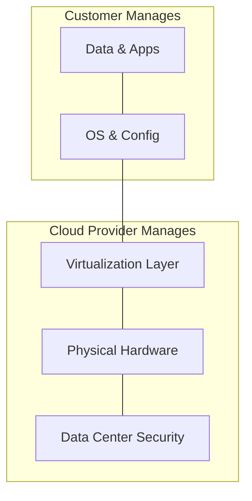

# Cloud Computing Basics: The Infinite Data Center

## 1. Beginner-friendly Hinglish Explanation 🇮🇳
Bhai, **Cloud Computing** ka matlab hai "Computer ko rent par lena." 

Pehle agar aapko ek website banani hoti thi, toh aapko physical servers kharidne padte the, unhe thanda rakhne ke liye AC lagana padta tha, aur 24/7 bijli deni padti thi. 
**Cloud** mein ye sab Amazon (AWS), Google (GCP), ya Microsoft (Azure) handle karte hain. Aap sirf ek button click karte ho aur aapko ek powerful computer mil jata hai. 
- Jitna use karo, utna pay karo (**Pay-as-you-go**). 
- Jab traffic badhe, toh 100 aur computers le lo (**Elasticity**). 
- Aur jab kaam khatam, toh unhe wapas kar do.

---

## 2. Deep Technical Explanation
Cloud computing is the on-demand availability of computer system resources, especially data storage and computing power, without direct active management by the user.

### The Service Models
1. **IaaS (Infrastructure as a Service)**: Raw materials. You get a VM, and you manage the OS, runtime, and apps. (E.g., AWS EC2, Azure VMs).
2. **PaaS (Platform as a Service)**: You manage the app; the cloud manages the OS and runtime. (E.g., Heroku, Google App Engine).
3. **SaaS (Software as a Service)**: You just use the software. (E.g., Gmail, Slack, Salesforce).
4. **FaaS (Function as a Service)**: You just write one function. The cloud handles everything else. (E.g., AWS Lambda).

### Key Concepts
- **Virtualization**: Running multiple "Virtual" computers on one single "Physical" server.
- **Regions & Availability Zones (AZ)**: 
    - **Region**: A physical location in the world (e.g., Mumbai).
    - **AZ**: One or more discrete data centers within a region with redundant power and networking.

---

## 3. Architecture Diagrams
**Cloud Shared Responsibility Model:**

---

## 4. Scalability Considerations
- **Vertical Scaling (Up)**: Adding more RAM/CPU to your current VM. (Limited).
- **Horizontal Scaling (Out)**: Adding more VMs. (Infinite).
- **Elasticity**: The ability to scale up and down automatically based on demand.

---

## 5. Failure Scenarios
- **Cloud Outage**: Even AWS goes down sometimes. (Fix: **Multi-AZ** or **Multi-Region** deployments).
- **Noisy Neighbor**: Another company on the same physical server is using all the CPU, making your app slow.

---

## 6. Tradeoff Analysis
- **Cloud vs. On-Premise**: Cloud is faster to start and flexible, but for very large companies, "On-premise" (owning your own servers) can sometimes be cheaper in the long run.

---

## 7. Reliability Considerations
- **Service Level Agreements (SLA)**: Cloud providers guarantee a certain uptime (e.g., 99.99%). If they fail, you get credits back.

---

## 8. Security Implications
- **Identity & Access Management (IAM)**: The most important part of cloud security. Controlling exactly "Who" can do "What" in your cloud account.

---

## 9. Cost Optimization
- **Reserved Instances**: Paying for 1 year upfront to get a 70% discount.
- **Spot Instances**: Using "Spare" cloud capacity for 90% discount (but they can be taken away with a 2-minute notice).

---

## 10. Real-world Production Examples
- **Netflix**: Runs almost 100% on AWS.
- **Spotify**: Uses Google Cloud (GCP) for its massive data processing needs.
- **Walmart**: Uses a Hybrid cloud (Azure + their own servers) to manage their massive scale.

---

## 11. Debugging Strategies
- **CloudWatch / Stackdriver**: Centralized logging and monitoring for all your cloud resources.
- **Cost Explorer**: Finding out why your bill jumped from $100 to $10,000 overnight.

---

## 12. Performance Optimization
- **Proximity**: Placing your servers in the region closest to your users (e.g., use the Mumbai region for Indian users).
- **Auto-scaling Groups**: Setting rules to automatically add servers when CPU hits 70%.

---

## 13. Common Mistakes
- **Leaving Resources Running**: Forgetting to turn off an expensive database after testing.
- **No Backups**: Thinking that "Cloud" means "Always safe." (You still need to back up your data!).

---

## 14. Interview Questions
1. What is the difference between IaaS, PaaS, and SaaS?
2. What are 'Regions' and 'Availability Zones'?
3. How do you optimize costs in a large-scale cloud environment?

---

## 15. Latest 2026 Architecture Patterns
- **Serverless-First**: Designing apps where you don't manage *any* servers; everything is a managed service.
- **Multi-Cloud Networking**: Using a single private network that spans across AWS, Azure, and GCP.
- **AI-Native Infrastructure**: Using AI (like **AWS Bedrock**) to build and deploy AI models without managing any GPUs.
	
