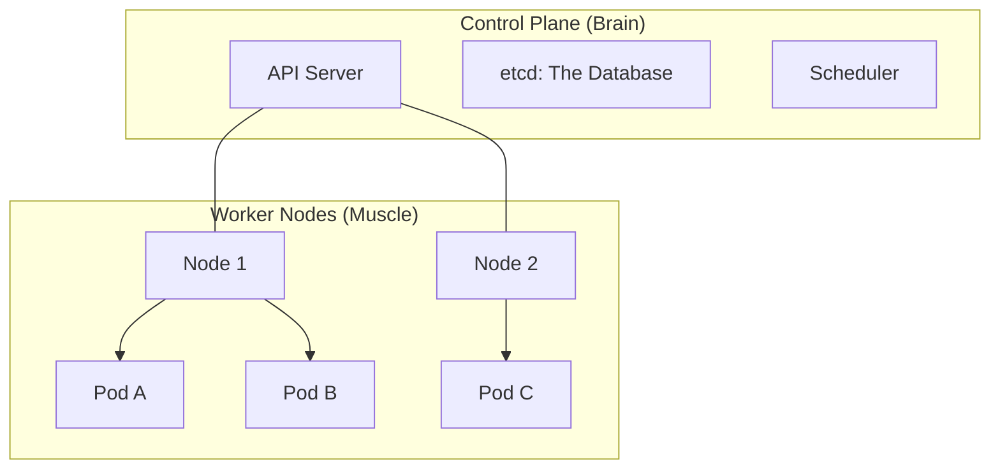

# Containers and Kubernetes: Orchestrating the Fleet

## 1. Beginner-friendly Hinglish Explanation 🇮🇳
Bhai, **Containers** aur **Kubernetes (K8s)** system design ki "Jaan" hain. 

- **Containers (Docker)**: Ye ek "Small Box" ki tarah hai jisme aapka code, libraries, aur settings sab kuch band hai. Isse "It works on my machine" wala panga khatam ho jata hai. Ek baar container bana liya, toh wo laptop par bhi chalega aur cloud par bhi. 
- **Kubernetes (The Captain)**: Socho aapke paas 1000 containers hain. Kaunsa container kahan chal raha hai? Kaunsa dead ho gaya? Traffic kaise baantni hai? Kubernetes wo "Captain" hai jo in hazaron containers ko manage karta hai. Agar ek container crash hota hai, toh K8s turant dusra start kar deta hai.

---

## 2. Deep Technical Explanation
Containerization is the packaging of software code with all the necessary components like libraries, frameworks, and other dependencies.

### Key Concepts
- **Image**: The blueprint (read-only) for a container.
- **Container**: A running instance of an image.
- **Pod**: The smallest unit in K8s. One or more containers that share network and storage.
- **Deployment**: Describes the desired state (e.g., "I want 3 copies of this pod").
- **Service**: Provides a stable IP address and load balancing for a set of pods.
- **Ingress**: Manages external access to the services (the "Gateway").

### Why Kubernetes?
- **Self-healing**: Restarts failed containers.
- **Auto-scaling**: Increases/decreases pods based on CPU/RAM usage.
- **Service Discovery**: Internal pods can find each other easily.

---

## 3. Architecture Diagrams
**Kubernetes Cluster Architecture:**

---

## 4. Scalability Considerations
- **Horizontal Pod Autoscaler (HPA)**: Automatically adds more pods when traffic spikes.
- **Cluster Autoscaler**: Automatically adds more "Physical Servers" (Nodes) to the cluster when pods have no place to run.

---

## 5. Failure Scenarios
- **Node Failure**: If a physical server dies, Kubernetes notices and moves all its pods to another healthy node.
- **CrashLoopBackOff**: A pod starts, crashes, K8s restarts it, it crashes again... (Fix: **Check logs and health probes**).

---

## 6. Tradeoff Analysis
- **Simplicity vs. Power**: Docker is simple for one container. Kubernetes is incredibly complex to set up and manage, but it's the only way to manage large-scale systems.

---

## 7. Reliability Considerations
- **Liveness Probes**: "Is the container still alive?" (If no, K8s restarts it).
- **Readiness Probes**: "Is the container ready to take traffic?" (If no, K8s stops sending it requests).

---

## 8. Security Implications
- **Container Isolation**: Containers share the same OS kernel. If a hacker breaks out of a container, they could potentially control the whole server. (Fix: **Pod Security Policies**).
- **Secrets Management**: Storing passwords/keys in K8s Secrets instead of environment variables.

---

## 9. Cost Optimization
- **Bin Packing**: Kubernetes tries to fit as many pods as possible on a single server to save money.
- **Preemptible Nodes**: Running K8s on cheap "Spot" instances.

---

## 10. Real-world Production Examples
- **Pokemon GO**: Used GKE (Google Kubernetes Engine) to handle 50x the predicted traffic during their launch.
- **Spotify**: Moved from their own system (Helios) to Kubernetes to manage their thousands of microservices.
- **Monzo Bank**: Runs their entire banking backend on a massive Kubernetes cluster.

---

## 11. Debugging Strategies
- **kubectl logs**: Seeing the console output of a pod.
- **kubectl exec**: Opening a "Terminal" inside a running container to debug.
- **kubectl describe**: Seeing why a pod is stuck in "Pending" state.

---

## 12. Performance Optimization
- **Resource Limits**: Setting a "Maximum" RAM/CPU for each pod so one pod doesn't steal all the resources (The "OOM Kill" problem).
- **Service Mesh (Istio)**: Handling complex networking between pods.

---

## 13. Common Mistakes
- **No Health Checks**: Kubernetes won't know if your app is stuck in an infinite loop if you don't define a Liveness Probe.
- **Storing Data Inside the Container**: If the pod restarts, the data is GONE. (Use **Persistent Volumes**!).

---

## 14. Interview Questions
1. What is a 'Pod' and why is it the smallest unit in K8s?
2. Explain the difference between a 'Deployment' and a 'Service'.
3. How does Kubernetes handle a 'Node Failure'?

---

## 15. Latest 2026 Architecture Patterns
- **Serverless Kubernetes (Fargate/Autopilot)**: Running K8s without managing any servers. You just pay for the pods.
- **GitOps (ArgoCD)**: Managing your cluster by just pushing code to Git. The cluster automatically "Syncs" itself to match the code.
- **AI-Native Orchestration**: AI that analyzes pod traffic and automatically suggests the perfect "Resource Limits" to save money and prevent crashes.
	
