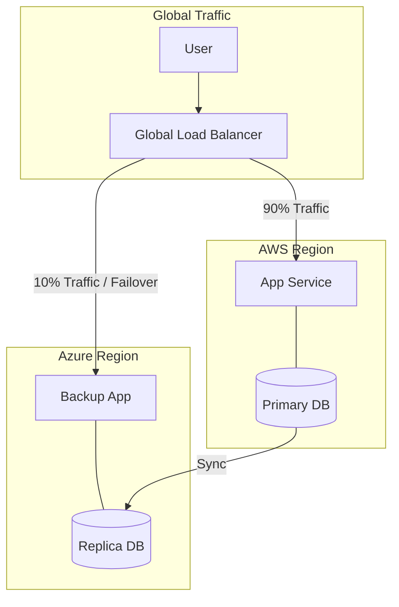

# Hybrid and Multi-Cloud Strategies: The Best of All Clouds

## 1. Beginner-friendly Hinglish Explanation 🇮🇳
Bhai, **Hybrid Cloud** aur **Multi-Cloud** ka matlab hai "Sabse thoda-thoda lena." 

- **Hybrid Cloud**: Aapka "Aadha" data apne purane servers (On-premise) par hai aur "Aadha" cloud (AWS) par. (E.g., Bank ka purana sensitive data unke office mein hai, par unki website cloud par). 
- **Multi-Cloud**: Aap do alag cloud providers use kar rahe ho. (E.g., AWS for servers and GCP for AI). 
Kyun karte hain ye? Taaki agar ek cloud provider (AWS) down ho jaye, toh aapka business Azure par chalta rahe. Isse "Vendor Lock-in" se bhi bacha jata hai.

---

## 2. Deep Technical Explanation
Hybrid and multi-cloud strategies involve coordinating resources across multiple independent environments.

### Hybrid Cloud
- **Definition**: A mix of private cloud (on-premises) and public cloud (AWS/Azure).
- **Use Case**: Data residency (keeping data in one country), leveraging existing hardware investments, or low-latency local processing.
- **Connectivity**: VPN or Dedicated Lines (AWS Direct Connect / Azure ExpressRoute).

### Multi-Cloud
- **Definition**: Using multiple public cloud providers.
- **Use Case**: Avoiding vendor lock-in, using best-of-breed services (e.g., GCP for data, AWS for compute), and extreme disaster recovery.
- **Connectivity**: Global private networks or internet-based tunnels.

---

## 3. Architecture Diagrams
**Multi-Cloud Architecture:**

---

## 4. Scalability Considerations
- **Data Gravity**: Moving petabytes of data between clouds is slow and expensive. You have to decide where the "Truth" (Main DB) lives.
- **Unified Management**: Using tools like **Anthos (GCP)** or **Azure Arc** to manage all clouds from one single dashboard.

---

## 5. Failure Scenarios
- **Complexity Overload**: Managing two clouds means learning twice as many services, which leads to more human errors.
- **Egress Costs**: Cloud providers charge a lot of money to send data *out* of their network to another cloud.

---

## 6. Tradeoff Analysis
- **Resilience vs. Simplicity**: Multi-cloud is 100% more resilient but 300% more complex and expensive.
- **Specialization vs. Portability**: Using "AWS-specific" features makes your app faster but harder to move to Azure.

---

## 7. Reliability Considerations
- **Global Load Balancing**: Using DNS-based or Anycast services that can route traffic between clouds based on health.

---

## 8. Security Implications
- **Consistent Security Posture**: Ensuring that the firewall rules in AWS are *exactly* the same as in Azure. (Fix: **IaC with Terraform**).
- **Inter-Cloud Encryption**: Every bit of data moving between clouds must be encrypted (mTLS).

---

## 9. Cost Optimization
- **Cloud Arbitrage**: Moving workloads to the cloud provider that is currently offering the cheapest "Spot" instances.
- **Direct Connect**: Saving 60% on bandwidth costs by using a physical cable between your office and the cloud.

---

## 10. Real-world Production Examples
- **Walmart**: Uses a multi-cloud strategy to avoid being 100% dependent on their competitor (Amazon).
- **HDFC Bank**: Uses a hybrid cloud for security and compliance reasons.
- **Unity (Gaming Engine)**: Uses multi-cloud to handle massive bursts of traffic from global game launches.

---

## 11. Debugging Strategies
- **Cross-Cloud Tracing**: Using **OpenTelemetry** to track a request that starts in AWS and calls a database in Azure.

---

## 12. Performance Optimization
- **Edge Computing**: Using a hybrid approach where "Heavy lifting" is in the cloud and "Small fast tasks" are in your local office/factory.

---

## 13. Common Mistakes
- **No Private Connection**: Trying to sync two databases over the public internet (unsafe and slow).
- **Ignoring Egress Bills**: Being surprised by a $5,000 bill just for moving data from AWS to GCP.

---

## 14. Interview Questions
1. What is the difference between Hybrid and Multi-cloud?
2. What are the biggest challenges of a Multi-cloud strategy?
3. How do you manage data consistency across two different cloud providers?

---

## 15. Latest 2026 Architecture Patterns
- **Sky Computing**: A futuristic concept where a "Meta-cloud" automatically picks the best cloud provider for your code at runtime.
- **Sovereign Clouds**: Specialized clouds (like **Oracle Cloud for Government**) that guarantee data never leaves a specific country.
- **Distributed SQL (CockroachDB)**: Databases that natively run across AWS, Azure, and On-premise as one single logical database.
	
