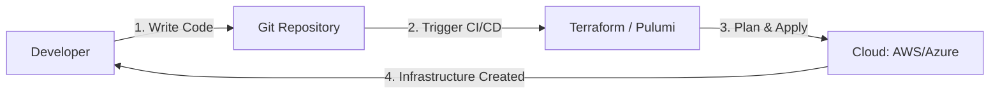

# Infrastructure as Code (IaC): Automating the Cloud

## 1. Beginner-friendly Hinglish Explanation 🇮🇳
Bhai, **Infrastructure as Code (IaC)** ka matlab hai "Cloud ko code se chalana." 

Socho aapko 10 servers, 1 database, aur 1 load balancer chahiye. 
- **Purana Tarika**: AWS Console mein login karo aur 1 ghante tak buttons click karte raho. (Isme galti hone ka chance bohot hai). 
- **IaC Tarika (Terraform/Pulumi)**: Aap ek text file likhte ho: "Mujhe 10 servers chahiye." Aap ek command chalate ho aur "Boom!", saara infrastructure 1 minute mein ban jata hai. 
Iska sabse bada fayda ye hai ki aap is code ko "Git" mein save kar sakte ho, version kar sakte ho, aur "Copy-Paste" karke dusre region mein bhi waisa hi system bana sakte ho.

---

## 2. Deep Technical Explanation
IaC is the managing and provisioning of infrastructure through code instead of through manual processes.

### Declarative vs. Imperative
1. **Declarative (The "What")**: You describe the final state. "I want 3 servers." The tool (Terraform) figures out how to do it. (Most popular).
2. **Imperative (The "How")**: You give step-by-step commands. "Create server A, then B, then C." (E.g., AWS CLI scripts).

### Key Tools
- **Terraform**: The industry standard. Uses HCL (HashiCorp Configuration Language). Works with all clouds.
- **AWS CloudFormation**: AWS-native tool using YAML/JSON.
- **Pulumi**: Allows you to use real programming languages (Python, TS, Go) for IaC.
- **Ansible/Chef/Puppet**: For "Configuring" the software inside the servers after they are created.

---

## 3. Architecture Diagrams
**IaC Workflow:**

---

## 4. Scalability Considerations
- **Environment Parity**: Creating 100 identical "Dev" environments for 100 different developers instantly using the same IaC code.
- **State Management**: Terraform stores a `terraform.tfstate` file that remembers what it built. For large teams, this must be stored in a shared place (S3 with Locking).

---

## 5. Failure Scenarios
- **State Corruption**: If two people try to update the infrastructure at the same time, the "State file" can get corrupted. (Fix: **State Locking**).
- **Drift**: Someone logs into the AWS console and manually deletes a server. The code and the reality are now different. (Fix: **Periodic Sync/Drift Detection**).

---

## 6. Tradeoff Analysis
- **Setup Time vs. Efficiency**: Writing IaC code for a 1-server app is "Overkill." But for a 50-service app, it's the only way to survive.

---

## 7. Reliability Considerations
- **Idempotency**: Running the same IaC code 10 times should produce the exact same result every time. It shouldn't create 10 copies of the same server!

---

## 8. Security Implications
- **Policy as Code**: Using tools like **Sentinel** or **OPA** to automatically block any IaC code that tries to create an "Insecure" resource (like a public database).
- **Secret Scanning**: Ensuring that no one puts the DB password in the IaC code.

---

## 9. Cost Optimization
- **Auto-Cleanup**: IaC scripts that automatically delete "Testing" environments at 6 PM every day to save money.

---

## 10. Real-world Production Examples
- **HashiCorp (Terraform)**: Used by almost every Fortune 500 company to manage their hybrid cloud.
- **Netflix**: Uses custom IaC tools to manage their massive, global streaming infrastructure.
- **Starbucks**: Uses Pulumi to manage their digital ecosystem using TypeScript.

---

## 11. Debugging Strategies
- **Terraform Plan**: ALWAYS run `plan` before `apply`. It shows you exactly what it's going to create, change, or delete.
- **TFLint**: A linter that finds common errors in your IaC code before you run it.

---

## 12. Performance Optimization
- **Parallelism**: Telling Terraform to create 50 resources at the same time instead of one-by-one.
- **Modularization**: Creating reusable "Modules" (e.g., a "Standard VPC" module) to avoid writing the same code again and again.

---

## 13. Common Mistakes
- **Hardcoding Values**: Putting a specific IP address in the code instead of using a variable.
- **No Remote State**: Keeping the state file on your laptop. (If your laptop dies, you can't update the cloud anymore!).

---

## 14. Interview Questions
1. What is the difference between Declarative and Imperative IaC?
2. What is 'Infrastructure Drift' and how do you handle it?
3. Why is 'Terraform State' important and where should it be stored?

---

## 15. Latest 2026 Architecture Patterns
- **LLM-Driven IaC**: Using AI to describe an architecture in English and having the AI generate the 100% correct Terraform code.
- **Cross-Plane**: Managing infrastructure using the Kubernetes API, so your servers look like K8s pods.
- **Self-Healing IaC**: Systems that automatically "Fix" any manual changes made in the console to match the code in Git (GitOps for Infrastructure).
	
