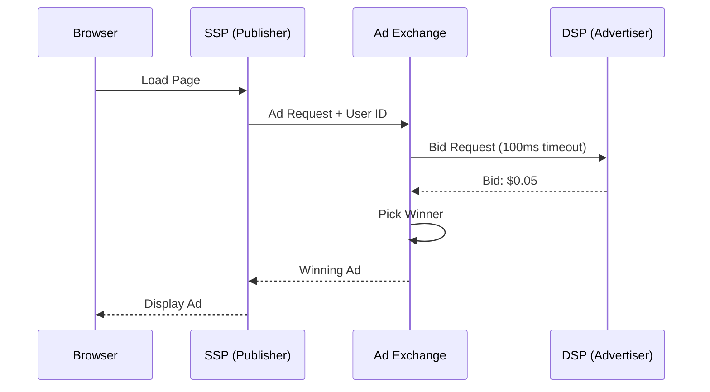

# Ad Tech and RTB Systems: The 100ms Auction

## 1. Beginner-friendly Hinglish Explanation 🇮🇳
Bhai, **Ad Tech** aur **RTB (Real-Time Bidding)** ka matlab hai "Internet ki sabse tez neelami (Auction)." 

Socho aapne ek news website kholi. Website load hone se pehle, piche ek auction hota hai: 
1. Website kehti hai: "Mere paas ek ad space hai, user India se hai aur use cricket pasand hai." 
2. 50 companies (Advertisers) boli lagati hain (Bid): "Main 10 paise doonga," "Main 12 paise doonga." 
3. Jo jeetta hai uska ad aapko 0.1 second mein dikh jata hai. 
Ye poora khel 100 milliseconds se kam mein khatam ho jata hai. Iska scale itna bada hai ki ye poore internet ka "Engine" hai.

---

## 2. Deep Technical Explanation
Real-Time Bidding (RTB) is a means by which advertising inventory is bought and sold on a per-impression basis, via programmatic instantaneous auction.

### Key Players
1. **DSP (Demand Side Platform)**: Used by advertisers (e.g., Nike) to manage bids.
2. **SSP (Supply Side Platform)**: Used by publishers (e.g., NYTimes) to sell ad space.
3. **Ad Exchange**: The central marketplace where the auction happens.
4. **DMP (Data Management Platform)**: Stores user data to help target ads.

### The 100ms Budget
- **0-20ms**: Request reaches the Ad Exchange.
- **20-80ms**: Exchange calls multiple DSPs. DSPs check their models and bid.
- **80-100ms**: Auction closes, winner is picked, and ad creative is sent to the browser.

---

## 3. Architecture Diagrams
**RTB Auction Flow:**

---

## 4. Scalability Considerations
- **High Throughput**: A major Ad Exchange handles millions of auctions per second. (Requires: **In-memory databases** and **Go/C++ high-concurrency code**).
- **Global Latency**: Bidding must happen in the same region as the user to meet the 100ms deadline.

---

## 5. Failure Scenarios
- **Timeout**: If a DSP is slow (takes 101ms), it misses the auction. (Fix: **Aggressive timeouts** and **UDP/gRPC communication**).
- **Ad Fraud**: Bots clicking on ads to steal money from advertisers.

---

## 6. Tradeoff Analysis
- **Complexity vs. Latency**: Adding more AI models to a DSP makes the bid smarter but slower.

---

## 7. Reliability Considerations
- **No-Single-Point-of-Failure**: If the Ad Exchange is down, websites lose money instantly. (Requires: **Global Active-Active architecture**).

---

## 8. Security Implications
- **Privacy (GDPR/CCPA)**: Moving away from "Third-party Cookies" and using "Privacy Sandboxes" to target ads without knowing the user's name.

---

## 9. Cost Optimization
- **Negative Bidding**: Instantly rejecting bid requests for "Low quality" users to save on processing costs.

---

## 10. Real-world Production Examples
- **Google Ad Manager**: The largest ad exchange in the world.
- **The Trade Desk**: A massive DSP that processes 10+ million queries per second.
- **AppNexus (Xandr)**: A global marketplace for programmatic advertising.

---

## 11. Debugging Strategies
- **Bid Logs**: Analyzing why a DSP lost an auction (Was the bid too low? Was it too slow?).
- **Win-Loss Ratio Monitoring**: Tracking the health of a bidding algorithm.

---

## 12. Performance Optimization
- **AeroSpike / Redis**: Used for storing user profiles with sub-millisecond lookup times.
- **Pre-filtering**: Using "Bloom Filters" to quickly decide if a user is in your target audience before doing expensive math.

---

## 13. Common Mistakes
- **High Latency in DSP**: Taking too long to decide on a bid.
- **Inaccurate Budgeting**: Spending the entire $10,000 budget in 5 minutes because of a bug in the "Pacing" algorithm.

---

## 14. Interview Questions
1. How does a Real-Time Bidding (RTB) auction work in <100ms?
2. What are the roles of a DSP and an SSP?
3. How do you handle 'Ad Fraud' in a distributed system?

---

## 15. Latest 2026 Architecture Patterns
- **Edge Bidding**: Moving the auction logic to the CDN Edge to reduce the "Round-trip" time for the user.
- **AI-Native Creative Generation**: Generating the ad image/text in real-time *after* the auction is won, tailored specifically for that user.
- **Privacy Sandboxes (Topics API)**: Targeting ads based on broad "Interests" stored on the user's browser rather than tracking them across websites.
	
