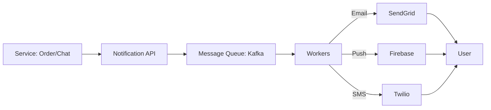

# Notification System Design: The Message Delivery Engine

## 1. Beginner-friendly Hinglish Explanation 🇮🇳
Bhai, **Notification System** ka matlab hai "User ko khabar dena (Alerts)." 

Socho aapka system bohot bada hai (Jaise Facebook ya Amazon). Aapko millions of users ko emails, SMS, aur Push Notifications bhejne hain. 
1. **Producer**: Wo service jo notification trigger karti hai (E.g., "Order Shipped"). 
2. **Queue**: Data ko ek queue (Kafka) mein daal diya jata hai taaki agar service busy ho, toh message khoye nahi. 
3. **Workers**: Alag-alag services jo actual message bhejti hain (SendGrid for Email, Twilio for SMS). 
Isme "Rate Limiting" aur "Retry Logic" sabse important hai—warna aap ek hi user ko 100 emails bhej doge aur wo aapka app delete kar dega!

---

## 2. Deep Technical Explanation
A notification system is a service responsible for sending alerts via multiple channels (Email, SMS, Mobile Push, In-app).

### Core Components
1. **API Server**: Validates requests and pushes to the queue.
2. **Cache**: Stores user settings (e.g., "Don't send me SMS at night") and templates.
3. **Message Queue (Kafka/RabbitMQ)**: Decouples the producers from the senders.
4. **Notification Workers**: Pull messages, format them using templates, and call third-party providers.
5. **Third-party Providers**: Twilio (SMS), SendGrid (Email), Firebase Cloud Messaging (Push).
6. **Analytics/Tracking**: Recording if the notification was delivered and clicked.

---

## 3. Architecture Diagrams
**Notification System Workflow:**

---

## 4. Scalability Considerations
- **Infinite Queue**: Using a distributed queue like Kafka to handle spikes (e.g., "Flash Sale" alerts).
- **Worker Auto-scaling**: Adding more workers when the queue grows too long.

---

## 5. Failure Scenarios
- **Provider Down**: Twilio is down. (Fix: **Circuit Breaker** and **Failover** to another provider like Vonage).
- **Infinite Retry Loop**: A message that always fails being retried forever, blocking the queue. (Fix: **Dead Letter Queue (DLQ)**).

---

## 6. Tradeoff Analysis
- **Latency vs. Reliability**: Do you want the SMS to reach in 1 second, or is it okay if it takes 1 minute as long as it's guaranteed to arrive?

---

## 7. Reliability Considerations
- **Idempotency**: Ensuring that if a worker crashes and restarts, it doesn't send the same "Order Confirmed" SMS twice. (Fix: **Deduplication ID**).

---

## 8. Security Implications
- **Opt-out Management**: Legally (GDPR/CAN-SPAM), you must allow users to unsubscribe easily.
- **Sensitive Data**: Never put a password or credit card number in a notification.

---

## 9. Cost Optimization
- **Batching**: Combining 10 notifications into one summary email (E.g., "You have 10 new likes").
- **Priority Queues**: Sending "OTP" (High priority) instantly while "Marketing" (Low priority) can wait for 10 minutes.

---

## 10. Real-world Production Examples
- **Amazon**: Sends millions of transactional emails and tracking updates using a highly decoupled architecture.
- **WhatsApp**: Uses a massive push notification system to keep users engaged even when the app is closed.
- **Slack**: A complex notification system that decides whether to send a Push, an Email, or just show a desktop alert based on the user's "Active" status.

---

## 11. Debugging Strategies
- **Message Tracing**: Using a "Correlation ID" to follow a notification from the initial API call to the final provider response.
- **Delivery Rate Dashboards**: Seeing which percentage of notifications are failing for a specific country or provider.

---

## 12. Performance Optimization
- **Pre-rendering Templates**: Compiling the HTML email templates in advance to save CPU time during sending.
- **Persistent Connections**: Keeping a hot connection open to providers like FCM.

---

## 13. Common Mistakes
- **No Rate Limiting**: Spamming a user and getting your email domain blacklisted by Google.
- **Hardcoded Templates**: Putting the email text in the code instead of a separate template service.

---

## 14. Interview Questions
1. How do you design a notification system for 100 million users?
2. How do you prevent 'Duplicate Notifications'?
3. How do you handle 'Priority' between OTPs and Marketing messages?

---

## 15. Latest 2026 Architecture Patterns
- **AI-Personalized Delivery Time**: AI that waits to send a marketing notification until the exact minute the user is most likely to check their phone.
- **Multi-Channel Fallback**: If the "Push" notification wasn't opened in 5 minutes, automatically send an "Email."
- **Web3 Notifications**: Sending alerts directly to a crypto wallet (e.g., using **XMTP**).
	
