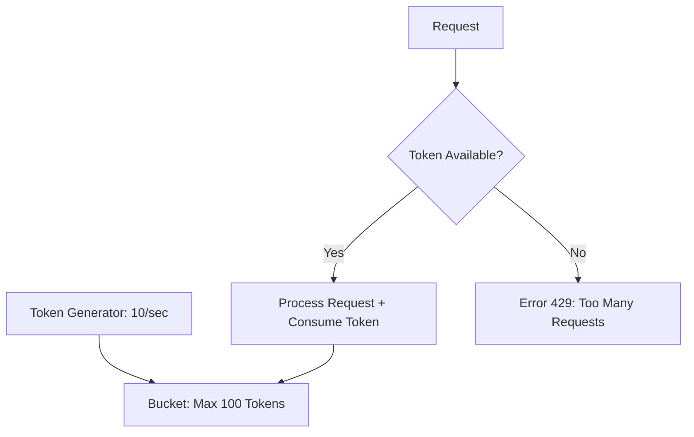

# Rate Limiter Design: Controlling the Flood

## 1. Beginner-friendly Hinglish Explanation 🇮🇳
Bhai, **Rate Limiter** ka matlab hai "Security guard jo gate par khada hai." 

Socho aapki ek API hai. Agar koi hacker script likhkar use har second 10,000 baar call karega, toh aapka server "Ghutne tek dega" (Crash). 
**Rate Limiter** check karta hai ki: "Is User ID ne pichle 1 minute mein kitni requests ki?" 
- Agar 100 se kam hain: "Jaao bhai, allowed ho." 
- Agar 100 se zyada hain: "Ruko! Thoda wait karo (Error 429: Too Many Requests)." 
Ye system design ka ek basic par bohot important hissa hai jo "DDoS attacks" aur "API abuse" se bachata hai.

---

## 2. Deep Technical Explanation
A rate limiter is used to control the rate of traffic sent by a client or service.

### Common Algorithms
1. **Token Bucket**: A bucket has tokens. Each request takes a token. Tokens are added at a fixed rate. (Best for "Burst" traffic).
2. **Leaky Bucket**: Requests enter a queue and are processed at a constant rate. (Best for "Smooth" traffic).
3. **Fixed Window Counter**: Count requests in a fixed time window (e.g., 12:00-12:01). (Issue: Spike at the edges of the window).
4. **Sliding Window Log**: Stores every request's timestamp. Accurate but uses too much memory.
5. **Sliding Window Counter**: A hybrid approach using the previous and current window counts. (Best balance of accuracy and memory).

---

## 3. Architecture Diagrams
**Token Bucket Algorithm:**

---

## 4. Scalability Considerations
- **Distributed Rate Limiting**: If you have 10 servers, you need a central place (like **Redis**) to store the token counts.
- **Race Conditions**: Two requests coming at the same millisecond trying to update the same counter. (Fix: **Redis Lua Scripts** or **Sorted Sets**).

---

## 5. Failure Scenarios
- **Redis Down**: If your central rate limiter (Redis) is down, do you block all traffic (High Security) or allow all traffic (High Availability)?
- **Clock Drift**: Different servers having slightly different times, causing sliding window issues.

---

## 6. Tradeoff Analysis
- **Accuracy vs. Performance**: The "Sliding Window Log" is 100% accurate but slow. The "Fixed Window" is fast but inaccurate at the boundaries.

---

## 7. Reliability Considerations
- **Fallback to Local Memory**: If the central Redis is slow, use a simple local rate limiter inside the application as a backup.

---

## 8. Security Implications
- **IP-based vs User-based**: Hackers can change their IP. Rate limiting by `User ID` or `API Key` is more secure.
- **DDoS Mitigation**: Using a cloud-level rate limiter (Cloudflare) to block millions of requests before they even touch your servers.

---

## 9. Cost Optimization
- **Tiered Rate Limiting**: "Free" users get 10 req/min, "Pro" users get 1000 req/min. This is a common way to monetize APIs.

---

## 10. Real-world Production Examples
- **GitHub API**: Has a strict 5000 requests/hour limit for authenticated users.
- **Twitter**: Limits how many tweets you can post or "Like" per hour to prevent bots.
- **Stripe**: Uses the "Token Bucket" algorithm to ensure their payment APIs are never overloaded.

---

## 11. Debugging Strategies
- **X-RateLimit Headers**: Returning headers like `X-RateLimit-Remaining` to the user so they know how many requests they have left.
- **Audit Logs**: Seeing which IPs/Users are getting blocked most often.

---

## 12. Performance Optimization
- **Edge Rate Limiting**: Running the rate limit logic at the CDN level (Cloudflare Workers) to reduce latency and server load.
- **Batch Updates**: Updating the central Redis counter every 100 requests instead of every single request (Tradeoff: less accuracy).

---

## 13. Common Mistakes
- **No Rate Limiting on Login/Reset Password**: Allowing hackers to brute-force accounts.
- **Not Handling 429 Errors in Frontend**: The app just showing a generic "Server Error" instead of telling the user to "Wait 5 minutes."

---

## 14. Interview Questions
1. Compare 'Token Bucket' and 'Leaky Bucket' algorithms.
2. How do you implement a rate limiter in a distributed system with multiple servers?
3. How do you handle 'Race Conditions' when updating rate limit counters?

---

## 15. Latest 2026 Architecture Patterns
- **AI-Adaptive Rate Limiting**: AI that monitors "Normal" traffic and automatically tightens the limits if it detects a "Bot-like" pattern.
- **Client-Side Throttling**: The server telling the client (via a header) to "Back off for 60 seconds," and the client automatically disabling the "Submit" button.
- **Service Mesh Rate Limiting**: Using **Envoy** or **Istio** to handle rate limiting between microservices without writing any code.
	
