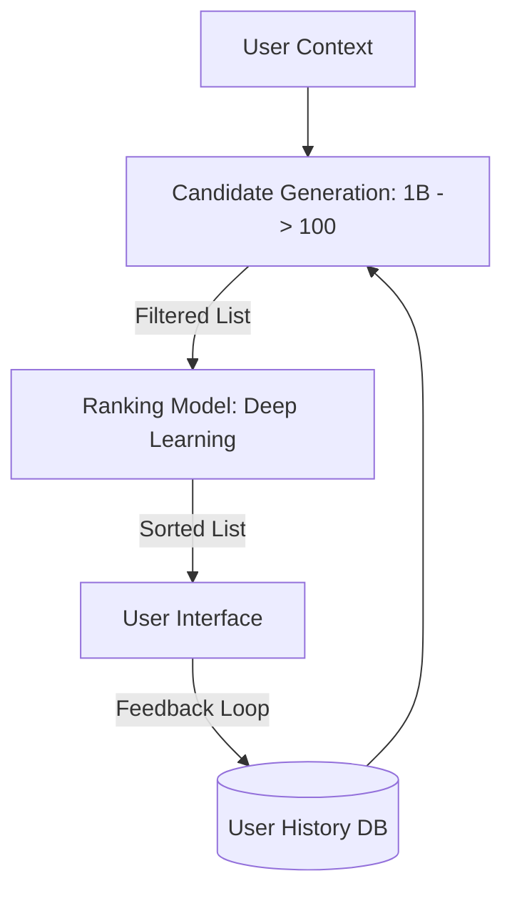

# Recommendation System Architecture: Predicting Desires

## 1. Beginner-friendly Hinglish Explanation 🇮🇳
Bhai, **Recommendation System** ka matlab hai "User ka mann padhna." 

Socho aap Netflix kholte ho aur wo aapko wahi movie dikhata hai jo aapko pasand aane wali hai. Ye koi jaadu nahi hai, ye do cheezon ka mix hai: 
1. **Collaborative Filtering**: "Agar Rahul aur Priya dono ko 'Action' movies pasand hain, aur Rahul ne ek nayi movie dekhi, toh shayad Priya ko bhi wo pasand aayegi." 
2. **Content-based Filtering**: "Agar aapne pichle hafte 5 horror movies dekhi hain, toh hum aapko aur horror movies dikhayenge." 
Modern systems in dono ko mix karke (Hybrid) aur AI use karke aapka "Feed" banate hain.

---

## 2. Deep Technical Explanation
Recommendation systems are algorithms aimed at suggesting relevant items to users (e.g., movies to watch, products to buy).

### Two-Stage Architecture
At scale (like YouTube), you can't rank 1 billion videos in real-time.
1. **Candidate Generation (Retrieval)**: Fast. Filter down 1 billion items to the "Best 100" based on simple rules (user location, past history).
2. **Ranking (Scoring)**: Slow but accurate. Use a deep neural network to score those 100 items and sort them for the final UI.

### Data Inputs
- **Explicit Feedback**: Star ratings, Likes, Thumbs up.
- **Implicit Feedback**: Watch time, Clicks, Hover time, Re-watches. (Much more powerful).

---

## 3. Architecture Diagrams
**Two-Stage Recommender:**

---

## 4. Scalability Considerations
- **Cold Start Problem**: How do you recommend a new movie that no one has watched yet? (Fix: **Content-based filtering** using metadata).
- **In-memory Vector Search**: Using databases like **Pinecone** or **Milvus** to find similar users/items in microseconds.

---

## 5. Failure Scenarios
- **Feedback Loop (Echo Chamber)**: Showing a user only what they've already seen, so they never discover new things. (Fix: **Exploration vs. Exploitation**—intentionally showing 5% random content).
- **Popularity Bias**: Only recommending "Trending" items and ignoring the "Long tail" of niche content.

---

## 6. Tradeoff Analysis
- **Latency vs. Accuracy**: Do you want a "Good enough" recommendation in 50ms or a "Perfect" one in 500ms?

---

## 7. Reliability Considerations
- **Fallback Logic**: If the AI model fails or is slow, the system should show "Global Trending" items instead of an empty screen.

---

## 8. Security Implications
- **Privacy**: Ensuring that sensitive user history (like "Adult content" or "Medical searches") isn't leaked through recommendations.

---

## 9. Cost Optimization
- **Embedding Compression**: Shrinking the mathematical "Vectors" that represent users and items to save on RAM and search costs.

---

## 10. Real-world Production Examples
- **YouTube**: Famous for its "Deep Learning for YouTube Recommendations" paper (2-stage architecture).
- **TikTok**: Known for its ultra-fast feedback loop (Algorithm knows what you like in <30 seconds).
- **Amazon**: "Customers who bought this also bought..." (Classic collaborative filtering).

---

## 11. Debugging Strategies
- **A/B Testing**: Showing 50% of users Algorithm A and 50% Algorithm B to see which one increases "Watch Time."
- **Model Explainability**: Seeing which specific features (e.g., "Language" or "Actor") caused a specific recommendation.

---

## 12. Performance Optimization
- **Near-line Processing**: Updating the user's "Interests" as they click, rather than waiting for a daily batch job.
- **Matrix Factorization**: A classic math trick to fill in the gaps of a huge User-Item matrix.

---

## 13. Common Mistakes
- **Ignoring Negative Feedback**: If a user clicks "Not interested," the system should remove that topic immediately.
- **Small Training Data**: Trying to build a recommendation engine with only 100 users. (It won't work!).

---

## 14. Interview Questions
1. How does YouTube's 2-stage recommendation architecture work?
2. What is the 'Cold Start' problem and how do you solve it?
3. What is the difference between Collaborative and Content-based filtering?

---

## 15. Latest 2026 Architecture Patterns
- **LLM-Based Recommenders**: Using Large Language Models to understand the "Reasoning" behind a recommendation (e.g., "I'm recommending this because you like dark sci-fi with a twist").
- **Real-time Feature Stores**: Using **Tecton** or **Feast** to feed live user behavior into the AI model in <10ms.
- **Multi-Modal Embeddings**: Combining text, images, and video into a single "Vector" to understand content better than ever before.
	
