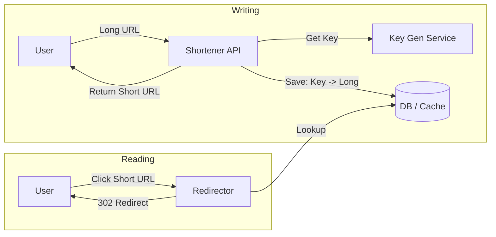

# URL Shortener Design: The Tiny Redirector

## 1. Beginner-friendly Hinglish Explanation 🇮🇳
Bhai, **URL Shortener** (Jaise bit.ly ya tinyurl) ka kaam simple hai: "Bade gande se URL ko chota aur sundar banana." 

- **Input**: `https://example.com/very/long/and/ugly/path?param=value`
- **Output**: `https://bit.ly/xyz123`
Piche kya hota hai? Server ek database mein ek entry banata hai: `xyz123 -> Long URL`. 
Jab koi chota link click karta hai, toh server database dekhta hai aur browser ko ek "Redirect" (301) signal bhej deta hai: "Bhai, asli jagah ye hai, wahan jao." 
Scale par ye mushkil isliye hai kyunki millions of clicks ko bina delay ke handle karna hota hai.

---

## 2. Deep Technical Explanation
A URL shortener is a system that creates short aliases for long URLs and redirects users to the original URL.

### The ID Generation Problem
How do you create a unique `xyz123` for every link?
1. **Base62 Encoding**: Convert a unique auto-incrementing integer to a string using `[a-z, A-Z, 0-9]`. (7 characters can support 3.5 trillion URLs!).
2. **Key Generation Service (KGS)**: Pre-generate millions of unique keys in a separate service and store them in a DB. When a request comes, just pick one. (No race conditions).

### The Redirection
- **301 Redirect (Permanent)**: Browser caches the result. Better for performance/server load. (But you can't track every click).
- **302 Redirect (Temporary)**: Browser asks the server every single time. Better for analytics (tracking who clicked, when, and from where).

---

## 3. Architecture Diagrams
**URL Shortener Workflow:**

---

## 4. Scalability Considerations
- **Read-Heavy System**: URL shorteners have a 100:1 read-to-write ratio. This means we should **Cache everything** in Redis.
- **Database Choice**: A NoSQL database like **Cassandra** or **DynamoDB** is great because it scales horizontally easily.

---

## 5. Failure Scenarios
- **Key Exhaustion**: Running out of unique 6-7 character keys. (Fix: **Increase key length**).
- **Cache Miss Spike**: If Redis goes down, every click hits the database, potentially crashing it.

---

## 6. Tradeoff Analysis
- **301 vs 302**: As discussed, it's a tradeoff between "Server Load" and "Analytics Data."

---

## 7. Reliability Considerations
- **High Availability for KGS**: If the Key Generation Service is down, no one can create new links. (Fix: **Replicated KGS nodes**).

---

## 8. Security Implications
- **Spam & Malware**: URL shorteners are often used to hide "Scam" links. (Fix: **Safety scanner** that checks the destination URL against a blacklist like Google Safe Browsing).

---

## 9. Cost Optimization
- **Cleanup of Old Links**: Deleting links that haven't been clicked in 2 years to save database space.

---

## 10. Real-world Production Examples
- **Bitly**: Processes billions of clicks and links per month.
- **Twitter (t.co)**: Automatically shortens every link to save character count.
- **TinyURL**: One of the oldest players in the game.

---

## 11. Debugging Strategies
- **Click Analytics Logs**: Tracking the referer, country, and device type for every click.
- **Database Index Health**: Ensuring that the "Key" column is primary and indexed for sub-millisecond lookups.

---

## 12. Performance Optimization
- **Redis Sharding**: Splitting the cache across multiple nodes to handle millions of queries per second.
- **Bloom Filters**: Quickly checking if a key *doesn't* exist in the DB without actually querying the DB.

---

## 13. Common Mistakes
- **Using UUIDs as Keys**: `https://bit.ly/550e8400-e29b-41d4-a716-446655440000` is NOT a short URL.
- **Predictable Keys**: If you use `1, 2, 3...`, anyone can guess the next link and see private data. (Fix: **Shuffle the ID** or use a random starting point).

---

## 14. Interview Questions
1. How do you generate unique 6-character IDs for 100 billion URLs?
2. What is the difference between a 301 and a 302 redirect?
3. How do you handle 'Read-heavy' traffic in a URL shortener?

---

## 15. Latest 2026 Architecture Patterns
- **Edge Redirection**: Moving the redirect logic to **Cloudflare Workers** so the user doesn't even have to travel to your main data center.
- **AI Link Scanning**: Using AI to detect "Phishing" links based on the destination page's content in real-time.
- **Deep Linking**: Automatically opening the mobile app (if installed) instead of the browser when a short link is clicked.
	
