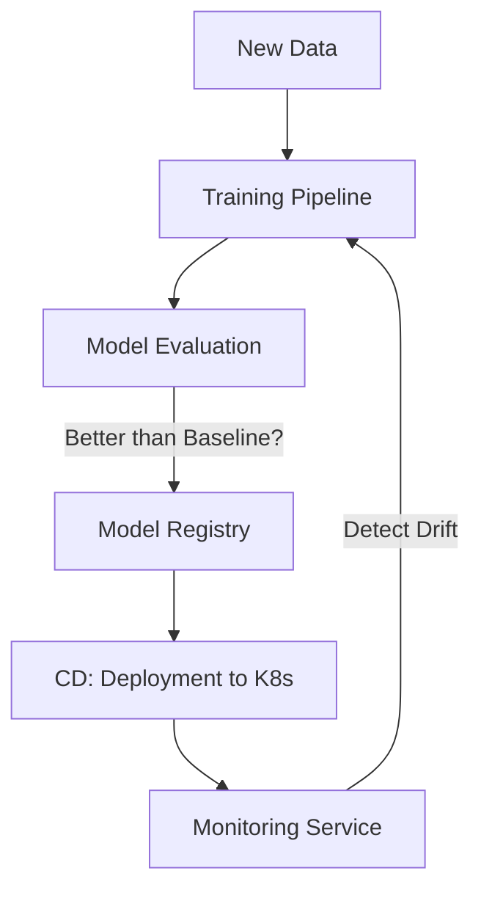

# MLOps and Model Monitoring: The DevOps of AI

## 1. Beginner-friendly Hinglish Explanation 🇮🇳
Bhai, **MLOps** ka matlab hai "Machine Learning ko ek serious factory banana." 

Laboratory mein model banana asan hai, par use 24/7 chalana aur "Up-to-date" rakhna mushkil hai. 
- **CI/CD for ML**: Jab aap naya data dalo, toh model apne aap train ho jaye aur test pass karke deploy ho jaye. 
- **Monitoring**: AI model insaan ki tarah hote hain, wo waqt ke saath "Purane" (Stale) ho jate hain ya galat jawab dene lagte hain (**Model Drift**). 
MLOps humein sikhata hai ki kaise AI system ko "Set and Forget" banaya jaye (automated).

---

## 2. Deep Technical Explanation
MLOps (Machine Learning Operations) is a set of practices that aims to deploy and maintain machine learning models in production reliably and efficiently.

### Core Pillars
1. **Version Control**: Not just for code, but for **Data** (DVC) and **Models** (MLflow).
2. **Pipelines**: Automating the data-to-deployment flow (Kubeflow, Airflow).
3. **Model Registry**: A central shop where you store every version of your model and its performance metrics.
4. **Monitoring & Observability**: Tracking "Data Drift" (Is the input changing?) and "Model Drift" (Is the output getting worse?).

### The Feedback Loop
If the model's accuracy drops below 90% in production, the system should automatically:
- Trigger an alert.
- Collect the "Hard" examples where the model failed.
- Re-train the model with this new data.
- Deploy the new version if it performs better.

---

## 3. Architecture Diagrams
**MLOps Maturity Level 2 (Full Automation):**

---

## 4. Scalability Considerations
- **Orchestration Scale**: Managing 1000s of simultaneous training jobs using **Kubeflow** on Kubernetes.
- **Feature Store Scale**: Providing real-time features to models with sub-10ms latency.

---

## 5. Failure Scenarios
- **Training-Serving Skew**: A bug where the Python code to clean data is different in the "Training" script vs the "Production" API. (Fix: **Unified Feature Engineering**).
- **Data Leakage**: Accidentally including the "Answer" (Target) in the training data, making the model look 100% accurate in the lab but 0% in production.

---

## 6. Tradeoff Analysis
- **Automatic vs. Manual Deployment**: Do you trust the system to deploy a new model without a human looking at it? (Start with **Shadow Mode**—deploy the new model but don't show its results to users yet).

---

## 7. Reliability Considerations
- **A/B Testing**: Running two models in parallel to see which one actually makes more money or keeps users happy.
- **Canary Deploys**: Sending 1% of traffic to the new model to ensure it doesn't crash the system.

---

## 8. Security Implications
- **Model Stealing**: An attacker calling your API 1 million times to "Re-train" their own model based on your answers. (Fix: **Rate Limiting**).
- **Compliance**: Ensuring that the training data doesn't contain sensitive info that the model could "Leak" later.

---

## 9. Cost Optimization
- **Early Stopping**: Stopping a training job after 1 hour if it's clear the model isn't getting better, saving the next 23 hours of GPU costs.

---

## 10. Real-world Production Examples
- **Uber (Michelangelo)**: One of the most famous internal MLOps platforms that manages thousands of models for Uber Eats and Surge Pricing.
- **Weights & Biases (W&B)**: The standard tool for tracking experiments and visualizing training progress.
- **MLflow**: An open-source platform by Databricks for the complete ML lifecycle.

---

## 11. Debugging Strategies
- **SHAP / LIME**: Mathematical tools to explain "Why" the model made a specific prediction (e.g., "It rejected the loan because of 'Credit Score'").
- **Drift Dashboards**: Watching the "Distribution" of your input data. (If user age was 20-30 and now it's 50-60, the model will fail).

---

## 12. Performance Optimization
- **Warm Replicas**: Keeping the previous model version in memory for a few minutes after a deployment to allow for an instant "Rollback."

---

## 13. Common Mistakes
- **No Baseline**: Trying to build a complex AI model before testing a simple "If/Else" rule. (Always start with a **Simple Baseline**!).
- **Manual Feature Engineering**: Manually cleaning data in Excel every time you want to train. (Automate it!).

---

## 14. Interview Questions
1. What is 'Model Drift' and how do you detect it?
2. Explain the 'Training-Serving Skew'.
3. How do you design an automated re-training pipeline?

---

## 15. Latest 2026 Architecture Patterns
- **LLM-Ops**: Specialized MLOps for Large Language Models, focusing on "Prompt Management," "Chain Evaluation," and "RLHF" (Reinforcement Learning from Human Feedback).
- **Continuous Fine-tuning**: Models that are updated every single hour with the latest world news and user interactions.
- **Data-Centric AI**: Shifting focus from "Improving the Model" to "Improving the Data" (cleaning bad labels using AI).
	
